# 音形意统一记忆法

**—— IPSM Approach**

> Integrated Pronunciation, Spelling and Meaning Approach
> 一本从发音机理与构词规则入手的英语单词记忆法

---

## 序言

### 为了帮助朋友记单词，我写了一本书

我有一位同学，英语基础一直很薄弱。在我的印象里，他几乎整天都在背单词，可英语水平始终没有起色。

他有一本四级核心词汇的小册子，是买四级真题时附赠的。每次考试前，他都会拿出来从头背到尾，直到觉得背得差不多了、稍稍有了点信心，才走进考场。临进考场前的最后几分钟，他还在突击巩固那几个最难记的单词。那本小册子被他翻得卷了边、脱了页，粘粘补补，下次接着用。

不难想象，英语对他来说是一道始终跨不过的坎。

他背单词时，会拿着一支笔，边念边写：heart，heart，heart，H-E-A-R-T，H-E-A-R-T，H-E-A-R-T……一遍又一遍地重复着字母顺序。听着听着你会发现，他的声音渐渐飘远——人已经走神了。

过了几天，我问他：heart，"心脏"这个单词怎么写来着？

他想了想：好像是 H-A-E-T？

我一时不知道该说什么。作为天天和他在一起的朋友，我想帮帮他。于是我跟他讲：你记单词的方法不太对，应该这样记……

当然，他并不太听得进去。他固执地相信，记单词只有一个办法，就是投入更多时间——早起背单词、练听力、做阅读、练口语。他觉得，自己英语学不好，根本原因只是早晨起得不够早。

几句话说不清楚，我干脆写本书来告诉你该怎么记单词——毕竟市面上也确实缺少一本真正合适的英语单词书。

三个月后，书稿完成。我打印出来拿给他看。他翻了几页，说：你这书太厚了，我把那本四级核心词汇背熟就够了。

我一时语塞。

他不愿看，我只好把这本书出版出来，留给真正需要它的人——也许有一天，连他的孩子也会用得上。

这本书要讲的，是一种叫做"音形意统一记忆法"的方法。

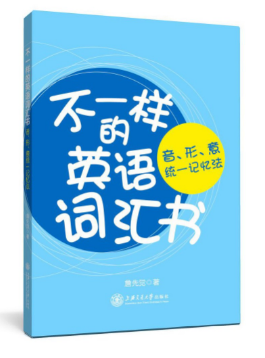

---

## 目录

- 序言　为了帮助朋友记单词，我写了一本书
- 第一篇　导论
  - 第 1 章　本书符号约定
  - 第 2 章　什么是音形意统一记忆法
  - 第 3 章　与国际音标 IPA 的对照
  - 第 4 章　快速入门
- 第二篇　音形统一 IPS
  - 第 5 章　IPS 音形统一
  - 第 6 章　拼读练习与简易教程
- 第三篇　形意统一 ISM
  - 第 7 章　ISM 形意统一
- 第四篇　音意统一 IPM
  - 第 8 章　IPM 音意统一
- 第五篇　字母
  - 第 9 章　字母的音形意
- 第六篇　学习理念与方法评述
  - 第 10 章　学习理念
  - 第 11 章　方法比较与评述
  - 第 12 章　教学与自学指南
- 附录 A　汉语与英语：编码与文字漫谈
- 附录 B　语言文化延伸阅读
- 附录 C　IPSM 标注阅读练习

---

## 第一篇　导论

本篇讲清四件事：本书用什么符号（第 1 章）、这套方法究竟是什么（第 2 章）、它与国际音标 IPA 的关系（第 3 章）、如何用最短路径入门（第 4 章）。四章共同构成理解后续各篇的地基。

### 第 1 章　本书符号约定

音形意统一记忆法**不创造新字符，也不替换字母**，而是在不改变单词拼写的前提下，直接在字母上方标注符号来区别读音。这样单词的"音"与"形"始终一体，看字即知音。

本书使用的标注符号分四类。为便于纸质呈现，原资料中以红色标记的"需单独记忆的例外发音"，本书统一改用**粗体**表示。

#### 1.1 元音字母上方的符号

元音的发音由"重"到"弱"分为四档节奏，对应四个主要符号：

| 符号 | 名称 | 作用 |
|:---:|---|---|
| ─ | 开音符 | 发所标元音字母的字母音（开音） |
| ∅ | 闭音符（空符） | 发该元音字母对应的闭音 |
| ⦁ | 轻音符 | 发轻音 /i/ |
| ○ | 弱音符 | 发弱音 /ə/ |

另有三个低频辅助符号：

| 符号 | 名称 | 作用 |
|:---:|---|---|
| ∼ | 长音符 | 标长音 |
| ∖ | 变音符 | 标变音 |
| ˄ | 尖角符 | 发 /ʌ/ 音 |

#### 1.2 极少数辅音字母上方的符号

少数辅音字母有多于一种发音，用以下符号区分其发音顺位：

- **∅ 无符**：第一种（最常见）发音
- **⦁ 圆点**：第二种（较少见）发音
- **∼ 波浪**：第三种（极少见）发音

例如浊音 th 写作 `ṫh`（点在下方），清音 th 写作 `th`。

#### 1.3 不发音字母

不发音的字母用**双线体（黑板体）**标示，以醒目区分：

𝕒 𝕓 𝕔 𝕕 𝕖 𝕗 𝕘 𝕙 𝕚 𝕛 𝕜 𝕝 𝕞 𝕟 𝕠 𝕡 𝕢 𝕣 𝕤 𝕥 𝕦 𝕧 𝕨 𝕩 𝕪 𝕫

𝔸 𝔹 ℂ 𝔻 𝔼 𝔽 𝔾 ℍ 𝕀 𝕁 𝕂 𝕃 𝕄 ℕ 𝕆 ℙ ℚ ℝ 𝕊 𝕋 𝕌 𝕍 𝕎 𝕏 𝕐 ℤ

> 词尾不发音的 e 为简便起见省略标示；仅词中不发音的字母（如中间的 e）用双线体标出，如 `nam𝕖ly`、`h𝕖art`。

#### 1.4 包裹约定

为避免混淆，本书将**音素标注（IPS）置于方括号 `[ ]` 内**（如 `[ā]`），将**国际音标（IPA）置于斜线 `/ /` 内**（如 `/æ/`）。箭头 `⟹` 表示"转换为"，`⇩` 表示"由重到弱递降"。

> **第 1 章一句概括**：开横、闭空、轻点、弱圈；不发音，双线体。

### 第 2 章　什么是音形意统一记忆法

#### 2.1 方法的定义

**音形意统一记忆法（IPSM Approach，Integrated Pronunciation, Spelling and Meaning Approach）** 是一种英语单词记忆法。它通过对英语单词进行**音素标注**与**词素划分**，将每个单词原本分离的读音（Pronunciation）、字形（Spelling）、意义（Meaning）突显并关联在一起，使学习者在学习过程中逐渐掌握单词的发音规则及核心字母的含义，达到**见词识音、见词识意**，提高记单词的效果。

记忆英语单词，本质上是将单词这三方面的属性关联在一起的过程。本方法包括三个方面：

- **音形统一（IPS，Integrated Pronunciation and Spelling）**：通过音素标注符号，将英语单词的发音规则融入单词；
- **形意统一（ISM，Integrated Spelling and Meaning）**：通过词素划分，将英语单词的构词规则融入单词；
- **音意统一（IPM，Integrated Pronunciation and Meaning）**：通过体会音素的音律与现实词意的内在联系来达到。

三个方面合起来，简称 **IPSM**。其中 IPS 对应"音形标注（IPS notation）"，是一种直注式音标；ISM 对应"词素划分（morphemic division）"；IPM 则是音与意之间一种"只可意会"的内在联系（详见第四篇）。

通过这套方法，学习者可以逐步具备以下能力：

- **见词识音**——看到一个生词，就能读出它的发音；
- **见词识意**——看到一个生词，就能推断它的意义；
- 有效减少拼写错误；
- 同步提升听、说、读、写能力；
- 更轻松地记忆大量单词。

#### 2.2 为什么要从"编码"说起

"如果让我喝这一碗鱼汤，一下能记住三个单词、永远忘不掉那种，这一百碗我都愿意喝。"这句玩笑，道出了中国学生记单词的心声——花在单词上的时间最多，收效却最微。

问题究竟出在哪里？不是语法，而是出在单词上。一群年轻人从小学一直学到大学，按理说总该学会了吧，然而并没有。这提示我们：当下记单词的方式，从根子上就有偏差。要讲清这个偏差，必须从两种语言最根本的**编码过程**说起。

众所周知，汉语是一种**拼形文字**（常被笼统称为象形文字或表意文字，但这两个名称都不够准确），而英语是一种**拼音文字**。二者在编码上有本质区别。

汉字的深层架构，不只是照着鸟的样子写出"鸟"、照着马的样子写出"马"，它还有一套以偏旁部首组合表意的系统性结构——意义主要由**字形组合**来承载。与之相对，英语的深层架构也不是 26 个字母本身，而是人类的口腔发音机理：字母记录音素，音素组合成词素，词素再构成单词——意义主要由**读音**来承载。

汉字的编码过程是：由笔画（横、竖、撇、捺、折）组成偏旁部首，再由偏旁部首组成汉字，最后由汉字组成词汇。

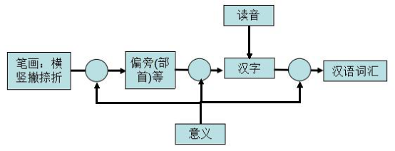

英语的编码过程是：由字母构成音素，再由音素构成词素，最后由词素构成单词。

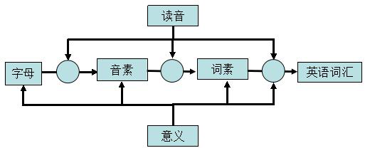

从这两条编码路径可以看出根本差异：**拼形文字的编码关键在字形，读音是后来强加的；拼音文字的编码关键在读音，意义主要是后来强加的。** 正因读音不参与汉语的编码，汉语在口语层容易分化出互不相通的方言，而字形作为编码主线，也使书法成为汉语特有的艺术形式；而英语中，语音起主导作用，构词法中词性的变化正来源于"意义参与词素至词汇的编码"这一过程。

理解一种语言，首先要厘清它赖以编码的底层架构。这本是学习英语的出发点，却被大多数学习者忽略了。

#### 2.3 现行记忆方式的误区

由于中国学生从小形成的拼形文字思维习惯，加之缺少英语语音环境，初学英语时往往把英语词汇看成形如数字的乱码加以记忆。很多学生未能总结出英语单词内在的构成规律，只能一味地把单词的读音、拼写和汉语意义强行结合起来记忆。

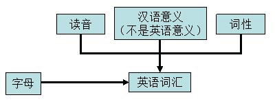

这种"硬性关联"的方式大大加重了学习负担。其后果有几个：单词缺乏层次感，不便于记忆；不能从字形上把握单词的大致词义、词性；单词的核心字母、核心音节不突出。

绝大多数英语词典不对单词作任何分割，只有极少数采用"音节划分"的方式。相比于音节划分，"前缀 + 词根 + 后缀"的构词法分割是另一种更合理且被普遍认可的划分方式，可惜几乎没有一本词典对单词进行系统全面的构词分割。

本方法的出路正在于此：按词意对单词进行词素划分，将少量具有固定样式的前缀和后缀分离出去，留下具有核心词义的词根；同时在字母上方标注音素符号，把发音规则也融入单词。这样，音、形、意三者便统一在同一个单词之中。

#### 2.4 一条"抓大放小"的学习路线

学好这套方法，不必一开始就钻进细节。有效的路线是**抓大放小**：先掌握主要的知识点，次要的先放一放。

具体而言，从 26 个字母入手学习英语单词的发音，由简入深。26 个英文字母可分为五个元音字母（A、E、I、O、U）、三个半元音字母（R、W、Y），其余 18 个为辅音字母。先把元音字母在开、闭、轻、弱四档节奏下的发音理清，再把常用前缀、后缀与词根的构成理清，单词的音与意便自然浮现。学会之后，甚至会感觉英语比拼音还要简单。

### 第 3 章　与国际音标 IPA 的对照

#### 3.1 国际音标的来龙去脉

19 世纪末期，西方语言学界为了克服当时注音方案的紊乱，讨论、制定了一套语音方案——**国际音标（IPA，International Phonetic Alphabet）**。国际音标的"国际"，指的是它能用于解释多国语言，并不是指它在解释英语上是"国际的"。到目前为止，国际音标共有 107 个单独字母，以及 56 个变音符号和超音段成分。

理解一样东西，最重要的是看它的目的。国际音标自己宣称的目的是：**为全世界所有语言注音**。它是一个面向所有语言——不论哪国语言、地方方言，还是非洲原始部落土语——的完整体系。若发现一个新的基本音，就创造一个新符号。因此，国际音标单纯描述文字的发音，根本不关心所谓的发音规则，也不关心字形和字意：只要音相同，就用同一个符号。

很多人有一个误解，以为国际音标是专门用来描述英语的。其实，很多英语国家根本不用国际音标解释英语单词发音。目的决定长短：**专注于语音，是它的优点，同时也是它的缺点。** 就像骆驼能吃到高处的叶子却钻不进门洞、羊能钻进门洞却够不到叶子一样，一定条件下，长处反而成了短处。

对于单纯地记忆英语单词而言，国际音标的不足是显而易见的：

- 它将发相同音的不同字母组合归结为同一个发音符号，易于导致拼写错误；
- 它的引入扰乱了原有的自然拼读思维秩序，割裂了单词音与形的联系；
- 它使学习者放弃了更为重要的发音规则。

中国目前对英语语音的解释主要采用国际音标。对于第二语言学习者记忆单词而言，这并不是一个很好的选择。

#### 3.2 读音解释的四种方法

要给一种语言的读音作解释，历史上共有四种方法。理清这四种方法，才能看清本书符号的位置：

| 方法 | 做法 | 代表 |
|---|---|---|
| **注音法** | 采用全新符号拼读 | 汉语拼音 |
| **重拼法** | 用原有、常见的符号代替要拼的符号，需要时加标记 | 美国传统字典 AHD |
| **直拼法** | 不替换字母，仅在原字母上添加标记 | 本书 IPS 符号 |
| **规则法** | 不用任何符号，仅依靠发音规则 | 德语 |

国际音标部分属于注音法、部分属于重拼法（例如 `phonetic` 标为 `[fə'netik]`，其中 f 代替 ph、netik 代替 netic 属于重拼，ə 代替 o 属于注音——凡是采用新符号皆属注音法）。

本书的音素符号属于**依据"规则法"创立的"直拼法"符号**：它不创造新字符、不替换字母，只在原字母上方加标记，音形一体。这正是一种较为适合英语单词读音解释的方式。

#### 3.3 重拼法与各大词典

英语长期被"音形不统一"所困扰，人们一直围绕如何解决单词发音问题争论不休，并创造了许多解释发音的符号。历史上重拼法符号繁多，最终得到普遍应用的却是国际音标。但国际音标引入了不少键盘上没有的特殊字符，对于想直接在单词上标注发音、并用键盘快速输入的学习者来说，并不算最便利。

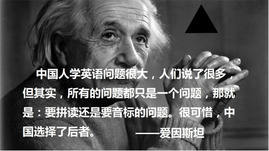

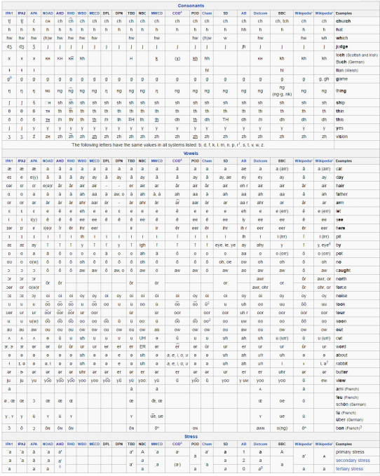

这汇总表涵盖了 IPA、AHD（美国传统字典）、COD（简明牛津字典）、BBC Phonetic Respelling 等近二十种方案。其中两种最值得英语学习者留意：

一是 **BBC Phonetic Respelling**。它最大的优点是**仅采用 26 个字母**表示，没有添加任何新东西。在打字时代，能由键盘直接输入是一大优势。

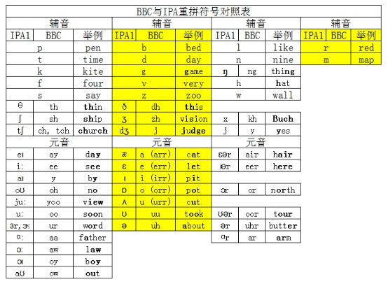

二是 **美国传统字典（AHD，American Heritage Dictionary）**。美国人习惯沿用本国标准，解释单词读音时不用国际音标，而用一种叫做 respell（重拼）的方法——用已有的发音组合代替要拼的单词（如 `great` 读作 `grate`，`night` 读作 `nite`）。

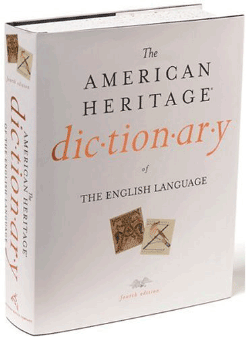

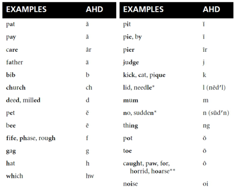

AHD 自己解释道：尽管 AHD 与 IPA 的符号相似，但它们并不完全相同，因为它们是 **for different purposes（为不同目的而设）**。AHD 的符号比 IPA 更直观：辅音尽量与辅音字母一致，不创造新符号；元音大致归类为——`—` 表示开音，`︶` 表示闭音，`ǝ` 表示短弱音，`ǝr` 表示长弱音，`∧` 表示重读的另外一些音。

以上四种方法，每一种都有优点和缺点，没有绝对的好坏，就看适不适用。BBC 符号胜在键盘友好，AHD 符号胜在直观，而本书的 IPS 符号胜在**可以直接标在单词上**——阅读时碰到生词，可直接在单词上方标符号提醒自己，而不必抄一长串国际音标。

#### 3.4 国际音标与本书符号的对照

将国际音标（IPA）与本书音素标注（IPS Notation）对照如下。从表中可以看出：本书音素标注不创造新字符，音形一体。记英语单词的关键，就在于将此表烂熟于心，并读准每一个单词。

| IPA | IPS Notation | IPA | IPS Notation |
|---|---|---|---|
| /p/ | [p] | **/æ/** | [a] |
| /b/ | [b] | /e/ | [e],[èa] |
| /t/ | [t] | /i/ | [i],[ẏ],[ė],[ėy],[ȧ],[u̇] |
| /d/ | [d] | **/ɔ/** | [o] |
| /k/ | [k],[c] | **/ʌ/** | [u],[ô],[ôu],[ôo] |
| /g/ | [g] | **/ei/** | [ā],[āi],[āy],[eā],[èy],[èi] |
| /f/ | [f],[ph],[gh] | **/i:/** | [ē],[ēe],[ēa],[ēi],[ēy],[iē],[ĩ] |
| /v/ | [v] | **/ai/** | [ī],[ȳ] |
| /s/ | [s],[c] | **/əu/** | [ō],[ōa],[ōw],[ōu],[e̊aù] |
| /z/ | [z],[ṡ] | **/ju:/** | [ū],[ew̅],[eū] |
| **/ð/** | [ṫh] | **/u:/** | [oo],[oū],[õ] |
| **/θ/** | [th] | **/u/** | [ù],[oo(k)],[oo(d)] |
| /m/ | [m] | **/a:/** | [àr],[à] |
| /n/ | [n] | **/au/** | [òu],[òw] |
| **/ŋ/** | [ng] | **/eə/** | [ār],[āir],[āer] ,[eār],[er] |
| /l/ | [l] | **/iə/** | [ēer],[ēar],[ēr] |
| /r/ | [r] | **/aiə/** | [īr] |
| /h/ | [h] | **/ɔ:/** | [or]=[ōr],[ōar],[ōur],[ōu(gh)],[ã(l)],[ãu],[ãw],[(w)ãr] |
| /w/ | [w] | **/uə/** | [ūr] |
| **/j/** | [y] | **/ə/** | [e̊], [å], [i̊], [o̊],[ů], [o̊u(s)] |
| **/ʃ/** | [sh],[ċh] | **/ə:/** | [e̊r],[år],[i̊r],[o̊r],[ůr],[e̊ar],[o̊ur],[e̊ur] |
| **/ʒ/** | [s̃] | **/ɔi/** | [oi],[oẏ] |
| **/tʃ/** | [ch],[tch] |  | |
| **/dʒ/** | [j],[g],[dg] | | |

> 注：表中**粗体**标记的 IPA 符号，为国际音标创造的额外符号（原资料中以红色标注）。

### 第 4 章　快速入门

第 3 章说明了 IPS 的定位——一种音形一体的直注式音标。本章用最短路径带你掌握 IPS 拼读：学完之后，大多数符合规则的单词都能"见词能读"。

**音形标注（IPS notation）** 属于一种直注式音标：在不改变单词拼写的情况下，通过在元音字母（以及少数辅音字母）上方标注符号来区别单词的不同读音，在简明性上优于国际音标（IPA）和其他重拼符号。

学习本章只需两个基础：掌握 26 个英文字母、学过汉语拼音（相当于小学二年级水平）。IPS 标注与国际音标一一对应，可相互转换；尚未掌握 IPA 不影响学习 IPS，若已掌握 IPA，则更能体会 IPS 的简明。

#### 4.1 四个节奏

音形意统一记忆法将单词主要元音的发音由"重"到"弱"分为四个节奏：开音节、闭音节、轻音节、弱音节。对应四个主符号：

| 节奏 | 符号 | 名称 | 发音 |
|---|:---:|---|---|
| 开音节 | ─ | 开音符 | 发所标元音字母的字母音 |
| 闭音节 | ∅ | 闭音符（空符） | 发该元音字母对应的闭音 |
| 轻音节 | ⦁ | 轻音符 | 全都发轻音 /i/ |
| 弱音节 | ○ | 弱音符 | 全都发弱音 /ə/ |

记忆口诀：**开横、闭空、轻点、弱圈**。

#### 4.2 五个元音字母 A E I O U

五个元音字母在四个节奏下各有发音，这是 IPS 拼读的核心，务必熟记。

**开音**（标横线 ─，发字母音）：

| 开音 | [ā] | [ē] | [ī] | [ō] | [ū] |
|---|---|---|---|---|---|
| 举例 | nāme | mē | līke | nō | ūse |

> 注：单词词尾的 e 字母不发音（如 name），除非全词只有一个音节（如 me）。

> **练习**
>
> 【拼读练习】
>
> cāpe nāme tāpe lāke gāme māke tāke hāte　mē bē fēte ēve wē
>
> bīte fīve nīne kīte mīne nīce rīde sīde　rōse nōse rōpe nōte pōse hōme rōde
>
> tūbe cūbe Jūne cūte hūge

**闭音**（不标符号 ∅，发短音）：

| 闭音 | [a] | [e] | [i] | [o] | [u] |
|---|---|---|---|---|---|
| 举例 | bat | bed | hit | dog | but |

> **练习**
>
> 【拼读练习】
>
> mat map bag cat hat fan bat apple　egg well red pen net hen bed bell
>
> lick six bib pig pin kiss ink hill　ox on box sock hot not bot
>
> sun cup bus nut gun

**轻音**（标圆点 ⦁，全读 /i/）：

| 轻音 | [ȧ] | [ė] | [i] | — | [u̇] |
|---|---|---|---|---|---|
| 举例 | imȧge | bėgin | lily | — | bu̇sy |

**弱音**（标圆圈 ○，全读 /ə/）：

| 弱音 | [å] | [e̊] | [i̊] | [o̊] | [ů] |
|---|---|---|---|---|---|
| 举例 | åbout | ope̊n | evi̊l | pro̊pel | sůpply |

#### 4.3 从 26 个字母读出辅音

通过 26 个字母的读音，就能直接掌握其中 16 个辅音：[b] [d] [f] [j] [ch] [k] [l] [m] [n] [p] [r] [s] [t] [v] [w] [z]。

| **A** | B | C | D | **E** | F | G |
|---|---|---|---|---|---|---|
| **[ā]** | [bē] | [sē] | [dē] | **[ē]** | [ef] | [jē] |
| H | **I** | J | K | L | M | N |
| [āch] | **[ī]** | [jā] | [kā] | [el] | [em] | [en] |
| **O** | P | Q | | **R** | S | T |
| **[ō]** | [pē] | [kū] | | **[àr]** | [es] | [tē] |
| **U** | V | W | | X | Y | Z |
| **[ū]** | [vē] | double-[ū] | | [eks] | [wī] | [zē] |

> 注：[j] 读作 /dʒ/；[ch] 读作 /tʃ/，与汉语拼音 ch 的发音不同；[y] 即国际音标中的 /j/，本方法还原其本来面目。表中**粗体**为元音字母行。

#### 4.4 两个元音字母组合

两个元音字母组合时，**哪个字母上方标横线，就读哪个字母的开音**。

| | -A | -E | -I | -O | -U |
|---|---|---|---|---|---|
| A- | | | [āi] | | **[ãu]** |
| E- | [ēa] | [ēe] | [ēi] | | [eū] |
| I- | | [iē] | | | |
| O- | [ōa] | | **[oi]** | **[oo]** | [ōu] |
| U- | | | [ūi] | | |

> 注：**oi、oo、au** 既不按前一个字母读，也不按后一个字母读，需单独记忆（表中以粗体标出）。

为便于记忆，可诵读这首《元音组合助记歌》：

> Rāin pãuse, sēe sēa　雨停了，看见大海
>
> Tōast food, but void sōul　烤着食物，心不在焉
>
> A piēce of frūit under Eūrop cēiling　一片水果，欧洲的天花板

> **练习**
>
> 【拼读练习】
>
> AI: tāil rāin pāint pāin jāil rāil nāil　AU: sãuse sãusȧge nãughtẏ ãutůmn
>
> EE: bēe pēel jēep fēet sēe tēeth　EA: sēa mēat pēanut ēagle pēach tēa lēaf pēa
>
> EI: cēil rėcēive co̊ncēit　IE: thiēf bėliēve piēce fiēld niēce
>
> OA: rōad tōast tōad cōal gōat bōat cōat sōap　OI: coin oil point noise boil soil poiso̊n coil
>
> OO: moon zoo roof rooste̊r boots food spoon room cool fool　OU: thōugh sōul shōulde̊r mōuld
>
> UI: sūit jūice frūit

> 说明：有些元音字母组合有多种发音（如 ea 可读 [ēa]/[eā]/[èa]，oo 可读 [oo]/[ôo] 等），需用波浪 ∼、长捺 ∖、尖角 ˄ 三个副符区分，详见第 5 章。

#### 4.5 I 和 U 的替身

字母 I 和 U 各有一个"替身"：I 的替身是 Y，U 的替身是 W。当它们以替身形式出现时，标注也随之替换。

| | 原符号 | 替代符号 | 例词 |
|---|---|---|---|
| i ⟹ y | [ī] | [ȳ] | flȳ |
| i ⟹ y | [i] | [ẏ] | lilẏ |
| ai ⟹ ay | [āi] | [āy] | sāy |
| ei ⟹ ey | [ēi] | [ēy] | kēy |
| ei ⟹ ey | [èi] | [èy] | thèy |
| au ⟹ aw | [ãu] | [ãw] | lãw |
| eu ⟹ ew | [eū] | [ew̄] | new̄ |
| ou ⟹ ow | [ōu] | [ōw] | slōw |
| ou ⟹ ow | [òu] | [òw] | còw |
| oi ⟹ oy | [oi] | [oẏ] | boẏ |

《替身字母歌》：

> Lilẏ flȳing　莉莉飞起来了
>
> Thèy sāy, kēy! new̄ lãw, slōw, còwboẏ　他们说：钥匙！新法规，慢点，牛仔

> **练习**
>
> 【拼读练习】
>
> AY: bāy rāy wāy sāy hāy pāy Māy lāy　EY: donkēy monkēy jockēy turkēy hockēy kēy trollēy
>
> OY: oẏste̊r boẏ còwboẏ soẏ toẏ　AW: pãw drãw sãw strãw strãwberrẏ lãwn
>
> OW: rainbōw pillōw yellōw windōw bōwl rōw hollōw lōw　OW: còw tòwel clòwn òwl cròwn bròwn flòwe̊r tòwe̊r

#### 4.6 元音字母 + R

字母 R 像"粘人的小弟弟"，爱与五个元音粘在一起，并使其前的元音发生轻微音变。

**开音 + R**：

| 开音+R | [ār] | [ēr] | [īr] | [ōr] | [ūr] |
|---|---|---|---|---|---|
| 举例 | cāre | hēre | fīre | fōre | dūre |

**元音组合 + R**：

| | [āir] | [eār] | [ēer] | [ēar] | [īr] | [ōar] | [ōur] |
|---|---|---|---|---|---|---|---|
| 举例 | hāir | weār | bēer | hēar | fīre | bōar | fōur |

**弱音 + R**：

| 弱音+R | [e̊r] | [i̊r] | [ůr] |
|---|---|---|---|
| 举例 | be̊rg | bi̊rd | bůrn |

**其他**：[àr] 如 càr；[or]=[ōr] 如 pork。

> 注：R 使其前的元音拉长或轻微音变，其发音机理详见第 5 章"流音"一节。

> **练习**
>
> 【拼读练习】
>
> AR: àrm càr càrd càrt fàrm pàrk gàrde̊n　ER: siste̊r brôthe̊r unde̊r rooste̊r winte̊r môthe̊r
>
> IR: ci̊rcůs di̊rtẏ bi̊rd ci̊rcle di̊rt gi̊rl　UR: tůrtle sůrfing tůrkėy fůr hůrt půrse nůrse
>
> OR: porch pork horse horn fort morning corn fork

#### 4.7 辅音字母与辅音组合

26 个字母之外，还有几个常用的辅音字母与组合需要掌握：

| | IPS | 例词 | 备注 |
|---|---|---|---|
| c | [k] | can | c 在 a, o, u, 辅音前，词尾 |
| c | [s] | cent | c 在 e, i, y 前 |
| g | [g] | go | g 在 a, o, u 前¹ |
| g | [j] | orange | 在 e, i, y 前，词尾 ge |
| th | [th] | think | |
| th | [ṫh] | ṫhis | 代词、冠词、介词、连词 |
| sh | [sh] | ship | |
| ch | [ch] | cheep | |
| ch | [ċh]=[sh] | maċhine | |
| tch | [tch]=[ch] | catch | |
| ph | [ph]=[f] | photo | |
| qu | [qu]=[kw] | quick | |
| ng | [ng] | king | |
| x | [ks] | excess | 词尾或后连辅音 |
| x | [gz] | exact | 后连元音 |

¹ 例外：eager, finger, gear, get, forget, together, altogether, gather, begin, give, gift, girl, linger, tiger

**辅音组合**（熟读）：

| bl- | cl- | fl- | gl- | pl- | sl- |
|---|---|---|---|---|---|
| br- | cr- | fr- | gr- | pr- | tr- | dr- |
| sc- | sk- | sm- | sn- | sp- | st- | sw- |
| scr- | spr- | str- | shr- | thr- | spl- | tw- |

> **练习**
>
> 【拼读练习】
>
> CH: bēach lunch chēese bench chůrch chickėn chāir cherrẏ　SH: shēep shi̊rt ship fish dish
>
> PH: phōtō elėphånt telėphōne trōphẏ phàrmåcẏ alphåbėt
>
> TH: brôṫhe̊r fèaṫhe̊r lèaṫhe̊r fàṫhe̊r môṫhe̊r　TH: thumb thrēe bath thi̊rstẏ thiēf mòuth tēeth
>
> BL: blūe black blòuse bloom blēach blank blonde　CL: clock clòud clēan clāy clīmb clōse clap clòwn
>
> BR: brook brim brīde bròwn brèad brick brôthe̊r　CR: cròwn crab crēam crōw crāyo̊n
>
> TR: tracto̊r truck trāin trāy trēe trīangle trunk trollėy　DR: drēam drum drẏ drop drãw drīve dress drink

> 说明：常见后缀（-ed、-s/-es、-tion 等）的发音，以及不发音字母的双线体标示，均有固定规则，详见第 5 章。

#### 4.8 学习思路：自上而下的金字塔

掌握了基本拼读，再回看本方法的学习思路，会更清楚自己所处的位置。

人类的知识体系像一座金字塔：底层知识支撑上层，越往上越抽象、越少，最顶尖只用一句话就能概括。学英语单词也有这样一座金字塔。

很多中国学生只学了最底层的 26 个字母，就开始记单词，随即陷入具体单词的汪洋，一直在最底层打转；由此衍生出形形色色的记忆法（谐音、联想、象形、分类、遗忘曲线……）。基础更好些的人能学到"前缀、词根、后缀"一层，豁然开朗之后又陷入新的困境——词根太多，音变似有规律又似无，市面上的词根书往往停留在归纳层面，缺少一条贯穿始终的统一规律。

在没有语音环境的前提下，本方法选择一条全新的道路——**自上而下**地学：

| 层次 | 内容 | 贯穿属性 |
|---|---|---|
| 第一层 | 重音 | 音 |
| 第二层 | 五个节奏 | 音 |
| 第三层 | 26 个字母 | 音、形、意 |
| 第四层 | 元音、辅音 | 音、形、意 |
| 第五层 | 前缀、词根、后缀 | 音、形、意 |
| 第六层 | 无穷无尽的具体单词 | 音、形、意 |

从山顶往下走，效率最高、最不易误入歧途。而且从头到尾，单词的三个属性——音、形、意——的规律是被打通的，就像三条滑梯顺流而下。正因为缺少语言环境的加持，我们更需要这样一套统一的逻辑规律来支撑，这个规律就是"音、形、意"的三角转换。若有语音环境双重加持，自然更好。

本书后续各篇，正是沿着这座金字塔自上而下展开：第二篇讲音（IPS），第三篇讲形意（ISM），第四篇讲音意（IPM），第五篇讲字母。

> **第 4 章一句概括**：四节奏入门，金字塔引路。

## 第二篇　音形统一 IPS

第一篇搭好了符号与概念的脚手架。从本篇起，我们沿第 4 章那座"金字塔"自上而下，依次打通单词三属性中的"音"。本篇讲**音形统一（IPS，Integrated Pronunciation and Spelling）**——用音素标注符号把发音规则直接融入单词，使拼与读合为一体。本篇共两章：第 5 章讲清发音规则背后的机理，第 6 章是配套的拼读练习与简易教程。

### 第 5 章　IPS 音形统一

每个英语单词都包含读音（Pronunciation）、字形（Spelling）、意义（Meaning）三个属性。本方法要求学习者在**准确发音**的基础上记忆单词，并在标注与拼读的过程中潜移默化地掌握语音规则。

准确发音是本方法的基础。要做到读准每一个元音和辅音——辅音相对容易，真正的难点在元音，学习者最常犯的错就是把不同的元音搞混。第 4 章已给出四节奏符号的速查表，本章则把符号背后的**机理与完整规则**讲透，使读者从"知其然"进到"知其所以然"。本章先讲前三节：重音与节奏、开音节与闭音节、基本元音与全部元音；流音、元音字母窜位、辅音、后缀及英美区别，放在本章后续各节。

#### 5.1 重音与节奏

要读懂一个英语单词的发音，首先要抓住它的**重音**。

重音指的是元音，而不是辅音；辅音只有与发重音的元音相拼，才能构成重音音节。国际音标用"ˈ"表示重音、"ˌ"表示次重音，而在本方法中，重音可由元音的类型自动区分，因此不再需要这两个符号。

重音之所以重要，是因为**重音的位置决定了单词中各个元音的拼读方式**。同一组字母，重音在前还是在后，读法往往截然不同。以前缀 com- 为例：重音落在 com- 上时读作 `[com-]`，如 comme̊nt；重音落在它之后时，com- 弱读为 `[co̊m-]`，如 co̊mmand。

从发音机理上看，重音就是**口腔紧张时**发出的元音——此时发音清晰、用力；与之相对，**口腔放松时**发出的元音便是弱音——发音模糊、省力。正因为发重音费力、发弱音省力，单词的前后音节通常不会一路重读到底，而以"重弱交替"的形式出现。这便是英语发音节奏的总根源：认识不到重音的重要性，便难以真正读懂英语单词的发音规律。

英语单词的重音位置有几条常见规律，可在记单词时逐步积累：

- **名词重音常在前，动词重音常在后**。如 record：作名词时重音在前，读作 `[ˈre-cord]`；作动词时重音在后，读作 `[rė-ˈcord]`。类似的还有 address、discount 等。
- **双音节词和三音节词的重音，常落在第一个音节**。
- **单词前若有前缀，前缀通常弱读**，重音落在词根第一个元音上，如 abˈout、beˈcause。
- **单词结尾若是 -ation，其中的 a 常重读**，如 transˈlation、pronunciˈation。

确定了重音位置，再依据"重弱交替"，大部分音节的重读与弱读便随之确定。

> **节奏：英语的"声调"**
>
> 汉语普通话有四个声调（阴平、阳平、上声、去声）外加一个轻声；方言里声调更多，上海话有六个，粤语多达九个。一种语言的声调越复杂，往往意味着它历史悠久、相互融合越深。英语单词也有高低起伏，但它与汉字"一字一调"的声调不是一回事：英语的起伏发生在**音节之间**，由重读与弱读的交替产生。为避免与汉语声调混淆，本书把英语这种重弱交替的高低起伏称为**节奏**。相较之下，英语的节奏比汉语的声调要简单。

从重到弱，英语单词的元音可排成一个由强到弱的顺序。理解这个顺序，就掌握了英语发音的总框架。

**元音重弱顺序表**

|  | 序号 | 名称 | 重弱情况 | 备注 |
|---|---|---|---|---|
| 重 | 1 | 开音（长音） | 重读 | ā, ē, ī, ō, ū 等 |
| ⇩ |  | 长弱（长音） | 重读 | å / e̊ / i̊ / o̊ / ů + r + 辅音 |
| ⇩ |  | 闭音（短音） | 重读 | a, e, i, o, u |
| ⇩ | 2 | 轻音（短音） | 重读或弱读 | ȧ, ė, i |
| ⇩ | 3 | 短弱（短音） | 弱读 | å / e̊ / i̊ / o̊ / ů（+ r + 元音） |
| 弱 | 4 | 不发音（无音） | 更弱 | 主要指词尾不发音的 e |

"重"与"弱"是相对概念：一个音遇到比自己重的音，它便是弱音；遇到比自己弱的音，它便是重音。一个单词通常只有一到两个音节重读，其余皆弱读；前缀和后缀常发弱音，发音较为固定。

英语单词的发音规则，归纳为四个字——**重、弱、开、闭**。"重"指重读，"弱"指弱读，"开"指开音节，"闭"指闭音节。考查全部单词可知，八成以上的单词都符合"重弱交替 + 开闭音节"的规则。记一个单词时，先确定它的重音音节，再按"重弱交替"推出弱读音节，然后判断重音是开音还是闭音，整个单词的读音轮廓便清晰了。对少数不符合一般规则的音节，专门留心即可显著提高记忆效率。

> **一句概括**：重、弱、开、闭——四字定乾坤。

#### 5.2 开音节与闭音节

大多数单词的发音都符合开音节与闭音节规则，少数不符合（如 have、change、waste、taste），记忆时注意区分即可。规则如表所示：

**开音节与闭音节规则**

|  | 规则 | 例词 |
|---|---|---|
| 开音节 | 元音结尾 | we, go |
|  | 元音字母 + 辅音字母¹ + 不发音 e 结尾（或 y 结尾） | name, lady |
|  | 元音字母 + 元音字母 + 辅音² | wait, meet |
| 闭音节 | 元音字母 + 辅音字母结尾 | net |
|  | 元音字母 + 两辅音字母 + 不发音 e 结尾 | solve |

¹ 可将 th、st、ng 组合看成一个辅音字母，这样 bathe、change、waste、taste 等就满足开闭音规则了。
² 此条规则中的元音字母组合见元音发音表；其中 R、W、Y 要与普通辅音字母区别对待——R 为翘舌，相当于长音；W 通 U，Y 通 I。而 `[èa]` 音可当作一个元音字母对待。

不发音的辅音字母在开闭音节规则中，视为没有该辅音字母。

> **一句概括**：元音收尾、静 e 垫尾为开；辅音堵口为闭。

#### 5.3 基本元音与全部元音

五个元音字母为 A、E、I、O、U，外加三个半元音字母 Y、R、W。这 8 个字母构成了元音的全部发音。下表是元音字母的基本发音表，列出了它们最规则、最常用的发音，务必熟记。

**元音字母基本发音表**

|  | A | E | I/Y | O | U |
|---|---|---|---|---|---|
| 开音 | [ā] | [ē] | [ī/ȳ] | [ō] | [ū]³ |
|  | late | me | nice | go | duty, blue |
| 闭音 | [a] | [e] | [i/ẏ] | [o] | [u] |
|  | bad | bed | sit | hot | but |
| 长弱音 | [år]⁴ | [e̊r] | [i̊r] | (w)[o̊r]⁵ | [ůr] |
|  | / | berg | bird | work | burn |
| 轻音 | [ȧ] | [ė] | [i/ẏ] | / | [u̇] |
|  | image | begin | lily | / | busy, minute |
| 短弱音 | [å] | [e̊] | [i̊] | [o̊] | [ů] |
|  | China | open | evil | compute | supply |
| 不发音 | 词尾不发音字母 e |  |  |  |  |
|  | name |  |  |  |  |

³ 开音节中，u 在 [j]、[l]、[r]、[sh]、[s̃]、[y] 后发 blue 中的 u 音，其余情况发 duty 中的 u 音，即在 [ū] 音前加 [y] 音，为 [yū] 音；[ū] 音在 [l]、[r]、[sh]、[ch]、[s̃] 前时发短音 [ù]，如 bull、full、pull、push。
⁴ 全部被 [àr] 取代，如 art。
⁵ 多数被 [or] 取代，如 force。

**弱音**：相比清晰、准确的开音和闭音这类重音，弱音便是随意、模糊、放松。开音和闭音是重要音节，弱音便是不重要音节。弱读的意义在于省力、休息、过渡、流畅。长弱音和短弱音都是弱音：所谓"长弱"，指 r 字母（当 r 后为辅音时）使弱音拉长，使原本的弱音具有了类似开音的长音；所谓"短弱"，指没有 r 字母，或 r 后紧跟其他元音（词尾不发音的 e 也算元音，如 culture），此时 r 成为与其后元音相拼的辅音字母。

**轻音**：轻音比重音弱一点，又比弱音重一点；它既可看作重音，也可看作弱音。

**元音的发音机理**

光记住元音表还不够。要真正发准每个元音，最好理解它背后的发音机理——元音之间的差别，本质上来自发音时**舌头在口腔中的位置**和**嘴张开的程度**。

国际音标有一张著名的"元音舌位图"（梯形图），它把每个元音按两个维度排列：一是**开闭**，即嘴张开的程度——越靠上张口越小，越靠下张口越大；二是**前后**，即舌头的位置——嘴角往两边拉时舌头前移，嘴往里收时舌头后缩。

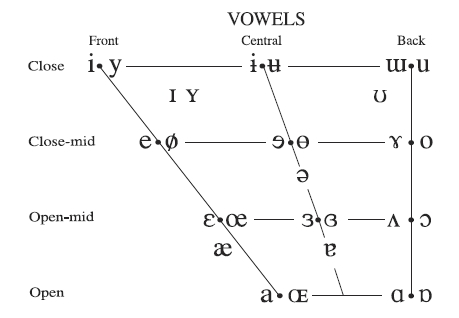

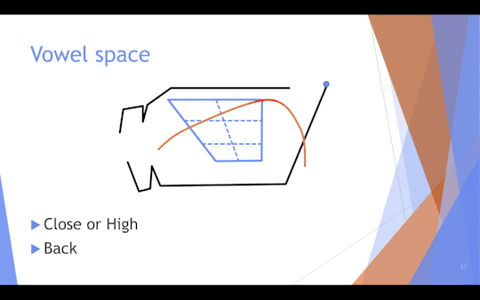

去掉英语用不到的符号后，分别用 DJ 音标和 KK 音标表示如下：

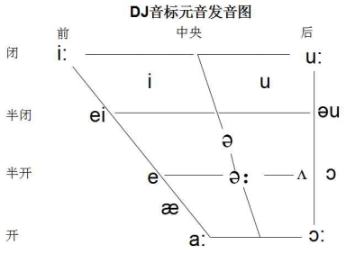

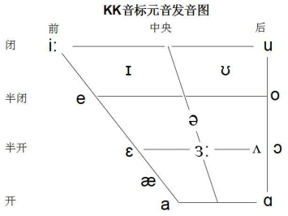

掌握这张图，抓住两个要领——开闭与前后。先看梯形四个角的四个极端元音：

- `/i:/`——嘴尽量往两边拉，舌头前伸，像使劲咧嘴笑；
- `/a:/`——嘴尽量张大，舌头放平，像医生检查喉咙时让你"啊"地张嘴；
- `/u:/`——嘴唇收圆前突，像用力吹口哨；
- `/ɔ:/`——嘴张大但不往两边拉，舌头后缩，像喉咙里卡了一根鱼刺。

这四个音发音最费力，连续发上几个小时，两腮会酸。学完四个最费力的，再学一个最省力的：

- `/ə/`——嘴既不张大也不张小，既不往两边拉也不往里收，舌头既不前伸也不后缩。什么都不必做，嘴轻轻张开，/ə/ 一声送出，非常轻松。

其余元音，在这几个极端之间取中间值即可。关键是嘴形和舌头都要到位，需反复练习。若想逐个元音对照口型动画练习，可参考爱荷华大学的 "Sounds of Speech" 互动网站（soundsofspeech.uiowa.edu/english）。

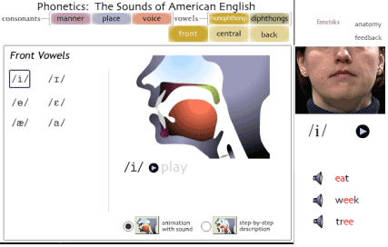

理解了这个机理，也就明白了本书为何把元音由重到弱分为"开、闭、轻、弱"四档：开音张口变化大、用力而清晰，弱音张口放松、模糊而省力，正是舌位与开口程度在重弱上的体现。

**全部元音**

在基本元音表的基础上扩展，便得到完整的元音对照表。下表给出每个国际音标（IPA）对应的本方法音素标注（IPS Notation），供读者全面对照。

**元音扩展表（IPA ↔ IPS）**

| IPA | IPS Notation | 例词 |
|---|---|---|
| /æ/ | [a] | bad |
| /e/ | [e], [èa] | bed, head |
| /i/ | [i], [ẏ], [ė], [ėy], [ȧ], [u̇] | sit, system, pretty, honey, damage, minute |
| /ɔ/ | [o] | hot |
| /ʌ/ | [u], [ô], [ôu], [ôo] | but, love, enough, blood |
| /ei/ | [ā], [āi], [āy], [eā], [èy], [èi] | late, wait, say, great, they, weight |
| /i:/ | [ē], [ēe], [ēa], [ēi], [ēy], [iē], [ĩ] | me, meet, mean, receive, key, belief, routine |
| /ai/ | [ī], [ȳ] | nice, fly |
| /əu/ | [ō], [ōa], [ōw], [ōu], [e̊aù] | go, road, slow, though, bureau |
| /ju:/ | [ū], [ew̅], [eū] | duty, new, Europe |
| /u:/ | [oo], [oū], [õ] | tool, group, do |
| /u/ | [ù], [oo(k)], [oo(d)] | put, look, good |
| /a:/ | [àr], [à] | dark, ask |
| /au/ | [òu], [òw] | loud, cow |
| /eə/ | [ār], [āir], [āer], [eār], [er] | care, fair, aerate, wear, there |
| /iə/ | [ēer], [ēar], [ēr] | beer, hear, here |
| /aiə/ | [īr] | fire |
| /ɔ:/ | [or]=[ōr], [ōar], [ōur], [ōu(gh)], [ã(l)], [ãu], [ãw], [(w)ãr] | port, fore, board, your, bought, tall, author, law, war |
| /uə/ | [ūr] | during |
| /ə/ | [e̊], [å], [i̊], [o̊], [ů], [o̊u(s)] | about, open, evil, propel, supply |
| /ə:/ | [e̊r], [år], [i̊r], [o̊r], [ůr], [e̊ar], [o̊ur], [e̊ur] | her, collar, first, word, occur, learn, colour |
| /ɔi/ | [oi], [oẏ] | oil, enjoy |

> **一句概括**：基本元音五个字母，扩展元音一张表；机理在舌位，口诀在四档。

#### 5.4 流音

流音（liquid）指字母 R 和字母 L 所发的音。这两个字母之所以特殊，在于它们的发音特点：**极易与辅音和元音结合**。正因如此，它们对相邻元音的影响格外显著——既能使元音拉长，也能使元音发生轻微音变。

**流音 R 的发音规则**

- -rr- 读作 `[r]`，如 merry。
- 弱元音或辅音 + r，读 `[r]`，如 facto̊ry、drive。
- 强元音 + r，读 `[e̊]`（因伴有翘舌，使元音发生轻微音变），如 dare、here、fire、during。
- 弱音 + r + 辅音，因伴有翘舌使弱音拉长，如 verge、birth、storm、burst。

**流音与强元音的结合**

流音 R 与元音结合的发音，在元音表中已有体现。R 发音时伴有翘舌，能使原有元音拉长或轻微音变；流音 L 也有同样功能。例如：

- `[ōr]`、`[ōar]`、`[ōur]` 受 R 影响听起来像 `[or]`（`[o]` 音拉长），如 po̊re、boård。
- `[ār]`、`[āir]`、`[āer]`、`[eār]` 受 R 影响听起来像 `[er]` 音，如 cāre、āir、beār。

**长音短化**

长音短化，指长元音后紧跟流音 `[l]`、`[r]` 或弱音时，受其影响使长元音听起来变短。由于流音 `[l]`、`[r]` 和弱音本身就有拉长作用，当它们与长元音结合时，长元音自然短化，以免整个音节发音过长。

**流音与辅音结合**

流音 L 和 R 也常与辅音结合，构成辅音组合，详见 5.6 节辅音组合表。

> **一句概括**：流音 R、L 能拉长元音、引发音变，长音遇之则短化。

#### 5.5 元音字母窜位与不发音元音

**元音字母窜位**

元音字母窜位，指其他的元音字母取代"本该发音"的元音字母而起发音作用。窜位的主要原因有两个：一是单词读音发生了变化，但字形没有跟着改变；二是外来词。窜位的主要情况如表：

**元音字母窜位情况表**

| 元音字母 | 窜位情况 | 例词 |
|---|---|---|
| E 窜 A | èy, èi | they, eight |
| I 窜 E | ĩ | ski, police |
| A 窜 O | ã(l), ãu, ãw, ãr | all, auto, law, war |
| O 窜 U | ô, ôu, oo / õ | love, double, blood, book, do |

**不发音元音**

在一个元音字母组合中，通常有一个对发音起主导作用的元音字母，如 mēan 中的 e 字母——本方法认为 ēa 组合共同发 ē 音；而如 b𝕦ild，本方法将 u 视作不发音。

字母 e 位于词尾时一般不发音，为简便起见省略双线体标示；e 位于词中却不发音时，用双线体标出，如 nam𝕖ly、chang𝕖able、h𝕖art、for𝕖in、for𝕖iner、pig𝕖on、g𝕦itar、q𝕦eue、fr𝕚end。实际上，除 re-、de- 等前缀外，凡是出现 xxxx e - xxxx 或 xxxx e 的形式，e 均不发音，如 for𝕖-i𝕘n、clos𝕖-ly、pig𝕖-on；而 re-cord 中的 re- 是前缀，e 是发音的。

gu 组合中，u 常不发音，如 g𝕦ess、fatig𝕦e。此时 g 后紧跟的是不发音的 u 而非 e，因此 g 发 `[g]` 而不发 `[j]`。qu 组合中，若 u 不发音，则 q 单独发 `[k]`，如 q𝕦eue、cheq𝕦e。

> **一句概括**：窜位是"音变形不变"，不发音元音用双线体标出。

#### 5.6 辅音与辅音组合

为使辅音字母与辅音音素书写一致，本书中 `[ch]` 表示 /tʃ/、`[j]` 表示 /dʒ/、`[y]` 表示 /j/、`[th]` 表示 /θ/、`[ṫh]` 表示 /ð/ 等。辅音发音的详细规则如表，其中**粗体**标出的是需单独记忆的例外发音。

**辅音音素发音规则表（清浊对照）**

| 清辅音 | 字母 | 例词 | 浊辅音 | 字母 | 例词 | 说明 |
|:---:|---|---|:---:|---|---|---|
| [p] | p | pen | [b] | b | bed | |
| [t] | t | time | [d] | d | day | |
| [k] | k / c | kite / can | [g] | g | go | k 用于 a,o,u,辅音前或词尾；c 在 e,i,y 前发 [s] |
| [f] | f / ph / gh | four / photo / tough | [v] | v | very | |
| [s] | s / c | say / cent | [z] | z / **ṡ** | zoo / rise | **ṡ** 用于元音或浊辅音后 |
| [th] | th | think | [ṫh] | **ṫh** | this | **ṫh** 用于代词、冠词、介词、连词 |
| [sh] | sh / **ċh** | ship / machine | [s̃] | **s̃** | vision | **ċh** 见于少数词；**s̃** 见于特殊后缀 |
| [ch] | ch / tch | cheap / catch | [j] | j / g(*) / dg | jeep / orange / judge | g(*) 在 e,i,y 前发 [j] |
| [h] | h | his | [l] | l | like | |
| [kw] | qu | quiet | [m] | m | map | |
|  |  |  | [n] | n | nine | |
|  |  |  | [ng] | ng | king | ng 中 n 在 [k] 前 |
|  |  |  | [r] | r | red | |
|  |  |  | [w] | w | wall | |
|  |  |  | [y] | y | yes | y 在词首 |
| [ks] | x | excess | [gz] | **ẋ** | exact | x 词尾/辅音前发 [ks]，元音前 **ẋ** 发 [gz] |

(*) eager、finger、gear、get、forget、together、altogether、gather、begin、give、gift、girl、linger、tiger 等为例外（g 在 e,i,y 前仍发 `[g]`）。两个相同辅音重叠时只发一个辅音，如 kick、scent、little。

**辅音组合**

辅音组合与辅音一样，都带有某些原始的、不可言状的内涵；学习者在记忆大量单词后自能体会——比如 fl- 有流动、飞、松弛之意，fr- 有裂开、冷、磨损之意，tw- 有扭曲之意。需要说明的是，这类联想属于"只可意会"的体会，并非严格的科学规律。常用辅音组合如表：

**常用辅音组合**

|  | 辅音组合 |
|---|---|
| 辅音 + l | bl-, cl-, fl-, gl-, pl-, sl- |
| 辅音 + r | br-, cr-, fr-, gr-, pr-, tr-, dr- |
| s + 辅音 | sc-, sk-, sm-, sn-, sp-, st-, sw- |
| 三辅音 | scr-, spr-, str-, shr-, thr-, spl- |
| 其他 | tw- |

> **一句概括**：辅音清浊成对，例外（粗体）单独记；组合有内涵，只可意会。

#### 5.7 后缀发音与不发音辅音

**后缀 -ed 的发音**

-ed 与 -s/-es 的发音都有固定规则。本书虽然给出不同标注，但为了简便，也可不标注。

| -ed 的发音规则 | 例词 |
|---|---|
| 在浊辅音和元音后，[𝕖d] ⟹ [d] | call𝕖d, borrow𝕖d, mov𝕖d |
| 在清辅音后，[𝕖ḋ] ⟹ [t] | ask𝕖ḋ, finish𝕖ḋ, help𝕖ḋ |
| 在 [t] 音后，[ėd] ⟹ [id] | wantėd, startėd |
| 在 [d] 音后，[ėd] ⟹ [id] | needėd, countėd |

**后缀 -s / -es 的发音**

|  | -s(-es) 的发音规则 | 例词 |
|---|---|---|
| 辅音后 | [s]、[z]、[sh]、[s̃]、[ch]、[j] 音后加 -es，读 [ėṡ] ⟹ [iz] | glassėṡ, buzzėṡ, washėṡ, teachėṡ |
|  | 清辅音后加 s，读 [s] ⟹ [s] | books, typ𝕖s |
|  | 浊辅音后加 s，读 [ṡ] ⟹ [z] | bagṡ, lin𝕖ṡ, besid𝕖ṡ |
| 元音后 | 字母 o 后加 -es，读 [𝕖ṡ] ⟹ [z] | tomato𝕖ṡ, potato𝕖ṡ, do𝕖ṡ |
|  | -y 改 i 加 -es，读 [𝕖ṡ] ⟹ [z] | ladi𝕖ṡ, fli𝕖ṡ |
|  | 其他，读 [ṡ] ⟹ [z] | newṡ, dayṡ, boyṡ, beeṡ |

另外一些后缀，如 -ly、-ous、-ity 等，发音都符合规则；本书虽给出标注，但由于它们的发音彼此一致，为简便起见也可不标注。

**特殊后缀的发音**

一些常用后缀的发音较为特殊，但规律相同，熟记即可。为简便起见，本书省略其语音标注。

| 特殊后缀 | 读音 | 例词 |
|---|---|---|
| -sion, -tion | -sho̊n | impression, nation |
| 元音字母 + -sion | -s̃o̊n | vision, decision |
| -s-tion | -s-cho̊n | question, suggestion |
| -sure | -shůre | pressure |
| 元音字母 + -sure | -s̃ůre | pleasure, measure |
| -dure | -dgůre | procedure |
| -ture | -chůre | picture, culture |
| -tiate | -shiāte | initiate, negotiate |
| -tial | -shål | partial |
| -tuous | -chūo̊us | virtuous |
| -cious | -sho̊us | delicious, precious |
| -cial | -shål | official, racial |
| -ceous | -sho̊us | herbaceous, curvaceous |
| -cient | -she̊nt | ancient |
| -ciency | -shency | efficiency, proficiency |

**不发音辅音字母**

对不发音的字母，可采用删除线、斜划线、下方加点等多种方式表示。本书为醒目起见，采用**双线体（黑板体）**标示；若学习者已熟记这些不发音字母，也可不标示。常见的不发音辅音如表：

| 组合 | 例词 |
|---|---|
| 𝕙 | 𝕙our, 𝕙onour |
| c𝕙 | mec𝕙anic, C𝕙rist |
| 𝕘𝕙 | li𝕘𝕙t, hi𝕘𝕙, ei𝕘𝕙t, si𝕘𝕙t, ni𝕘𝕙t |
| g𝕙 | g𝕙ost |
| r𝕙 | r𝕙yme, r𝕙ythm |
| 𝕘n | 𝕘nat, si𝕘n |
| 𝕜n | 𝕜nife, 𝕜now, 𝕜nee, 𝕜nock |
| m𝕓 | com𝕓, lam𝕓, thum𝕓, dum𝕓, clim𝕓 |
| 𝕡n | 𝕡neumonia |
| 𝕡s | 𝕡sychology |
| 𝕨r | 𝕨rong, 𝕨rist, 𝕨rite, 𝕨rap, 𝕨retch, 𝕨rench |
| 𝕨h | 𝕨ho, 𝕨hose |
| w𝕙 | w𝕙at, w𝕙en, w𝕙ere, w𝕙y |
| -is𝕥- | lis𝕥en, c𝕙ris𝕥en, c𝕙ris𝕥mas, whis𝕥le |
| 𝕤 | i𝕤land |

> **一句概括**：后缀 -ed/-s 看前后音，特殊后缀熟记；不发音辅音双线体一目了然。

#### 5.8 美国英语与英国英语的区别

美国英语与英国英语的区别，概括为一句话：**美国英语比英国英语更规则**。

**在书写上**

美式拼写倾向于去掉不发音字母和多余字母，并统一某些字母组合：

| 英语 | 美语 | 说明 |
|---|---|---|
| catalogue | catalog | 去掉不发音字母 |
| kilogramme | kilogram | 去掉多余字母 |
| programme | program | 去掉多余字母 |
| cigarette | cigaret | 去掉多余字母 |
| judgement | judgment | dg 发 [j]，可去掉字母 e |
| acknowledgement | acknowledgment | dg 发 [j]，可去掉字母 e |
| honour | honor | 去掉多余字母 |
| labour | labor | 去掉多余字母 |
| jewellery | jewelry | 去掉不发音字母 |
| woollen | woolen | 非重读闭音节，不重写 |
| traveller | traveler | 非重读闭音节，不重写 |
| cheque | check | 用另一字母组合代替相同发音 |
| aeroplane | airplane | 用另一字母组合代替相同发音 |
| centre | center | 用 -er 代替 -re |
| fibre | fiber | 用 -er 代替 -re |
| metre | meter | 用 -er 代替 -re |
| theatre | theater | 用 -er 代替 -re |
| defence | defense / defence | 二者皆可 |
| offence | offense / offence | 二者皆可 |
| licence | license / licence | 二者皆可 |
| pretence | pretense / pretence | 二者皆可 |

**在发音上**

1）美语中 a 字母不发 `[à]` 音：

| 英语 | 美语 |
|---|---|
| àsk | ask |
| dànce | dance |
| fàst | fast |
| hàlf | half |
| pàth | path |

2）美语中 i 字母不发 `[ĩ]` 音：

| 英语 | 美语 |
|---|---|
| sàrdĩne | sàrdine |
| roūtĩne | roūtine |
| magåzĩne | magåzine |
| po̊lĩce | po̊lice |
| lĩte̊r | lite̊r |

3）美语喜欢把卷舌音（r）发出：

| 英语 | 美语 |
|---|---|
| car | ca𝓻 |
| door | doo𝓻 |
| river | rive𝓻 |
| party | pa𝓻ty |
| board | boa𝓻d |
| dirty | di𝓻ty |
| morning | mo𝓻ning |

4）英语通常"一弱到底"，美语在词尾还会起重音，更符合"重弱交替"规则：

| 英语 | 美语 |
|---|---|
| dictio̊nårẏ | dictio̊narẏ |
| labo̊råto̊rẏ | labo̊råtorẏ |
| necėssårilẏ | necėsarilẏ |
| prėparåto̊rẏ | prėparåtorẏ |
| secre̊tårẏ | secre̊tarẏ |

5）其他：

| 英语 | 美语 |
|---|---|
| clerk（er 发 àr 音） | cle̊rk |
| eīthe̊r | ēithe̊r |
| neīthe̊r | nēithe̊r |
| lèisure | lēisure |

> **背景：元音大推移（The Great Vowel Shift）**
>
> 英语拼读之所以如此复杂，与一次历史性的语音变迁密切相关。丹麦语言学家奥托·叶斯柏森（Otto Jespersen）发现，从 14 世纪起英语发生了一次大规模的语音转变，并一直持续到 16 世纪：**绝大多数元音（尤其是长元音）都发生了变化，而辅音基本不变**，史称"元音大推移"。
>
> 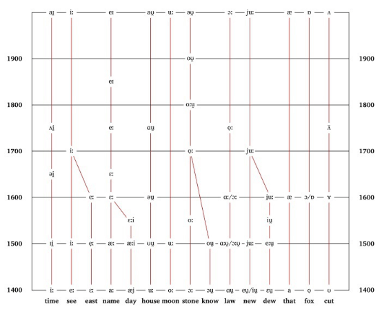
>
> 这正应了那句话——"元音动若流水，辅音静若磐石"：元音靠口型与舌位决定，极易被改变；辅音相对稳定。少数超级常用的词，如 father 的 a、to 和 do 的 o，因太过深入人心，连元音大推移也未能撼动。15 世纪中叶以后，活字印刷术使英语拼写逐渐固定，语音变迁随之趋缓。理解了这段历史，便更能体会本书用符号直接标注读音的用意——字形早已凝固，而读音需要被重新点亮。

**见词识音：本方法的最终目标**

学完以上规则，便回到了本方法的最终目标——**见词识音**：看到一个单词，不查词典就能读出它的发音。要做到这一点，需把握三个要点：

1. **重音是单词的灵魂**——先确定重音位置；
2. **掌握五个节奏**——开音、长弱、闭音、轻音、短弱，由重到弱；
3. **系统归纳同一发音的不同字母组合**，并牢记在心，如同背九九乘法口诀。例如 a、ai、ay、ea、ey、ei 六种字母组合都可能发 `[ā]`（/ei/）音；e、ee、ea、ei、ey、ie、i 七种字母组合都可能发 `[ē]`（/i:/）音。

以 meet 为例：看到这个词时，不止于认读音标，而要这样分解并记住——字母 m 发 `[m]`，字母组合 ee 发 `[ē]`（永远记住 ee 发 `[ē]`），字母 t 发 `[t]`。如此举一反三，看到 need 便能直接读出。

**为什么用直注，而非音节划分**

面对"单词该怎么读"的问题，传统做法之一是"音节划分"。然而音节划分有一个根本局限：**它依赖于事先知道单词的读音**。要判断一个音节是开音还是闭音，必须先知道其中元音发什么音；可这恰恰是初学者所不知道的。于是陷入循环——要拼读，先要划分；要划分，先要会读。正因如此，绝大多数英语词典并不做音节划分。

本方法选择另一条路：**用音素符号直接把读音规则标注在单词上**（IPS 音形标注），让规则融入字形本身，从而真正实现见词识音。至于从"意"的角度对单词作词素划分（前缀 + 词根 + 后缀），则是第三篇形意统一（ISM）的主题。

> **第 5 章一句概括**：重、弱、开、闭四字立纲，直注一行见词识音。

### 第 6 章　拼读练习与简易教程

第 5 章把发音规则讲透了，本章把这些规则落地——学会由字母"拼读"出单词。对中国学习者而言，有一个得天独厚的优势：**汉语拼音**。拼音与英语同属拼音文字的底层逻辑，拼音学得好的人，英语也没理由学不好。本章先打通拼音到英语的桥梁，再按 26 个字母顺序做拼读练习，最后用一个完整的例子把音、形、意三方面贯通起来。

#### 6.1 从汉语拼音到英语

汉语拼音是一个巨大的宝库。许多人拼音学得不错，英语却一直没起色，多半只是还没找到两者之间的门道。打通这层窗户纸，是本章的第一步。

先看 26 个字母的发音对比（英语字母上方的横线表示读该字母的本身音）：

**26 个字母发音对比（汉语 / 英语）**

| | A | B | C | D | E | F | G |
|---|---|---|---|---|---|---|---|
| 汉语 | [a]啊 | [bo]玻 | [ci]雌 | [de]得 | [e]鹅 | [fo]佛 | [ge]哥 |
| 英语 | [ā] | [bē] | [sē] | [dē] | [ē] | [ef] | [jē] |

| | H | I | J | K | L | M | N |
|---|---|---|---|---|---|---|---|
| 汉语 | [he]喝 | [i]衣 | [ji]基 | [ke]科 | [le]勒 | [mo]摸 | [ne]讷 |
| 英语 | [āch] | [ī] | [jā] | [kā] | [el] | [em] | [en] |

| | O | P | Q | R | S | T |
|---|---|---|---|---|---|---|
| 汉语 | [o]喔 | [po]坡 | [qi]欺 | [ri]日 | [si]思 | [te]特 |
| 英语 | [ō] | [pē] | [kū] | [àr] | [es] | [tē] |

| | U | V | W | X | Y | Z |
|---|---|---|---|---|---|---|
| 汉语 | [u]乌 | [vi] | [wu]乌 | [xi]希 | [yi]衣 | [zi]资 |
| 英语 | [ū] | [vē] | [double-ū] | [eks] | [wī] | [zē] |

这张表不必死记，一个个慢慢看即可。关键在五个元音字母 A、E、I、O、U（汉语还有 ü）：

| | A | O | E | I | U | ü |
|---|---|---|---|---|---|---|
| 汉语 | [a]啊 | [o]喔 | [e]鹅 | [i]衣 | [u]乌 | [ü]迂 |
| 英语 | [ā] | [ō] | [ē] | [ī] | [ū] | — |

真正有意思的对比，是汉语的四声与英语的四档重弱：

| | | A | O | E | I | U |
|---|---|---|---|---|---|---|
| 汉语 | 第一声 | [ā] | [ō] | [ē] | [ī] | [ū] |
|  | 第二声 | [á] | [ó] | [é] | [í] | [ú] |
|  | 第三声 | [ǎ] | [ǒ] | [ě] | [ǐ] | [ǔ] |
|  | 第四声 | [à] | [ò] | [è] | [ì] | [ù] |
| 英语 | 开音 | [ā] | [ō] | [ē] | [ī] | [ū] |
|  | 闭音 | [a] | [o] | [e] | [i] | [u] |
|  | 轻音 | [ȧ] | — | [ė] | [i] | — |
|  | 弱音 | [å] | [o̊] | [e̊] | [i̊] | [ů] |

发现了没有？**英语似乎比汉语拼音还要简单**。汉语一个元音要分四个声调，而英语只需用四种符号区分"开、闭、轻、弱"——开音标一横（长音），闭音不标，轻音标一点，弱音标一圈。这正是本书符号的设计初衷：用最简洁的标记，把四档节奏区分清楚。

辅音方面，汉英两套系统重合度极高。绝大多数辅音，拼音与英语的发音部位相同，只是后面拖的元音不同——比如 B，拼音读 `[bo]`（玻），英语读 `[bē]`，前头的辅音 `[b]` 是一样的。下面这些辅音，汉英发音基本一致：b、p、m、f、d、t、n、l、g、k、h。英语特有的、需专门练习的辅音主要是 `[v]`、`[th]`、`[ṫh]`、`[ch]`、`[sh]` 等。

找到了这层门道，便能把汉语拼音的功底直接迁移到英语上。当然，光理解原理还不够，还要用 IPSM 把具体单词操练起来。

> **一句概括**：拼音为桥，四声换四档；辅音多同，元音重新标。

#### 6.2 26 个字母的拼读

有了拼音这座桥，下面按 26 个字母的顺序，再次梳理每个字母的发音，说明如何由字母"拼读"出单词。这一节可作速查之用：遇到拿不准的字母，按字母查阅即可。其中绝大多数辅音与汉语拼音发音相同，重点放在元音字母及其组合上。

**A**　开音 `[ā]`：nāme；开音组合 `[āi]`、`[āy]`：rāin、wāy；其他组合 `[ãu]`、`[ãw]`：sãuse、lãw；闭音 `[a]`：bad；`[à]` 音：clàss、glàss；`[àr]` 音：càr；短弱音 `[å]`：åbòut；轻音 `[ȧ]`：imȧge。

**B**　与汉语拼音 `[b]` 发音相同。

**C**　c 在 a、o、u 前和词尾发 `[k]`；c 在 e、i、y 前发 `[s]`；ch、tch 组合发 `[ch]`，如 chip、catch；ch 组合极少数情况发 `[sh]`，如 machine、chicago。

**D**　与汉语拼音 `[d]` 发音相同；dg 组合发 `[j]`，如 judge。

**E**　开音 `[ē]`：mē；元音组合 `[ēe]`、`[ēa]`、`[iē]`、`[ēi]`、`[ēy]`；闭音 `[e]`：bed；长弱 `[e̊r]`：berg；短弱 `[e̊]`（/ə/）；轻音 `[ė]`：begin；无音：词尾 e 通常不发音。

**F**　与汉语拼音 `[f]` 发音相同。

**G**　g 在 a、o、u 前和词尾发 `[g]`；g 在 e、i、y 前发 `[j]`，少数高频词例外仍发 `[g]`，如 get、girl、tiger、begin、finger、forget、give；gh 组合通常不发音（如 light），极少数发 `[f]`（如 laugh、tough）；ng 组合发 /ŋ/，如 king。

**H**　与汉语拼音 `[h]` 发音相同；个别单词 h 不发音，如 what、hour。

**I**　开音 `[ī]`：nice；闭音 `[i]`：sit；长弱 `[i̊r]`：bird；短弱 `[i̊]`：evil；轻音 `[i]`：lily；长音 `[ĩ]`：police。

**J**　与汉语拼音 `[j]` 发音相同。

**K**　与汉语拼音 `[k]` 发音相同；以 kn 开头的单词 k 不发音，如 knife。

**L**　与汉语拼音 `[l]` 发音相同。

**M**　与汉语拼音 `[m]` 发音相同。

**N**　与汉语拼音 `[n]` 发音相同。

**O**　开音：go；开音组合 `[oa]`、`[ow]`；闭音：hot；长弱：多被取代而发 /or/，如 force；短弱：/ə/；组合元音 `[oo]`；`[ou]`、`[ow]`：loud、cow；`[oi]`、`[oy]`：oil、boy。

**P**　与汉语拼音 `[p]` 发音相同；ph 组合发 `[f]`，如 photo。

**Q**　qu 组合常位于词首，发音为 /kw/。

**R**　与汉语拼音 r 发音相同；开音 + R：a、e、i、o、u 与 r 组合为 ar、er、ir、or、ur；闭音 + R、弱音 + R 的发音详见第 5 章流音一节。

**S**　与汉语拼音 s 发音相同；也发 `[z]` 音；sh 组合发 `[sh]`；作为后缀（如 -sion、-sure），发音固定，熟记即可。

**T**　与汉语拼音 t 发音相同；th 组合多数发 `[th]`（如 thing），在介词、冠词、代词、连词等少数词中发 `[ṫh]`（如 the、they）；作为后缀（如 -tion、-ture），发音固定，熟记即可。

**U**　开音：发 /ju:/（如 duty），但在 L、R 字母后发 /u:/（如 blue、ruler）；组合：ui、eu、ew；闭音：but；长弱：burn；短弱：/ə/；轻音：极少，如 busy、minute。

**V**　发 `[v]`，如 very。

**W**　作辅音时与汉语拼音 `[w]` 相同；作元音时相当于 u 字母；组合：aw、ew、ow。

**X**　在辅音前发 `[ks]`；在元音前发 `[gz]`；在词首发 `[z]`。

**Y**　作辅音时发 `[y]`，如 yes；作元音时相当于 i 字母。

**Z**　与汉语拼音 z 发音相同。

> **一句概括**：辅音借拼音，元音看四档；按字母速查，拼读自通。

#### 6.3 一个完整的例子：abandon

前面分别讲了规则（第 5 章）和拼读（6.1、6.2），本节用一个完整的例子，把音、形、意三方面贯通起来。以大家熟悉的 abandon 为例，它在音形意统一记忆法中的标注形式是：

**å-band-o̊n**

这个词被划分为 a-（前缀）+ band（词根）+ -on（后缀）三段，其中 a 与 o 弱读、band 重读。下面从三个角度分别分析。

**从音的角度（IPS）**　重音落在第二个音节 band 上，此处 a 发闭音；前后两个音节都弱读（在元音字母上方标注弱音符号作提示）。整个单词的核心音节是 ban——听和说的时候，一定要把重点放在这个音节上，前后两个弱读音节则不必太在意。

**从形的角度（ISM）**　a- 是前缀，band 是词根，-on 是后缀；整个单词的核心字母是 b。阅读时，一眼抓住字母 b，再用余光扫过其余字母，而不是从第一个 a 逐个看到最后一个 n（a→b→a→n→d→o→n）。

**从意的角度（IPM）**　意是无形的，分析"意"必须结合"音"与"形"——音与形是意的实体，意从音与形中产生。

先从"形 → 意"看：a- 作为前缀表"否定"，band 作为词根表"绑、带、条"，-on 是名词/动词后缀。三者合起来，便是"解除绑定"，即"抛弃"之意。

再从"音 → 意"体会：反复读几遍 abandon。第一个音节 å 轻柔，像手里拿着东西轻轻抚摸；读到第二个音节 band 时态度陡转，东西被摔到地上，发出 bang 的一声；第三个音节 don，东西在地上跳了几下，像垃圾一样停在那里不动了。音律的起伏与"抛弃"的意象彼此呼应。需要说明的是，这种音与意的联想属于个人的感受，**只可意会，并非严格的规律**——它更像背古诗时"读得多了，其意自现"，多读多感受，便是音意统一（IPM）的修习。

这样一个单词，便同时体现了 IPSM 的三个方面：用符号标注读音（IPS）、用词素划分显露结构（ISM）、用音律体会词意（IPM）。本方法的记词过程，就是同时对一个词作这三种分析。

> **一句概括**：一词三析音形意，拼音为桥拼读通。

第二篇到此结束。本篇讲清了"音"——如何用音素标注把发音规则融入单词、实现见词识音。下一篇进入"形意"，讲词素划分如何把构词规则融入单词。

---

## 第三篇　形意统一 ISM

第二篇讲清了"音"——如何用音素标注（IPS）把发音规则融入单词，做到见词识音。本篇转而讲"形"与"意"的统一：通过**词素划分**，把英语单词拆成前缀、词根、后缀等构件，让构词规则显形于拼写之中，做到见词识意。

第 5 章末尾曾留下一问：切分单词，究竟该按"音节"还是按"词素"？本篇的回答是**词素**。音节服务于发音，词素服务于意义——**ISM 用词素而非音节来划分单词**，使拼写直接暴露出意义的结构。

### 第 7 章　ISM 形意统一

**形意统一（ISM，Integrated Spelling and Meaning）**通过**词素划分（morphemic division）**，将英语单词的构词规则融入单词。其做法是把每个单词分解为有意义的构件——**词素（morpheme）**——并用短横分离开来，使原本看似一体的单词显露出"前缀 + 词根 + 后缀（+ 连缀）"的结构。如此，学习者一方面可由前缀和词根大致获悉词义，另一方面可由后缀准确判断词性；多重后缀亦一并给出划分，以呈现词性的变换过程。

词素（morpheme）是构词的最小意义单位，本方法将其分为四类：

- **前缀（prefix）**：置于词根之前，给出方向、否定、加强等含义；
- **词根（root）**：单词的核心，承载主要意义；
- **后缀（suffix）**：置于词根之后，主要改变词性；
- **连缀（combining vowel）**：辅音结尾的词根与辅音开头的后缀之间，加入 -a-、-e-、-i-、-o-、-u- 起连接作用。

这种思路与传统"词根记忆法"一脉相承：词根记忆法针对那些**可分解为前缀、词根、后缀**的单词，通过训练把每个构件与相应的汉语意义关联起来，再把各构件的意义综合成整体意义。ISM 在此基础上更进一步——它不只用于"记词义"，而是把这种分解**直接标注在单词之上**，让"形"自己呈现"意"的结构，从而见词识意。

> 关于词根记忆法因舍弃"音"而难以触及英语真意的局限，留待第 11 章方法评述中讨论；"音"如何参与"意"，则见第四篇 IPM。

由于前缀和后缀数目有限、词根繁多，记忆策略是：**熟记前缀与后缀，词根在日常阅读中逐步积累**。下面依次给出词根、前缀、后缀、连缀，以及前后缀的变形与组合规律。

#### 7.1 词根

词根（root）是单词的核心意义所在。由于词根数目众多，以下仅列出最常用的一小部分；更全面的词根可查阅专门的词根词典。

| 词根 | 意义 | 词根 | 意义 |
|---|---|---|---|
| ag, act | 做 | agr | 农田 |
| am | 爱 | anim | 心灵，精神，生命 |
| ann, enn | 年 | astro | 星 |
| audi | 听 | bell | 战争 |
| bio | 生命，生物 | brev | 短 |
| ced | 走 | cent | 百 |
| center, centr | 中心 | cid, cis | 杀，切 |
| claim, clam | 叫喊 | clar | 清楚，明白 |
| clud, clos | 关闭 | cogn | 知道 |
| cord | 心 | cosm | 宇宙，世界 |
| cred | 相信 | cur, cours | 跑 |
| cycl | 圆，环 | di | 日 |
| dict | 说 | duc, duct | 引导 |
| ed | 吃 | fact | 做，制 |
| fer | 带，拿 | flu | 流 |
| form | 形式，外形 | fract, frag | 破，折 |
| fus | 倾，注 | gen | 起源 |
| geo | 地球，土地 | grad | 步，走 |
| gram | 写，记录 | graph | 写，画 |
| gress | 行走 | hap | 机会，运气 |
| hospit | 客人 | insul | 岛 |
| hydra | 水 | ject | 投，掷 |
| junct | 连接，结合 | lect, leg, lig | 挑选，采集 |
| lev | 举，升 | liber | 自由 |
| lingu | 语言 | liter | 文字，字母 |
| loc | 地方 | log | 讲演 |
| loqu | 说话 | manu | 手 |
| medi | 中间 | memor | 记忆 |
| milit | 兵 | min | 少，小 |
| mob, mot, mov | 移动 | mort | 死亡 |
| nov | 新 | numer | 数 |
| oper | 工作 | opt | 视觉 |
| path | 感情，疾病 | pel | 推，驱 |
| pend, pen | 悬挂 | phon | 声音 |
| plen | 满，全 | pon, pos | 放置 |
| popul | 人民 | port | 搬运 |
| prim | 第一 | psych | 精神 |
| pur | 纯，净 | rect | 正，直 |
| rid, ris | 笑 | rupt | 破 |
| scend, scens, scent | 爬 | sci | 知道 |
| sens, sent | 感觉 | sol | 太阳 |
| spec | 看 | spir | 呼吸，生命 |
| tact, tang, tag | 接触 | tail | 切，割 |
| tain, ten, tin | 保持，容纳 | tect | 掩，盖 |
| tele | 远 | tend, tens, tent | 伸 |
| text | 编织 | therm | 热 |
| tor, tort | 扭，扭转 | tract | 拖，拉 |
| un, uni | 联合 | ut | 用 |
| vac, van | 空，空虚 | vari | 变化 |
| ven | 来 | vert, vers | 转 |
| vid, vis | 看见 | vit, viv | 生命 |
| volv | 滚动 | wis, wit | 知道 |

#### 7.2 前缀与同化

前缀（prefix）置于词根之前，数目有限，便于集中熟记。此处列出常用前缀及其变形，并非全部。

前缀变形中最常见的形式是**前缀同化（assimilation）**：前缀末尾的辅音字母同化为与词根首字母相同，以便顺畅拼读。例如前缀 in- 在字母 l、r 前变为 il-、ir-（il-legal、ir-regular），在 b、m、p 前变为 im-（im-possible）。

**表 15　前缀及其变形规则**

| 前缀 | 变形 | 意义 |
|---|---|---|
| in- | 在l, r,gn前变为il-, ir-, i- 在b、m、p前变为im- | 里，否定 |
| ad- | 在bfglnprst前同化为 ab, af, ag, al, an, ap, ar, as, at 在c、k、q前变为ac- | 远离，否定，加强 |
| con- | 在h、gn和元音前变为co- 在l前变为col- 在r前变为cor- 在b, m, p前变为com- | 共同 |
| en- | 在b、m、p前变为 em- | 里，加强 |
| ex- | 在f前变为ef- 在bcdgjlmnrv前变为e- extra-, exo- | 外， |
| ob- | 在c、f、p前变为oc-、 of- 、op- | 对立 |
| syn- | 在b、m、p前变为sym- 在l、r前变为syl-、syr- 在s、z前变为sy- 在元音前去n | 同 |
| sub- | 在cfgmpr前变为suc- 、suf-、 sug-、 sum- 、sup-、 sur- | 下 |
| a- | 在元音或辅音h前变为an- | 否定，加强 |
| ne- | 在元音前变为n- 在以l开头的词根前变为neg- | 否定 |
| per- | 在l前为pel-。 | 穿，全部 |
| dis- | 在f前为dif-。 | 远离，否定 |
| inter- | intra-, intro- 在l前为intel-。 | 相互 |
| contra- | 变体为contre-,contro | 对立，否定 |
| se- | 在元音前为sed-。 | 分离 |

数字前缀自成一类，常用于表示数量、序次。

**表 16　数字前缀**

| 一 | 二 | 三 | 四 | 五 | 六 | 七 | 八 |
|---|---|---|---|---|---|---|---|
| uni- mono- | bi- di- amphi- | tri- | quadr- quart- tetra- | quinque- pent- | sex- hexa- | sept- hept- | octa- |

| 九 | 十 | 半 | 多 | 百 | 千 | 微 | 宏 |
|---|---|---|---|---|---|---|---|
| non- enne- | deci- deca- | semi- demi- hemi- quasi- | multi- poly- | cent- hecto- | chili- kilo- | milli- mini- micro- | macro- |

其他常用前缀如下：

| 前缀 | 意义 | 前缀 | 意义 | 前缀 | 意义 |
|---|---|---|---|---|---|
| ante- | 前面、先 | auto- | 自动 | be- | 使…成为 |
| bene- | 好 | by- | 旁的、副的 | circum- | 周围 |
| counter- | 相反 | de- | 加强 | dia- | 穿过 |
| endo- | 内 | eu- | 好 | fore- | 前 |
| hetero- | 异类 | holo- | 全部 | homo- | 同类的 |
| hyper- | 超 | hypo- | 下 | infra- | 下 |
| iso- | 等、同 | mal-/male- | 坏 | meta- | 超过、改变 |
| mis- | 错误 | neo- | 新 | non- | 否定 |
| omni- | 全部 | out- | 外 | over- | 超 |
| paleo- | 古、旧 | pan- | 广 | para- | 穿 |
| pen-/pene- | 近似 | peri- | 周围 | poly- | 多 |
| post- | 后面 | pre- | 前 | pro- | 前 |
| proto- | 原始 | pseudo- | 假 | re- | 重复 |
| retro- | 后退 | sino- | 中国 | step- | 步 |
| stereo- | 立体 | super- | 超、上 | supra- | 超 |
| trans- | 变换、越过 | tele- | 远、电 | ultra- | 超 |
| under- | 下 | vice- | 副 | with- | 向后，相反 |

#### 7.3 后缀

后缀（suffix）置于词根之后，数目有限，主要作用是**改变词性**。以下按所属词性给出最常用的后缀，便于分类记忆。

- **名词**
  - 人、物：ain, aire, an, i-an, ant, ar, ard, art, ary, ate, at-or, ee, eer, en, enne, ent, er, ese, ess, eur, fi-er, herd, ic-i-an, ier, ist, ist-er, ite, it-or, ive, log-ist, man, on, or, our, ster, y, yer
  - 抽象名词：abili-ty, ibi-li-ty, ace, acy, aci-ty, ac-le, ade, age, al, al-ity, ance, ancy, ane-i-ty, ary, ari-an, at-ion, ence, ency, e-th, cy, dom, f-ic-at-ion, hood, ia, ic(s), ice, i-li-ty, ise, ing, (s/t)ion, ism, asm, it-ion, itude, iv-ity, iz-at-ion, logy, (i)um, ment, mony, ness, our, or, os-i-ty, ry, ship, th, ty, ety, ity, ure, y
  - 处所：ace, age, ary, dom, ery, ory, ari-um, ori-um, um, y
  - 小的东西：cle, el, le, en, in, et, ette, kin, let, ling, ule, ie, y
- **形容词**

  ace-ous, aci-ous, able, ible, al, i-al, an, i-an, ant, ane-ous, ent, ar, ari-an, ary, ate, at-ic, at-ive, at-ory, ete, et-ic, ute, ed, en, e-ous, ern, ese, est, (i)f-ic, fold, ful, ic, ic-al, ic-ity, id, ile, ine, ing, ior, ique, i-ous, it-i-ous, it-ive, esque, ish, ist-ic, ist-ic-al, ite, ive, less, like, log-ic-al, ly, most, ory, ous, proof, some, u-al, ular, ward, y
- **副词**

  ably, ibly, al-ly ence, est, ling, long, ly, s, ward(s), way(s), wise
- **动词**

  ate, en, er, esce, fy, ish, ize, ise, le
- **其它后缀**

  ast, end, and, act, it

#### 7.4 连缀

当辅音结尾的词根遇上辅音开头的后缀时，因缺少元音、不能形成顺畅拼读，需加入**连缀**（-a-、-e-、-i-、-o-、-u-）起连接作用。一些词根后面常跟固定的连缀，可把该连缀视为词根的一部分来记，如词根 agri- 中的 -i-。

有时连缀会与后缀结合在一起。以 artificial 为例，最完整的划分是 art-i-f-ic-i-al（art 为词根，第一个 i 与第三个 i 为连缀，f 为 fy 变 fi 后去 i 的形式），通常只作 art-if-ic-ial。再如 institution，最完整的划分是 in-stit-u-t-i-on（in 为前缀，stit 为词根，u 与 i 为连缀，on 为后缀），通常只作 in-stit-ut-ion 或 in-stitu-tion 或 in-stitut-ion 或 in-stit-u-tion，可视个人习惯而定。

#### 7.5 后缀变形

最广为人知的后缀变形是：形容词后加 -ly 变副词；动词后加 -ing、-ed 改变时态；形容词后加 -er、-est 变比较级与最高级。这些看似繁复的变化，实则由**三条规则**与**五个连缀**组合而成。

**规则一　改 y 为 i**：以 y 结尾的词素，在加其他后缀时要改 y 为 i；若后缀本身以 i 开头，则只保留一个 i。

**规则二　去 e**：在不发音字母 e 后面加以元音或半元音开头的后缀时，要去掉 e；加以辅音开头的后缀时，则保留 e。

不过，如 changeable，为使 g 不发生变音，则保留 e。

> 由于词尾不发音 e 是开闭音判断的标志，去除后有时会引起开闭音混淆，需加留意。

**规则三　重写（双写）**：以"一个元音字母 + 一个可重写辅音字母"结尾的**重读闭音节**，在加以元音字母开头的后缀、-y 或 -le 时，要重写末尾的可重写辅音字母。

例如 app-le（重读闭音节，重写）、tab-le（重读开音节，不重写）、happ-y（重读闭音节，重写）。反过来看，根据是否重写，也能判断前面的元音字母属开音节还是闭音节。

可重写辅音字母有：**B, C, D, F, G, L, M, N, P, R, S, T, Z**。不可重写辅音字母有：H, J, K, Q, V, W, X, Y。其中 qu 开头的单词，u 发 [w] 音、视为辅音，故 quitting 重写 t。

辅音字母 C 视其后元音字母而定，重写时可为 cc 或 ck。

需注意区分：**前缀同化不属于重写**（如 a-ffect）；**单词本身固有的重写字母也不属于重写**（如 ill、bill、billion、passage）。

以下是部分后缀变形的例子（并非全部；在单词实例部分可更清楚地看清各种变形及其词性改变）：

- -u-le ⟹ -ule ⟹ -ul-
- -i-le ⟹ -ile ⟹ -il-
- -i-fy ⟹ -ify ⟹ -ifi- ⟹ -if-
- -le-ing ⟹ -ling
- -le-er ⟹ -ler
- -le-ed ⟹ -led
- -i-ous ⟹ -ious
- -i-on ⟹ -ion
- -acy-ous ⟹ -acious
- -acy-ty ⟹ acity
- -ist-er ⟹ -istr（少量）
- -ate-ion ⟹ -ation
- -ate-ic ⟹ -at-ic
- -ate-ive ⟹ -at-ive
- -ate-ory ⟹ -at-ory
- -ary-um ⟹ -ari-um
- -ory-um ⟹ -ori-um
- -acy-ous ⟹ -aci-ous

#### 7.6 前后缀常见组合

词素由元音音素与辅音音素组成。前后缀相对词根而言数目较少，故可对其元音与辅音构成加以分析。分析可知前后缀的常见组合如表 17 所示，熟记此表可有效帮助掌握前后缀。

**表  前后缀常见组合表**

|  | A | E | I/Y | O | U/W |  |
|---|---|---|---|---|---|---|
|  | ab | - | - | - | - | -B |
|  | ac/ace | - | ic | - | - | -C |
|  | acy | - | - | - | - | CY |
|  | - | - | - | - | - | CH |
|  | ad | ed | id | - | - | -D |
|  | af | ef | ify | of | - | -F |
| F- | - | - | fy | - | - |  |
|  | ag/age | eg | - | - | - | -G |
|  | - | - | - | - | - | -H |
|  | - | - | - | - | - | -J |
|  | - | - | - | - | - | -K |
|  | al | el | - | - | ul | -L |
| L- | - | le | ly | - | - |  |
|  | am | em | im | om | um | -M |
|  | an | en | in | on | om | -N |
|  | ang | eng | ing | ong | - | -NG |
|  | ant | ent | - | - | - | -NT |
|  | ance | ence | - | - | - | -NCE |
|  | ancy | ency | - | - |  | -NCY |
|  | ap | - | ip | - | - | -P |
| Q- | - | - | - | - | qu |  |
|  | ar | er | ir | or | ur | -R |
|  | ary | ery | - | ory | - | -RY |
|  | as | es | ise | - | us | -S |
|  | ast | est | ist | - | - | -ST |
|  | - | - | ism | - | - | -SM |
|  | - | - | ish | - | - | -SH |
|  | at/ate | et | it/ite | - | ut | -T |
|  | - | - | ity | - | - | -TY |
|  | - | - | ive | - | - | -V |
|  | aw | ew | - | ow | - | -W |
|  | - | ex | - | - | - | -X |
|  | ay | ey | - | oy | - | -Y |
|  | - | - | ize | - | - | -Z |

> **第 7 章一句概括**：词素切分形见意，前缀词根后缀连。

至此，第三篇讲清了“形”与“意”如何通过词素划分统一起来——前缀、词根、后缀各司其职，让拼写自己说出意义的结构。然而，词素划分主要解决了“形 ⟹ 意”这一条路径；英语单词的真意，还有相当一部分藏在“音”的起伏之中。下一篇进入第四篇，讲“音意统一（IPM）”如何体会音素音律与现实词意之间的内在联系。

---

## 第四篇　音意统一 IPM

第二篇讲清了“音 ⟹ 形”——用音素标注把发音规则融入单词；第三篇讲清了“形 ⟹ 意”——用词素划分把构词规则融入单词。至此，音、形、意三者之中，唯独“音 ⟹ 意”这条路径还没有展开。而这恰恰是三方面中最特殊、也最难用文字讲清的一条。

本篇讲音意统一（IPM，Integrated Pronunciation and Meaning），体会音素的音律与现实词意之间的内在联系。在第 6.3 节的 abandon 一例中，我们已经做过一次初步体会：读到 band 时“东西被摔到地上 bang 的一声响”，音律的起伏与“抛弃”的意象彼此呼应——那便是 IPM。需要预先说明的是，IPM 与 IPS、ISM 不同：后两者有成套规则可循，IPM 则更多是一种“只可意会”的感受（见第 2.1 节定义）。本篇的文字，只能算引路；真正的理解，要靠反复地听、反复地读。

### 第 8 章　IPM 音意统一

#### 8.1 为何“音意统一”最难讲

回到第 6.3 节那个 abandon 的例子。我们曾从三个角度分析它：用符号标读音（IPS）、用词素显结构（ISM）、用音律体会词意（IPM）。前两件事，规则清晰、可以完全描述；唯独第三件，当时只用一段话轻轻带过。

这并非有意省略，而是 IPM 天生难讲。难，不在于做不到，而在于**难以描述**。

音形意统一记忆法的转换关系，可以看成三条边：**音 ⟹ 形**（IPS）由元音、辅音构成的语音法则完全描述；**形 ⟹ 意**（ISM）由核心字母加前缀、词根、后缀的构词法完全描述。这两条边之所以好讲，是因为它们最终都能落到“形”——落到看得见、写得出的字母与符号上。

唯独**音 ⟹ 意**（IPM）这条边很麻烦。一旦你要去描述它，就必定要用文字；而一旦用文字，“形”就介入进来了，便不再是纯粹的“音至意”关系。这是 IPM 与生俱来的悖论：**它本是不依赖文字而存在的，却只能借助文字来讲述。**

证据其实就在身边。不识字的文盲人士、没有文字的方言土语，音与意之间的转换顺畅得很，毫无障碍；婴儿尚未识字，却能从大人的语气里听出是哄逗还是斥责。这些都说明：音意关系并不需要文字作中介，它一直存在于空气中。

因此，理解 IPM 最直接、最有效的办法，不是读这一章的文字，而是**反复地听、反复地说**。文字只能指一个方向——把“音”放在“心”上，去感受“意”。本章后面的归纳，也只是帮读者找到感受的方向，并非严格的规律。

> **小贴士**　感受音意关系，可做到三点：① 读准每一个音——音读错了，指望由音得意便无从谈起；② 多听——同一种声音听多了，自然就有了那种味道；③ 对比——音是相通的，声音没有国度，把英语的音和母语里相近的音放在一起比照，感受会更深。

#### 8.2 核心音节与核心字母

体会音意，要先抓住每个单词的重心。这个重心，就是**核心音节**与**核心字母**。

**核心音节**是整个单词最重要的音节，通常由核心字母与其后的重读元音组成。无论是听、说、读、写，都应准确把握它：听的时候，注意力集中在核心音节上，其前后通常弱读，抓住它便易于听懂整词；说的时候，核心音节要发准，听众才能听清你想表达的词；读的时候，一眼抓住核心字母，正所谓“打蛇打七寸”，能显著提高阅读速度；写的时候，尽量不要写错核心音节包含的几个字母，即便其他字母写错，整词也不至于错得太离谱。

以 intimidate（in-𝓽im-id-āte）为例，其核心音节是 𝓽im。一眼抓住核心字母 𝓽，余光扫过其他字母，瞬间便能领会整词大意，而不必从 i 到 e 逐个字母遍历（i→n→t→i→m→i→d→a→t→e）再去脑中检索汉语意思。这种能力，应从最初记单词时就有意培养。

**核心字母**是每个单词的重心字母，通常有一到两个。无前缀的单词，核心字母是单词首字母；有前缀的单词，核心字母是词根首字母。由于英语多辅音组合，多辅音组合（如 bl-、str-）也整体充当核心字母。核心字母的组合情况如表 18。

**表 18　核心字母的组合情况**

| 组合情况 | 核心字母 |
| --- | --- |
| 元音 | a, e, i, o, u |
| 单辅音 | b, c, d, f, g, h, j, k, l, m, n, p, qu, r, s, t, v, w, x, y, z |
| 双辅音 — 辅音+l | bl-, cl-, fl-, gl-, pl-, sl- |
| 双辅音 — 辅音+r | br-, cr-, fr-, gr-, pr-, tr-, dr- |
| 双辅音 — s+辅音 | sc-, sk-, sm-, sn-, sp-, st-, sw- |
| 双辅音 — 其他 | tw- |
| 三辅音 | scr-, spr-, str-, shr-, thr-, spl- |

核心字母通常由辅音字母充当，少数情况下为元音字母。一部分单词是组合词（两个单词拼成），便有两个核心字母，如 goodbye 的核心字母是 G 和 B。

回看 abandon：从形的角度（ISM），核心字母是 b；从音的角度（IPS），核心音节是 ban。一个落在“形”，一个落在“音”，二者并不完全重合——这正是 IPM 与 ISM 视角不同的体现。

> **说明**　核心字母还能带出一种朦胧的“内涵”：如 good、great、God 的核心字母都是 G，于是 G 给人一种“好、伟大”的感觉；home、house、hold、have、help 让人感到 H 有“持有、保护”之意；light、relate、lace、line、long 让人感到 L 有“线、联系”之意。这是一种**只可意会、不可言传**的体会，要靠读者在学习中自己感悟，不属于本书要归纳的规律。

#### 8.3 辅音静，元音动

那么，音与意之间究竟有没有可以把握的线索？有一条，可以概括成八个字：**辅音静若磐石，元音动若流水。**

对比多种语言可以发现，不同语言语音的主要区别集中在元音上，而辅音的发音基本相同——这由人的发音器官决定。由于元音变化多端、辅音较为固定，于是**元音适合承载语音，辅音适合承载语意**。换句话说，一个词“说的是什么”，更多由辅音决定；“带着什么口音说”，更多由元音决定。

这个判断有几处日常经验可作佐证：

- **方言互通，关键在辅音。** 一个北方人和一个南方人同到广东，南方人往往更快听懂广东话——因为广东话的辅音与他的方言有不少相近之处。四川话、东北话、陕西话的辅音与普通话接近，听起来基本无碍；闽南话、苏州话、广东话的辅音与普通话差别较大，就难懂些，但闽南话和广东话之间因共享部分辅音，又能彼此听懂一部分。
- **幼儿学语，先抓住辅音。** 牙牙学语的孩子，含混的发音一般人听不懂，因为他口腔尚未发育完全，难以准确发出元音；但若仔细辨听他发出的辅音，往往就能猜出他在说什么。
- **反过来看，外语的难点在元音。** 元音的差别更为细微，元音发不好，听起来就总有口音；要学好元音，需长期的听说练习。

辅音承载词意、元音承载语音，在英语的词形变化里也留下了痕迹：**时态与词性的变形，变的几乎总是元音，辅音通常不变**——因为词意基本不变，承载词意的辅音自然不动。如表 19、表 20。

**表 19　动词变形（时态变，元音变、辅音不变）**

| 原形 | 过去式 | 过去分词 |
|---|---|---|
| be𝓰in | be𝓰an | be𝓰un |
| 𝓫ite | 𝓫it | 𝓫itten |
| 𝓼ee | 𝓼aw | 𝓼een |

**表 20　词性变化（元音变、辅音不变）**

|  |  |
|---|---|
| 𝓯ull | 𝓯ill |
| 𝓼it | 𝓼eat |
| 𝓬𝓱oose | 𝓬𝓱oice |
| 𝓫ind | 𝓫and |

#### 8.4 音意的跨语言相通

既然辅音承载词意，而人类的发音器官、生存环境又彼此相同，那么不同语言在语音上“殊途同归”、音意相通，也就不难理解了。下面是最浅显的几组例证，辅音相同或相近，词意也相近（表 21）。

**表 21　不同语言中音意相通的例证**

|  |  |  |
|---|---|---|
| 背（𝓫ei） 𝓫ack | 爆（𝓫ao） 𝓫omb | 打（𝓭a） 𝓭o |
| 给（𝓰ei） 𝓰ive | 送（𝓼ong） 𝓼end | 绑（𝓫ang） 𝓫ind |
| 废（𝓯ei） 𝓯ail | 盘（𝓹an） 𝓹an | 抹（𝓶o） 𝓶op |
| 欺（𝓺i） 𝓬𝓱eat | 拉（𝓵a） 𝓵ug | 律（𝓵v） 𝓵aw |
| 泼（𝓹o） 𝓹our | 弯（𝔀an） 𝔀arp | 归（𝓰ui） 𝓰o |
| 快（𝓴𝓾ai） 𝓺𝓾ick | 合（𝓱e） 𝕨𝓱ole | 害（𝓱ai） 𝓱arm |
| 懒（𝓵an） 𝓵azy |  |  |

类似地，许多英语单词都能在汉语里找到辅音相近、意思相通的对应，如表 22（取自日常词汇，可自行体会）。

**表 22　英汉辅音相近、意思相通的词汇（节选）**

| 英语 | 汉语（近似音） | 英语 | 汉语（近似音） |
|---|---|---|---|
| baby | 宝贝（bǎo bèi） | give | 给（gěi） |
| hello | 哈啦（hā la） | fold | 覆（fù） |
| search | 搜查（sōu chá） | send | 送（sòng） |
| get | 搞（gǎo） | bomb | 爆（bào） |
| do | 打（dǎ） | bind | 绑（bǎng） |
| fly | 飞（fēi） | fail | 废（fèi） |
| find | 发现（fā xiàn） | pour | 泼（pō） |
| back | 背（bèi） | quick | 快（kuài） |
| cheat | 欺（qī） | whole | 合（hé） |
| law | 律（lǜ） | harm | 害（hài） |
| lazy | 懒（lǎn） | set | 设（shè） |
| lug | 拉（lā） | warp | 弯（wān） |
| float | 浮（fú） | merge | 没（mò，淹没） |
| sand | 沙（shā） | rude | 辱（rǔ） |

> **重要说明（方法论边界）**　上表的对照，目的是**借母语里辅音的直觉，帮助建立“音—意”的联想、启发音感**，属于对“语音象征”（sound symbolism）的感性体会，**并非词源学的考证**。英语与汉语分属不同语系，多数词并无同源关系，这里罗列的只是发音巧合与心理联想。把它当成“科学规律”或“考证结论”是错误的——关于词源学记单词的局限，本书第 11 章还会专门讨论。体会这些对照，重在“借音生感”，切莫当作铁律。

#### 8.5 核心音素的意义

如果把感受再细化，可以下探到单个音素。万物皆有声响，人类语言从模仿外界声音开始；体会音素的意义，要静下心来感悟，把“音”放在“心”上，便能感受到“意”。

**元音**的意义，可从声音的“长、短、强、弱”去体会：

- 开音响亮、重要；
- 闭音紧张、强调；
- 长音和缓、轻柔；
- 短音催促、急躁；
- 重音清晰、明确；
- 弱音模糊、随意。

**辅音**的意义，下面只作粗略的文字描述，**仅可意会，不是规律总结**：

- [b]：爆、炸、破、条、块……
- [c]：跑、走、拿、抓、唱、吵……
- [d]：重、沉……
- [f]：风、吹、飞、轻……
- [g]：土、大、生、给……
- [h]：高、吹、呼……
- [k]：开、结、踢、打……
- [l]：线、拉、联……
- [m]：母亲、女性、山、动……
- [n]：出生、否定……
- [p]：平、拍、打、推……
- [r]：磨、擦、粗糙、升、发……
- [s]：出气、吸气、坐……
- [t]：标记、击打、拧……
- [v]：看、旋、转、胜……
- [w]：水、波、行、动……

**辅音组合**的意义，同样**仅可意会，不是规律总结**，列举若干：

- [bl]：光亮、阻碍、颜色、模糊、吹……
- [br]：弧形、分裂、破碎、产生……
- [cl]：交叉、神圣、信仰、分离、合并……
- [cr]：叫喊、爬、升……
- [dr]：拖拉、坠落、拽……
- [fl]：扁平、流动、弯曲、飞翔……
- [gl]：光滑、光亮、闪耀……
- [gr]：磨、刻、写、抓、生长……
- [pl]：平、静、弯绕、折……
- [pr]：前、首先、原始、压……
- [sc]：表面、攀爬、切割、看……
- [sl]：湿、松慢、细长、滑……
- [sp]：小点、驱散、说、旋转……
- [st]：站立、停留、静止、尖刺……
- [str]：拉、扯、吵闹……
- [sw]：弯、甩、摇摆……
- [tr]：穿过、磨损、戳、拉扯……
- [tw]：扭曲、二、双……
- [wr]：扭、曲、绕、卷、拧……

> **说明**　本节的全部归纳都是**粗略的、主观的感受**，意在帮读者找到体会的方向，绝非可套用的公式。真正要让这些音素“活”起来，唯有反复听说、用心体察。再次强调：**只可意会，不是规律。**

#### 8.6 句级音意：重音与断音

前面几节讲的都是“词”层面的音意。把视线放大到“句”，IPM 还有一项极为实用的应用：**靠重音断句、听懂语流。**

听不懂英语，很多时候不是词不认识，而是**不懂得“断音”**。英语进入耳朵时，并不是一个词一个词隔开的，而是一串没有空格、连读不断的声波：

> greathardwareispoweredbygreatsoftwareandabeautifulintuitivedeviceallowstheunderlyingtechnologytoshine

（Great hardware is powered by great software. And a beautiful, intuitive device allows the underlying technology to shine.）

这句话里 is、by、great、and、a、beautiful、the、to 都是极常见的词，单独听人人都懂；可一旦揉进连读的声波串里，往往就反应不过来了。

为什么？因为汉语是“一音一字”，断音天然简单；而英语是“多音一词”，听懂一句话，必须先会断音——你无法指望说话者替你停顿。

断音的钥匙，仍是**重音**。无论一个词多长，它都只有一个主重音（至多一个次重音）。把重读音节抓住，语流就有了骨架。仍以上句为例，把重读音节加粗：

> Gr**ea**t h**ar**dw**ar**e is p**ow**ered b**y** gr**ea**t s**o**ftw**ar**e. **A**nd a b**eau**tiful, int**ui**tive dev**i**ce all**ow**s the **u**nderl**y**ing t**e**chn**o**logy to sh**i**ne.

连起来：

> Gr**ea**th**ar**dw**ar**eisp**ow**eredb**y**gr**ea**ts**o**ftw**ar**e**A**ndab**eau**tifulint**ui**tivedev**i**ceall**ow**sthe**u**nderl**y**ingt**e**chn**o**logytosh**i**ne

重音一标出，原本混沌的声波串立刻有了节奏，词与词的边界清晰起来——这便是第 5.1 节“重音是英语单词的灵魂”在听力上的兑现。词级 IPM 靠辅音载意，句级 IPM 靠重音断音，两者合起来，才是从音通往意的完整路径。

> **第 8 章一句概括**：辅音载意稳如磐，重音断句音自通。

第四篇到此结束。本篇讲清了“音”与“意”之间那条最难言说的路径——辅音承载词意、重音切分语流，音律的起伏里藏着词的本真。至此，音、形、意三者两两相通的关系都已展开。下一篇进入第五篇，下探到比单词更微观的字母，看 26 个字母如何本身就是音、形、意的统一体。

---

## 第五篇　字母

前面四篇，从音形（IPS）、形意（ISM）讲到音意（IPM），三者两两相通；但这些讨论都把“单词”作为基本单位。

本篇再往下探一层，到构成单词的 26 个字母。字母是比单词更基本、更微观的元素，它本身也是音、形、意的统一体。理解了字母的音形意，回过头再看单词，会有更深的体会。

### 第 9 章　字母的音形意

#### 9.1 字母：音形意的统一体

英语单词是音、形、意的统一体，构成单词的字母，也是音、形、意的统一体。

26 个字母是比单词更基本、更微观的元素，因此它们的音、形、意统一关系，反而更难用更高一级的语言去描述。要阐述字母的内涵，得去探寻比字母更基础的东西：

- 字母的**音**，与人的口腔、喉部、肺等发音器官的结构密切相关——大自然的声音丰富多样，但人嘴能发出的声音却是有限的；
- 字母的**形**，与人手的关节构造密切相关——手的生理构造使某些符号适合轻松书写；
- 字母的**意**，则与衣食住行密切相关。

由于字母是音、形、意统一的一体，常常会出现“音”“形”“意”两两相互转换的现象：音转意、意转音、形转意、意转形、音转形、形转音。本章就分这三方面来看 26 个字母。

#### 9.2 字母的音

26 个字母的发音，由最基本的元音和辅音拼读而成。正确掌握 26 个字母的发音，便掌握了绝大多数音素的发音。

下表是英语字母的读音表。注意：五个元音字母 A、E、I、O、U 以及辅音字母 R 的发音需单独记忆（表中以**粗体**标出）；其余字母的读音都可直接由字母名推出。

**表 23　26 个字母的读音**

| 字母 | **A** | B | C | D | **E** | F | G |
|---|---|---|---|---|---|---|---|
| 发音 | **[ā]** | [bē] | [cē] | [dē] | **[ē]** | [ef] | [gē] |
| 字母 | H | **I** | J | K | L | M | N |
| 发音 | [āch] | **[ī]** | [jā] | [kā] | [el] | [em] | [en] |
| 字母 | **O** | P | Q |  | **R** | S | T |
| 发音 | **[ō]** | [pē] | [kū] |  | **[àr]** | [es] | [tē] |
| 字母 | **U** | V | W |  | X | Y | Z |
| 发音 | **[ū]** | [vē] | double-[ū] |  | [eks] | [wī] | [zē] |

#### 9.3 字母的形

26 个字母的形，是一种极其简练的符号，是时间千锤百炼的产物——形虽简洁，内涵却极为丰富。

由于人右手的关节构造，从左至右连贯书写**竖线 `|`** 与**圆圈 `◯`** 这两种符号时，不仅快速，而且省力；而**短横 `—`** 与**点 `•`** 可作为醒目标记。因此，26 个字母实际上是这四种符号的组合。竖线从上到下书写；圆圈有顺时针、逆时针两种写法。举几个例子：

- 𝓪：圆圈（逆时针）+ 短竖
- 𝓫：长竖 + 圆圈（顺时针）
- 𝓬：左半圆（逆时针）
- 𝓭：圆圈（逆时针）+ 长竖
- 𝓮：短横 + 半圆（逆时针）
- 𝓰：圆圈（逆时针）+ 下半圆（顺时针）
- 𝓱：长竖 + 上半圆（顺时针）
- 𝓵：长竖
- 𝓸：圆圈（逆时针）
- 𝓼：上半圆（逆时针）+ 下半圆（顺时针）
- 𝔃：上短横 +（中间连笔）+ 下短横

其余字母可类推，都是由这四种基本符号组合而成。

小写字母中，**占格与发音强弱有某种联系**（这是一种推想性的观察，并非严格规律）：五个元音字母全部仅占中间一格；占中间一格的辅音字母多为发音较弱的辅音（鼻音 𝓶、𝓷，擦音 𝓼、𝔃，半元音 𝔀 等）；占两格的辅音字母则全部为发音较强的辅音。

- 占中间一格的元音字母：𝓪, 𝓮, 𝓲, 𝓸, 𝓾
- 占中间一格的辅音字母：𝓶, 𝓷, 𝓻, 𝓼, 𝔃, 𝓬, 𝔁, 𝓿, 𝔀
- 占上、中两格的辅音字母：𝓫, 𝓭, 𝓹, 𝓺, 𝓵, 𝓱, 𝓴, 𝓽
- 占中、下两格的辅音字母：𝓰, 𝓳, 𝔂
- 占上、中、下三格的辅音字母：𝓯

占两格的字母在视觉上更醒目，像尖刺一样向上或向下凸起，是快速阅读时视觉重点捕捉的特征；占一格的字母则较为局促，在连笔中容易被一笔带过。

为了使首字母更加醒目，又创造了**大写字母**。大写字母与对应的小写字母极为相似，只是进行了加高、加宽、加大或锐化，从不醒目升级为单词中最醒目的字母（如 𝓐 锐化加高、从占一格升级为占两格；𝓑 加大、上部多一个右半圆；𝓛 加宽；𝓕 锐化）。

#### 9.4 字母的意

综合字形与发音，可以体会每个字母的内在含义。必须预先说明：**本节是“只可意会”的内容，不作一般规律看待**——它更像一种文化联想，帮读者建立对字母的亲切感，而非可推导的法则。

- 𝓐, 𝓪：26 个字母的首字母，有“第一”的意义；字形像箭头，尖锐如埃菲尔铁塔，象征阳刚之气。
- 𝓑, 𝓫：闭口爆破音，发音时一股强气流冲出，给人冲破阻碍、膨胀、吹气之感；字形像一块很大的物体，很稳定；又是字母表第二个字母，有时表“第二”。
- 𝓒, 𝓬：字形像挖空的洞穴，可藏可盖；又像一根捆起的绳子，能给人循环之感——绳子打硬结时发 [k] 音，富有动感；随意摆放时发 [s] 音。
- 𝓓, 𝓭：无论发音还是字形，都给人一种很重、强调的感觉。
- 𝓔, 𝓮：字形有方向之意，向东、向外；作为元音很活跃，是使用率最高的字母。
- 𝓕, 𝓯：字形像迎风飘扬的旗子，发音 [f] 像风在吹，给人永不停息的能量运动之感，有“做”之意；又因风给人虚无之感，也有假、弱之意。
- 𝓖, 𝓰：像一个头盔，能起保护作用，给人很强、很好的感觉。
- 𝓗, 𝓱：字形给人高耸入云之感，有天、欢乐、占有等意。
- 𝓘, 𝓲：代表自我，有向里、向内之意。
- 𝓙, 𝓳：像个铁钩，有加入、连接之意；发音代表欢乐。
- 𝓚, 𝓴：发音像折断树枝的声音，字形像一根戕、一个绳结。
- 𝓛, 𝓵：像一根线，有拉、连接之意。
- 𝓜, 𝓶：字形稳固，像连绵的山陵；发音有母亲、女性之意，象征阴柔之美。
- 𝓝, 𝓷：字形像一扇门——门关上便有“否定”之意，门又有“连通、连接”之意。
- 𝓞, 𝓸：字形圆圆的，发音时口形也为圆形，意思与圆相关。
- 𝓟, 𝓹：爆破音，发音时一股强气流冲出，给人推力感；字形像带柄的拍子。
- 𝓠, 𝓺：很特别，必须和 U 组合使用，也没有独特发音；字形像停在湖面的天鹅，给人平静、安详之感。
- 𝓡, 𝓻：发音翘舌、刺耳，有摩擦、开始、发射之意。
- 𝓢, 𝓼：字形与发音都像一条蛇，因而既神圣又黑暗，既连续又曲折，内涵丰富。
- 𝓣, 𝓽：外形像简略的十字架，有标记、苦难之意。
- 𝓤, 𝓾：字形像杯子、山沟，有下、低、差之意。
- 𝓥, 𝓿：字形与发音都给人快速之感，像光一样快，又像旋转的陀螺。
- 𝓦, 𝔀：字形像波浪，富有动感，有摇动、摆动、移动之意；发音与 U 相近，故 W 可通 U。
- 𝓧, 𝔁：交叉的十字，发音与字形都是两种东西组合的产物，极富神秘感，是未知的代名词。
- 𝓨, 𝔂：字形像分叉的树；因 y 通 i，多以 i 的替身而存在。
- 𝓩, 𝔃：字形像一道闪电、条纹，代表激情；它是最后一个字母，使用率很低，含 Z 的单词看起来像个外来客。

> **说明**　再次强调，字母的“意”是**只可意会**的主观联想，不是科学规律。把它当作记词的辅助感觉可以，当作推导词义的法则则误入了歧途。

#### 9.5 字母的音形意关系

英语的字母与字母之间并非孤立，而是联系紧密——虽然不同字母发不同的音，但发音器官是一样的。相似的辅音字母不但发音相似，字形也相似，于是“音相通，意相随”便顺理成章。

从辅音字母关系图和元音字母关系图中可以清楚看到：英语单词并非随意的字母组合，字母与字母之间有着非常紧密的联系。

**图：辅音字母关系图**

图中可见一些成对的联系，例如：

- b 和 p 都是塞音，一浊一清，字形相似，都带“一股强大的力”之意；
- d 和 t 都是塞音，一浊一清，d 表强调、t 表标记，意思相近；
- v 和 f 都是擦音，一浊一清，v 表快速、f 表风；
- m 和 n 都是鼻音，字形与发音都相似；
- g 在 e、i、y 前发 j 音，二者字形也较相似；
- c 后接 e、i、y 时发 s 音，接 a、o、u 时发 k 音；
- w 与 v 发音相似，字形上 w 是 vv 的组合，且 w 常充当 u 的角色。

**图：元音字母关系图**

元音字母之间同样彼此相通。图中每个字母或字母组合大多不止发一个音，其具体发音情况已在第 5 章的元音扩展表中列出，此处不再重复。

#### 9.6 见词识意与“以形代音”的误区

**见词识意**，是从字母、音素、音节、词素、语境等多个层面解构单词的意义——多方面入手，层层深入，最后综合起来，便形成单词最完整、最正确的意义。

需要澄清的是，本书所说的“见词识意”，**并不是指准确说出单词的汉语意思，而是指单词的字面模糊意**。对于符合构词法的单词，这种模糊意尤其适用：它直达单词的本质内涵，是一种更科学、更快速的意义，适用于任何母语的人。

与此相关，要特别提醒一种常见的方法误区——**以形代音**的记词法。

市面上有一些“象形记词”的产品，给每个单词配一幅象形图画，让学习者用画面去联想词义。这类方法的问题在哪里？

它本质上只利用了“形”——把单词当成一个个孤立的图形来记，**既没有涉及单词的发音规则，也没有触及构词规律**。对于以拼音文字为本质的英语，发音才是编码的关键；脱离发音、只看图形，记下的只是一幅幅互不相关的画面，难以系统掌握大量单词，更谈不上“见词识音”。

每一门语言都有自身的音、形、意，是自成体系的存在，不需要依靠其他语言解释。英语讲究音意统一，意思主要靠声音体现；汉语讲究形意统一，意思主要靠字形体现。一门语言的“意”依赖于其本身的“形”和“音”而存在，脱离了原有的“形”与“音”，意也不能得到保全。象形法把拼音文字当拼形文字来记，恰恰背离了英语“以音为纲”的本质。

> **说明**　客观地说，象形分析也并非全无价值。把它定位在英文商标、logo 设计领域，仍有参考意义：少部分象形分析确实形象生动，能给设计人员带来灵感。它的长处本在视觉设计，移作记单词之用，才偏离了初衷。

> **第 9 章一句概括**：字母音形意一体，以音为纲不靠图。

第五篇到此结束。本篇把视线从单词下探到字母，看到 26 个字母本身就是音、形、意的统一体，也澄清了“以形代音”的记词误区。至此，IPSM 方法的三方面——音形（IPS）、形意（ISM）、音意（IPM）——以及它们在字母层面的根基，都已讲完。下一篇进入第六篇，谈学习方法与理念：如何放下汉语中介、读懂原著、培养语感，把这套方法真正用起来。

---

## 第六篇　学习理念与方法评述

前五篇讲完了方法本身——音形（IPS）、形意（ISM）、音意（IPM）三方面，以及它们在字母层面的根基。方法是“器”，要把器用好，还得有“道”，也就是学习的理念。

本篇谈学习理念与方法评述：第 10 章讲学习理念（中英底层差异、词汇书的局限、放下汉语中介、读原著、快速阅读、发音节奏），第 11 章评述常见的记忆方法，第 12 章给出教学与自学的指南。

### 第 10 章　学习理念

#### 10.1 中英两种语言的底层差异

要学好英语，先要认清一件事：汉语和英语虽然都有音、形、意，但三者的“主次顺序”恰好相反。

任何自然产生的语言，都是先有“音”，后有“意”，再经漫长岁月将音意统一，最后发明文字把音意“文字化”，于是音、形、意统一成一个整体。明白这个顺序，学习语言便有了清晰的方向。

音、形、意是语言“三位一体”的核心，学习语言的过程就是将这三者统一的过程。可惜许多学习者把三者当成互不相关的东西，靠硬凑、靠死记——这恰恰背离了语言的本性。

三位一体之中，还有主次之分：

- **汉语**：第一位是形，第二位是意，第三位是音。输入以眼睛（阅读）为主，输出以手（书写）为主。
- **英语**：第一位是音，第二位是意，第三位是形。输入以耳朵（听）为主，输出以口（说）为主。

换句话说，**汉语重字形、轻读音，英语重读音、轻字形**。打个比方：汉语培养的是“画家”，英语培养的是“音乐家”。再好的画家，也未必是好的音乐家；反之亦然。中国学生学英语之所以吃力，根源常常在于——用一套“画家”的习惯，去学一门“音乐家”的语言。

这一点，从汉语自身的演变也能看明白。古代汉语的“散”，散在两处：一是口语（各地方言）与书面（文言文）不统一，二是口语自身（各方言）之间不统一。白话文运动解决了第一处，“推广普通话”解决第二处，而《汉语拼音方案》正是补上“统一口语”这关键一环的方案——它以一套统一的注音符号，为各地方言的人提供了共同的口语标准。经历“白话文运动 → 汉字简化 → 汉语拼音方案 → 推广普通话”，汉语这套信息系统才愈发稳固。

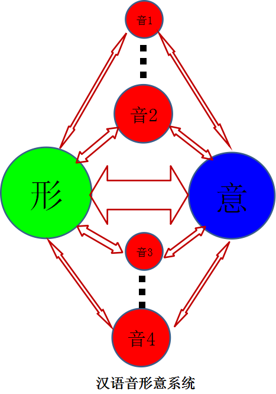

汉语以“形表意”，英语以“音表意”，各有编码逻辑（详见第 2 章）。正因为英语以音为纲，学习英语就必须从“音”入手——这是本书反复强调重音、节奏、见词识音的根本理由。

#### 10.2 词汇书的局限与记忆的真正关键

许多学习者把“背单词”当成英语学习的主任务：口语差、听力差，最终都归到“单词量太少”上。于是选一本“靠谱”的词汇书，成了头等大事。

先算一笔账。国内考试（四六级、考研、高考）与国外考试（托福、雅思、GRE、GMAT、SAT、LSAT 等）所需词汇量，大约在 7000 到 25000 之间。若按每天记 10 个、且永不忘来算：

- 7000 ÷ (10 × 365) ≈ 1.9 年
- 25000 ÷ (10 × 365) ≈ 6.8 年

然而很少有人能每天坚持，更难做到永不忘。死记硬背不是不行，但代价是大量时间，而且一辈子都要记——不常用的词总会忘，忘了就得重背。

那么，母语者为什么几乎不用刻意背单词？因为他们身处语言环境，单词的音、形、意每天都在自然、大量地重复，无需刻意去记也能掌握。中国学习者缺的正是这个环境，所以才更需要一套系统、高效的方法来弥补。

再看词汇书本身。任何一本词汇书，内容都相对固定：单词、音标、词性、中英文释义、例句，外加辅助记忆法（词根词缀或联想），再加不同的编排顺序（字母序、逆序、词频、分类）。形式如此固定，市面上的书却层出不穷——这恰恰说明，**问题不在“选哪本”，而在“怎么记”**。词汇书只能提供素材，提供不了记忆的方法。

那记单词主要记什么？**主要记读音，意思记个大概即可，不必死记汉语意思。**正确的读音对口语和听力至关重要——这正呼应了本书“音形统一（IPS）”的主线：先把音站稳，形和意才有依托。

#### 10.3 放下汉语中介，让音直达意

很多学习者有这样的体验：听英语时，脑子里要先把英语译成汉语才能理解；说英语时，是先把汉语译成英语再说出口。结果听说能力大打折扣。

问题出在哪？出在**把“汉语解释”当成了“单词意义”**。于是听“音”无法直达“意”，中间硬生生插了一个中介——汉语。要克服这个毛病，只有一个办法：记单词时，有意识地放下汉语中介。

从英语单词的编码过程可以看出，意义是一步步加在字母、音素、词素、单词上的：

而不是把“汉语意思”一次性强加到单词上。要做到见词识意，就要从字母、音素、词素、单词这四个方面同时入手，层层深入，最后综合成单词最完整、最正确的意义。

本书所说的“见词识意”，不是准确说出汉语意思，而是越过汉语、直达本质的“模糊意”（详见第 9.6 节）。体会单词的意义，应从字母、音素、词素、单词、语境这五个层面入手，不应把汉语意思强加其上。事实上，相当一部分英语单词的汉语释义只能近似，无法涵盖其字面内涵。

以 free 为例。它的汉语义“自由的、免费的、解放”是后加的标签；而从字面本意体会：f 的发音像风，有放松之意；fr 像折断树枝，有裂开、解除之意；ee 是长音，有和缓之意。通过对音的体会，free 的内在感觉便在脑中成形。汉语解释只是帮助体会的辅助，不该硬套。

再如新词 blog，它源自 weblog：bl 有“吹、说”之意，log 有“记录”之意，所以虽是新词，一见就懂；意译成“网络日志”失了新奇，音译成“博客、部落格”虽传音，却丢了构词字面的可解性。

一门语言的“意”，依赖其本身的“形”和“音”而存在；脱离了原有的形与音，意也不能保全。所以学英语时，汉语意思只能作辅助，不应让英语受汉语束缚。

#### 10.4 读原著：训练系统分析能力

谈完记词，再谈读书。绝大多数学习者有一个共同问题：不读原著。

先澄清一个概念：**原著不一定是名著，名著也不一定是原著。**人们常说“天下文章一大抄”，抄来抄去，终归要有一个最初的原点——这个原点，就是原著。

在中国，看过《西游记》电视剧的人多，读过原著的人少；学过初中几何的人多，读过欧几里得《几何原本》的人少；会说“有朋自远方来”的人多，读过《论语》的人少；学过马克思主义哲学的人多，读过《资本论》的人少；张口“优胜劣汰，适者生存”的人多，读过《物种起源》的人少；学过物理的人多，读过牛顿《自然哲学的数学原理》的人少；喜欢宫斗剧的人多，读过《史记》的人少；炒过股的人多，读过《国富论》的人少。

为什么一定要读原著？**读原著主要不是为了获取知识，而是训练系统分析能力。**学过课本知识、考试得 100 分，顶多算普通；考试只考 60 分，但读过原著，便可称卓越。课本和二手材料给出的是结论，原著展示的是得出结论的完整思路——后者训练的，是独立分析的能力。

喜欢读原著的人，难以被忽悠、被取悦、被煽动；道听途说、只言片语，都不是他们获取知识的途径。

既然好处这么多，为什么人们平时不读？因为读原著并不容易，至少有四难：

- **其一，原著是“高冷”的。**它为解决问题、为前无古人的创新而诞生，不是为讨好读者；有些原著不但不讨好，甚至引来攻击。
- **其二，原著是“粗糙”的。**它是粗粮、是生肉，习惯了流食的人承受不了，只会抱怨它伤胃、乏味。
- **其三，原著常被转述者无意掩盖。**二手材料往往不再回溯原始出处，读者接触的是层层转述后的版本。
- **其四，糟糕的翻译。**若拿起一本原著，字字认识、句句似懂非懂，多半是译本未能准确传达原著表述。等一个完美译本，可能永远等不到；而直接读原著（或其语言原版），才是最可靠的途径。

读了一本原著，若爱不释手，想找它的英文原版来读、离大师更近一步——那时，一套系统的英语词汇方法，便能帮你叩开大师的门。

#### 10.5 快速阅读：核心字母与冗余度

读原著、读文献，都离不开阅读速度。英语的快速阅读，建立在一个有趣的矛盾之上。

理论上，26 个字母能组合出的短单词数量极大：长度为 1 时可构成 26 个，长度为 2 时 26² = 676 个，长度为 3 时 26³ ≈ 1.7 万个。也就是说，**只需 3 个左右的字母，理论上就足以区分上万乃至更多的词**。可实际上，英语里短单词少得可怜（见表 24）。

**表 24　英语短词的实际数量**

| 长度 | 实际词数（约） | 例 |
|---|---|---|
| 1 个字母 | 2 | a、I |
| 2 个字母 | 28 | am、an、as、at、by、do、go、he、if、in、is、it、me、my、no、of、on、or、so、to、up、us、we 等 |
| 3 个字母 | 约 300 | — |
| 4 个字母 | 约 850 | — |

合计约 1180 个，远小于理论上的 1.7 万——**冗余度很高**。

既然短字母组合的理论容量远超实际词数，长单词里就有大量字母是冗余的。阅读时，只需抓住核心字母即可。比如 ConDuctor（9 个字母），抓住词根首字母 D、余光扫一下词首 C 就够了；entertainment，抓住 enter-Tain-ment 几个音节，熟练后只看 T。

这正是本书第 8.2 节所讲的“核心字母”。训练有素的读者，是以核心字母为单位、整块整段地处理文本，而不是逐字母、逐词地挪动。所谓快速阅读，并非天赋，而是把“核心字母”的意识练成本能。

#### 10.6 从“生硬”到行云流水：发音的节奏

许多中国人说英语显得生硬，每个音节像方块字一样往外蹦，缺乏英语本该有的流畅。

根子仍在汉语的迁移：用汉语“一字一音”的方式去念英语，自然格格不入。一个常见的表现是，在辅音结尾的单词后私加一个元音。比如把 Who is your wife? 念成“hu eezee yo waifoo”，把 What is your name? 念成“woter eezee yo neimoo”，又比如把 feel 念成“fiu”——这些都是词尾辅音后被硬加上去的多余元音。

要纠正这种生硬，有两条原则：

- **第一，辅音结尾的单词后不要再加元音。**辅音就是辅音，干脆利落地收住，不要拖一个多余的尾巴。
- **第二，把发音重点放在重读音节上，弱读音节要弱化。**这正是第 5.1 节“重弱交替”的要求——重音节清晰有力，弱音节模糊带过，英语的节奏才出得来。

记词时主要记读音，说词时抓住重音节奏，这两条合起来，说出来的英语才能从“生硬”走向“行云流水”。

> **第 10 章一句概括**：音为主线形为辅，放下中介读原著。

### 第 11 章　方法比较与评述

中国学生记单词最普遍的误区，是把读音、拼写、汉语意义三者强行"硬性关联"。这个误区催生了形形色色的记忆法——谐音、联想、象形、遗忘曲线、词根词源、自然拼读……方法虽多，评判它们却需要一把统一的尺子。

这把尺子，就是本书反复强调的判据：**一种方法好不好，归根结底看它是否抓住了"音形意统一"，尤其是是否以"音"为纲。** 英语是拼音文字，音是编码的关键（详见第 2 章）；任何撇开"音"、只动用视觉，或硬加一层联想的方法，都偏离了英语的本质。

本章先用一张多维评分表总览各种方法的长短，再按流派逐一评述。评述的原则是**评方法不评人**：客观描述每种方法的设计意图，精确指出它的局限，不否定其初衷，也不对任何人作人身评判。许多方法各有其合理之处，了解它们的长短，反过来更能看清"音形意统一"的立意所在。

#### 11.1 一把统一的尺子：方法多维评分

英语单词学习方法很多，归纳起来，比较有代表性的有二十种左右。评价一个方法的好坏，不能只看一两个指标，而要从多个方面去看。下面从十个维度评价这些方法，每个维度从 0 分（完全没有）到 5 分（最高）。

十个评价维度是：

1. **记忆效率**——记住一个单词所需投入的精力；
2. **见词识音**——能否由拼写读出发音；
3. **见词识意**——能否由拼写领会意义；
4. **拼写正确率**——能否拼写得对；
5. **词汇扩展能力**——能否由已知推未知、举一反三；
6. **方法科学性**——方法本身是否成体系、有规律；
7. **学习经济性**——所需花费是否可承受；
8. **总时间投入少**——达到目标所需时间是否较短；
9. **学习效果（听、说、读、写）**——四项技能的提升程度；
10. **入门容易度（小、初、高、大学生）**——不同阶段学习者上手的难易。

下表是这二十种方法在十个维度上的评分。

**表 25　各种英语单词学习方法的多维评分**

| 方法 | 记忆效率 | 见词识音 | 见词识意 | 拼写 | 词汇扩展 | 科学性 | 经济性 | 耗时少 | 效果（听/说/读/写） | 入门（小/初/高/大） |
|---|---|---|---|---|---|---|---|---|---|---|
| 死记硬背 | 1 | 0 | 0 | 1 | 0 | 2 | 5 | 1 | 2/2/2/2 | 4/4/4/4 |
| 记忆曲线 | 1 | 0 | 0 | 2 | 0 | 2 | 5 | 1 | 2/2/2/2 | 4/4/4/4 |
| 记忆口诀 | 3 | 0 | 0 | 2 | 0 | 0 | 4 | 2 | 1/1/1/1 | 5/5/5/5 |
| 谐音 | 3 | 0 | 0 | 2 | 0 | 0 | 4 | 2 | 0/0/0/0 | 5/5/5/5 |
| 联想 | 3 | 0 | 0 | 2 | 0 | 0 | 4 | 2 | 1/1/1/1 | 5/5/5/5 |
| 想象 | 3 | 0 | 0 | 2 | 0 | 0 | 4 | 2 | 0/0/1/1 | 5/5/5/5 |
| 谐音联想 | 3 | 0 | 0 | 1 | 0 | 0 | 4 | 2 | 0/0/1/0 | 3/3/3/3 |
| 象形文字 | 3 | 0 | 0 | 1 | 0 | 0 | 4 | 2 | 0/0/1/0 | 3/3/3/3 |
| 编码 | 2 | 0 | 0 | 2 | 0 | 0 | 4 | 2 | 0/0/0/0 | 1/1/1/1 |
| 构词 | 2 | 0 | 3 | 2 | 4 | 4 | 4 | 2 | 0/0/0/0 | 1/2/2/3 |
| 词根 | 4 | 0 | 3 | 2 | 4 | 4 | 4 | 3 | 0/0/3/3 | 1/2/2/3 |
| 词缀 | 4 | 0 | 3 | 2 | 4 | 4 | 4 | 3 | 0/0/3/3 | 1/2/2/3 |
| 词源 | 3 | 0 | 3 | 3 | 4 | 3 | 3 | 2 | 0/0/3/3 | 1/2/2/3 |
| 国音 | 2 | 2 | 0 | 2 | 3 | 3 | 5 | 4 | 3/3/2/2 | 2/2/3/4 |
| 国际音标 | 2 | 3 | 0 | 3 | 3 | 3 | 3 | 4 | 3/3/2/2 | 2/2/3/4 |
| 自然拼读 | 3 | 3 | 0 | 3 | 2 | 4 | 3 | 4 | 3/3/2/2 | 3/2/4/4 |
| 然读 | 4 | 3 | 0 | 3 | 2 | 4 | 3 | 4 | 3/3/2/2 | 4/4/4/4 |
| 简易音标 | 4 | 3 | 0 | 3 | 2 | 4 | 3 | 4 | 3/3/2/2 | 4/4/4/4 |
| 语音环境 | 4 | 3 | 2 | 4 | 2 | 5 | 0 | 1 | 5/5/3/3 | 4/4/4/4 |
| **音形意统一** | **5** | **5** | **5** | **5** | **5** | **5** | 4 | **5** | 4/4/5/5 | 3/3/3/3 |

读这张表，有几处值得注意。

第一，**"方法科学性"被打 0 分的方法**（记忆口诀、谐音、联想、想象、谐音联想、象形、编码等），并非说它们一无是处，而是指它们不成体系、缺乏贯穿始终的规律——学了不至于有害，只是所花时间与学习效率各有高下。

第二，**谐音、联想、谐音联想三类**在"入门容易度"上得分很高（对中小学生尤其友好），这也是不少初学者优先选择它们的原因；但它们在其他维度上普遍偏弱。"编码法"门槛较高（入门仅 1 分），实际使用者不多。

第三，**构词法、词根法、词源法**在"记忆效率""见词识意""词汇扩展能力"上明显占优，这是它们的长处；但在"入门容易度""见词识音"上却有很大欠缺。

第四，**"语音环境法"**对母语者是最好的方法（经济性、入门皆满分），但对第二语言学习者，全英语环境的花费很高（经济性 0 分）、且需持续投入大量时间（总时间 1 分），可望而不可及。不少人以为"一出国英语自然就好"，其实不然——在国外待了七八年仍只会简单英语的人并不少见。

第五，**"音形意统一记忆法"**在多数维度上丝毫不亚于"语音环境法"，尤其在"记忆效率、见词识音、见词识意、拼写正确率、词汇扩展能力、方法科学性"六项上可得满分；它的短板仅在"入门容易度"——需要先学一套符号，故打 3 分。若能与"语音环境法"结合，可谓强强联合。

第六，大多数学生实际采用的，其实是**"反复死记硬背"加"国际音标"**；而"反复死记硬背"又常被包装成"记忆曲线"。其学习效果如何，许多人深有体会。

归纳起来：**"音形意统一记忆法"是一种集大成的方法**——它身上有其他方法的优点，却没有其他方法的缺点。例如，它去除了"构词法"复杂的词义解释，只留下"词素划分"，因此入门容易度可达 3 分，又在六项核心维度上拿到满分。

需要说明的是，评分表只是提供一个比较的框架，不必拘泥于具体分数。本章接下来要做的，是回到这些方法本身，看清它们各自的设计意图与局限所在。

#### 11.2 复习类：遗忘曲线与集中循环

"艾宾浩斯遗忘曲线"是许多人安排复习的依据。心理学家赫尔曼·艾宾浩斯（Hermann Ebbinghaus）用一些**毫无意义的字母组合**作实验材料，让受试者记忆，再在不同时间间隔后检查遗忘率，由此得到一条描述遗忘速度的曲线。

这里有一个常被忽略的关键：实验的材料是"毫无意义的字母组合"。那么，英语单词是"毫无意义的字母组合"吗？显然不是。单词有音、有形、有意，内部还有可循的规律。如果单词当真是无意义的字母串，那么按遗忘曲线反复背诵，确实是合理的选择；既然它不是，记单词就应当**先把其中的音形规律找出来，再配合适当的复习巩固**，这样才能事半功倍。

这么说，并非否定复习的价值。按遗忘曲线安排复习，对巩固记忆确有帮助。问题在于：许多单词书和单词 APP 只按曲线安排复习间隔，却不帮学习者理清单词本身的音形规律——只反复诵读，不去利用单词内在的规律，效率并不高。对这类工具，了解其局限即可，不必全盘依赖。

复习类方法的共同特点，是把"复习的节奏"当成了"方法本身"。**复习节奏不等于方法。**遗忘曲线与集中循环解决的，是"如何不忘"，而不是"如何记住"；它们假定单词已经被正确地编码进记忆，只负责巩固。可若一开始就没有理清单词的音形规律，单靠反复诵读，巩固的只是一堆无规律的字母串。正确的顺序是：先用 IPS 把音形规律理清，再以适当的复习节奏巩固——规律提供"记住"的依据，复习负责"不忘"的保障，两者各司其职。

#### 11.3 联想类：谐音、意义联想与记忆宫殿

联想记忆法以"轻松速成"为卖点，在入门容易度上得分很高，吸引了不少学习者。它主要分两种：谐音联想与意义联想。

先看谐音联想的典型例子：

- pregnant（怀孕）——"扑来个男的"
- ambulance（救护车）——"俺不能死"
- pest（害虫）——"拍死它"
- ambition（雄心）——"俺必胜"

这些例子都是用汉语谐音去"对应"英语单词的发音。学英语最要紧的一件事，是把每个元音和辅音读准；只有读准每个音，才能准确拼写、流利听说。而谐音法恰恰相反——它把彼此相近却又不同的发音混为一谈，让学习者用汉语读音去"凑"英语发音。采用这类方法的人，日后往往仍需重新梳理发音；先入为主的谐音联想会持续干扰对正确发音的记忆，纠正起来反而比从零开始更费力。商业记忆法市场鱼龙混杂，部分课程以"速成"为噱头，学习者还需理性辨别。

再看意义联想：

- business——在公交车（bus）里面（in）有一只鹅（e）跟两条蛇（ss）在跳舞
- jeopardy（危险）——医生"解剖地"面，地板又开裂了

这类意义联想同样是用汉语画面去"挂住"英语单词，与单词本身的音、形规律并无必然关联。它有一个难以自圆其说的矛盾：既然最终要用汉语意思去理解单词，那记到最后，方法本身往往还要求学习者"记住后，请忘掉汉语"——先借汉语入门，再要求抛弃汉语，绕了一圈，负担不减反增。

从脑回路看，更清楚。谐音联想法的内核是"汉语"，它只在英语和汉语之间硬加了一层中介，而且只对母语是汉语的人管用。

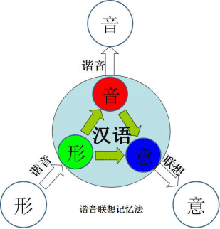

与其借汉语绕一道弯，不如回到发音本身，建立从字形直接到字音的联系。下图为"音形意统一记忆法"的脑回路，两相对照，差别显而易见：建立直接的音形联系后，听说读写能力可以同步提升。

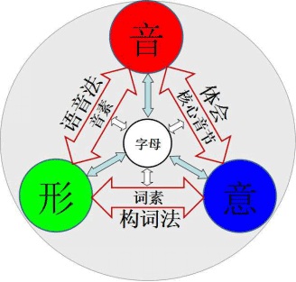

记单词时，应让音直达意，而不是在中间硬插一层汉语。

"记忆宫殿"又称"空间物体联想记忆法"或"编码记忆法"，常见于魔术表演中"过目不忘"的演示。它的原理是三步：在头脑中构建空间、构建物体、再将待记内容与空间和物体关联起来。比如记一副随机扑克牌，先把家中的"门、鞋架、过道、沙发……"编为空间点，再把每张牌转成谐音物体，安放到各个空间点上，最后按空间顺序反推出牌序。持续练习，确实能练就快速记忆的本领。

用于表演、或从事需要快速记忆的工作，记忆宫殿是可行的，持续练习也确能提升记忆力。但若用它来记单词，问题就很明显：记一个单词，要同时把空间、物体、联想这些与单词毫不相干的内容全都包进来——而这些全是累赘。任何与单词本身无关的附加信息，都会增加认知负担。真要为记单词另建一套编码，反不如谐音联想直接；可谐音联想本身也并非良法（见上文）。层层比较之下，更见出"零冗余"的可贵：好的方法，应当让记忆的负担尽可能落在单词自身的音形意规律上，而不是外挂一套宫殿。

**一个触及本质的例外：字母形象联想。** 在联想类方法里，有一种尝试触及了"音意"的本质，值得单列一说。张宇绰在《常用英文单词形象联想记忆法》等著作中提出一种思路：选取单词中**重读音节的辅音字母**（他称为"声部"，相当于汉语拼音的"声母"），由这些辅音去推知词义。其洞见在于，他忽略了前缀、后缀和词根的元音，却保留了词根的辅音——而辅音正是单词语音中最稳定的部分，最能体现"音至意"的关系；不仅在英语，在汉语、法语、俄语中，这部分辅音都最能表意。

这一思路，恰恰呼应了 IPM 所讲的"辅音承载词意"：抓住重读辅音，就抓住了单词语音的骨架。可惜的是，这种做法只给出了分类的结果，缺少完整的理论支撑，一般读者难以看懂、难以系统把握——有发现，却像空中楼阁。它之所以值得肯定，正在于它无意中触及了"音至意"这个最模糊、最抽象、也最难讲清的核心；而本书 IPM 部分（第 8 章）所要努力的，正是把这一层关系尽可能讲明白。可见，即便是联想类的方法，只要朝"音"的方向多走一步，就能更接近英语的本质。

#### 11.4 词根与词源类：重形轻音的通病

构词法、词根法、词源法，在"词汇扩展能力""见词识意"上得分很高，是许多人记单词的主力工具。但它们有一个共同的短板——**重形轻音**：偏重字母的视觉与形态，却忽略了语音维度的规律。这个通病并非只出现在某一处，而是从学术研究（词源学）、到大众工具（词根记忆法）、再到市场读物（几本代表性书籍），一脉相承、层层加重。本节就顺着这条线索，把这个"重形轻音"的通病看个清楚（这也是第 7 章末、第 8.4 节两次预告过的内容）。

**词源学：为记单词研究词源，是偏离初衷。** 词源学研究词汇的历史，是一门讲究咬文嚼字的学问，本身无可厚非——若有人纯粹出于兴趣研究它，自然很好。问题出在"为了记几个单词、通过某场考试，而去研究词源学"。

打个比方。Richard Sears 深感汉字结构复杂，于是花二十年研究甲骨文、金文、大篆、小篆，其认真劲令人敬佩。但如果每个老外学中文都要像他这样，先钻研甲骨文，那就本末倒置了——一个只想像普通中国人那样使用中文的人，花大量时间学甲骨文，合适吗？国内的英语词源研究，情形与此类似：若想研究英语词汇的起源，去学古英语、印欧语乃至楔形文字，当然可以；但若只是想记几个单词，这样做就偏离了初衷。事实上，国内词源研究发端于构词研究，构词研究又发端于记单词——研究的重心，就这样一步步偏离了"记单词"这个实用的出发点。

值得肯定的是，詹贤鋆先生 1985 年出版的《科技英语词素》，在那个没有计算机的年代，把构词学讲得相当详尽，任何人翻开都能受益匪浅，后来的著作大多是在它基础上扩展。但即便是这本书，在词根问题上也感到为难：词根实在太多，很难归纳出像模像样的规律。

更让人惋惜的是，这类研究大多没有进一步发现**音的规律**。它们偏重字母的视觉与形态，较少利用语音维度；而音的规律其实相当明显，却长期未被重视。英语的美感在于音——音要通过口腔演奏出来，让别人听到，它不是写在纸上的符号。若能换一个角度，重视起语音维度的规律，构词与词源研究或许能为记单词这件事提供更直接的帮助（这也正是第 8.4 节所强调的：音意的相通，是对"语音象征"的感性体会，而非词源学的考证）。研究层面如此，大众更常用的词根记忆法，同样在"音"的面前止了步。

**词根记忆法：推理链止于汉语意义。** 词根记忆法只对部分单词有效——那些能分解为"前缀 + 词根 + 后缀"的单词；对于不能分解、或很难分解的单词，它就无能为力了。它的运作方式是：把前缀、词根、后缀分别关联到各自的**汉语意义**，再把这些汉语意义综合起来，形成一个综合的汉语意义。问题出在最后一步——这个综合的汉语意义，本应进一步关联到英语单词的真实意义，但词根法通常不做这一步，它到"汉语意义"就自动结束了。

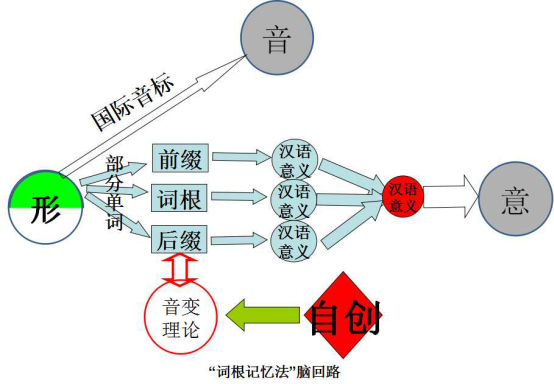

为什么会停在这一步？因为**英语单词的意义，有很大一部分隐藏在"音"里**；不考虑"音"，就理解不了"意"。词根法所能理解的"意"，终究只是汉语的意思，所以它难以真正脱离汉语。又由于缺少对"音"的体会，学习者也就难以感受发音本身的乐趣——这恰恰呼应了本书第 7 章末留下的那个问题：词根记忆法因舍弃"音"，而难以触及英语的真意。

国内的词源、构词研究者为此自创了种种"音变理论"，试图解释前缀、词根、后缀的变形规律。这类理论大多不够系统，本质上是在一套不完整的体系之外，另加一套规则来打补丁。与其事后补一套"音变理论"，不如从一开始就把"音"纳入记词体系——这正是 IPSM 的设计出发点。重形轻音，是这类方法共同的通病；那么，它在出版物市场上，又留下了怎样的痕迹？

**两本书的对照：读音才是老大。** 把两本曾经流行的书放在一起看，这个通病便一目了然。蒋争的《英语词汇的奥秘》根据构词法记单词，编排简洁明了，把词汇按前缀、词根、后缀分类，靠口碑畅销多年——凭良心说，这本书是可以读一读的。李佳俊的《英语读音的奥秘》则根据读音规律记单词，却反响平平；它四百多页，篇幅较长、主题聚焦不足，读起来不够精炼。

为什么"根据字形"的书热销，"根据读音"的书却无人问津？从编排看，《词汇的奥秘》确实更易用，它不求全，连音标都省了（以至有读者抱怨单词没法读）；而不少讲读音规律的书，也都有《读音的奥秘》那种冗长的毛病。但若论接近英语的本质，《读音的奥秘》反在《词汇的奥秘》之上。对于英语单词，**读音是老大，意义是老二，字形是老三**；老大要立起来，不能让老三跑过来坐了老大的位置。只有掌握了读音的规律，才能彻底丢下英语学习的包袱。《音形意统一记忆法》所做的，正是把"读音的奥秘"系统化，同时在编排上避免冗长。不过，还有一类书走得更远，索性连"音"都完全不提。

**《没有词是一座孤岛》：对"音"只字未提。** 还有一类书，如《没有词是一座孤岛：溯源解义学单词》，对符合构词法的单词给出汉语说明，再用汉语把词义展开解释一番，让原本不相关的几个汉语意思"显得"相关，以便记忆。参与编写的作者工作用心，例句也多搬自大牌英英词典，比那些只为卖书而粗制滥造的商业之作要用心得多——好东西本该传播。

但在肯定其用心的同时，也要指出它方法上的根本局限。这类书走的仍是那条老路——只调动视觉和默记，几乎不涉及听和说。最关键的是，**全书对"音"没有只言片语**。按这种只看字形、只靠默记的方法，最多只能提高一点阅读能力，与所花的时间相比，得不偿失。而正确的记词法，应当使听、说、读、写四项技能同时提高——这正是 IPSM 的标准。

综合这一节：构词法、词根法、词源法各有其价值（尤其在词汇扩展上），但它们的共同短板是**重形轻音**——把精力放在字母的视觉与形态、放在汉语意义的串联上，却忽略了语音这一编码的关键。不考虑音，就理解不了意；这是它们难以触及英语本质的根本原因。象形记词法（见第 9.6 节）的问题也同出一源：把拼音文字当拼形文字来记，同样背离了"以音为纲"。

#### 11.5 拼读规则类：自然拼读与福尼斯

"拼读法"对拼音文字而言，是最正确的学习思路——因为拼音文字本就该"拼"着读，不用拼读而用别的方法，反而偏离了文字本身的规律。从这个意义上说，自然拼读法（Phonics）的出发点是对的。它的定位也很明确：源于英国等英语为母语国家、适宜儿童的方法。

但"自然拼读法"的实际覆盖范围，与它的宣传存在落差——它无法实现对英语单词的真正"自然拼读"。一个单词只要落入以下四种情况之一，自然拼读就失效，而这样的单词所占比重不小：

- **重音位置不确定**——同一串字母，重音不同，读音可能全变；
- **多音节单词重音与弱音的区分**——重读还是弱读，自然拼读管不了；
- **开音节与闭音节的区分**——同一个字母，在开、闭音节里发音不同；
- **不规则单词的发音**——完全不按规则走的词。

仅这四条，自然拼读法就难以应对。它真正能"自然拼读"的，只是少部分简单词汇——通俗说，就是幼儿园和小学词汇。比如 apple、dog、cat 它敢教，可 banana 它就不敢教了：学生会问，为什么读作 [bə'nɑːnə] 而不是 ['bænənə] 或 [bə'neɪnə]？母语为英语的孩子不会问，因为他们事先头脑里已有 [bə'nɑːnə] 这个音；而中国学生事先并不知道，正需要音标来帮忙。

正因如此，自然拼读法一直缺乏一本给教师用的、系统像样的教材，多见的只是给幼儿园小朋友看的卡通课本。到了中学、大学阶段，它的局限会充分暴露，学生最终还是要回到国际音标。更麻烦的是，学过自然拼读的学生，有时反而会凭印象乱拼，这是这种不完整方法留下的"后遗症"。有人说，自然拼读法就像一张满是漏洞的渔网，要用它捕鱼，得把漏洞全补上；于是有教师在它之外归纳大量拼读规则，可规则写出来却是厚厚一本书，别的教师看了摇头——还是用国际音标吧。

"福尼斯英语"是另一套拼读规则体系，源自一份名为 Single Phonograms 的英语教学资料。它总结了大量英语单词的读音规则，据说有 120 条；其办法是在字母右上角标数字（1、2、3、4）来区分同一个字母的不同发音，比如 a 字母有 5 种发音，就在右上角标 1~5 加以区分。

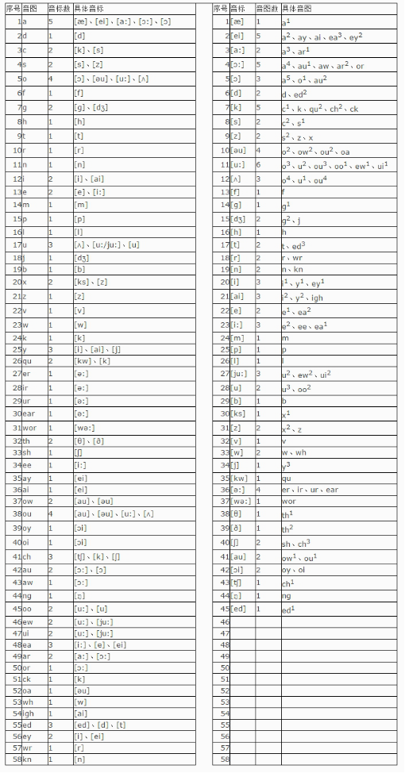

它的主要不足在于：没有对元音进行系统的分类（而这正是本书 IPS 用开、闭、轻、弱四档节奏所做的），学习者需要记忆的条目较多，掌握起来不算轻松。它的名称也容易让人误解为 Phonics 的音译，从而与自然拼读法相混淆，其实两者虽有相似，却并不相同。

拼读类的思路是对的——英语是拼音文字，本就该拼着读；问题在于，简单的拼读规则覆盖不了英语的全部发音现象。**自然拼读法、福尼斯英语都败在"规则不够系统"上。**本书 IPS 所做的，正是吸收自然拼读"拼读"的优点，又能应对复杂词与不规则发音：用开、闭、轻、弱四档节奏统摄元音，用音素符号标注例外——既可以教小学生，也可以教大学生，既适用于中国学习者，也适用于其他母语背景的人（详见第 4、第 5 章）。这也呼应了第 3 章对国际音标、重拼法的讨论：对非母语者而言，音标是"学英语的命根"，而 IPS 提供的，是一套比国际音标更贴合单词本身的直拼符号。

#### 11.6 文字改革类：正字法与拼写改革

在绝大多数人眼里，英语单词的发音复杂且极不规则；但英语发音其实很简单、极具规律，只不过有**少数不规则的单词**夹杂其中。死记硬背的人，把规则词和例外词一概死记，负担自然很重。更好的办法，是先把少数例外词单独挑出来，单独对待，而不是和所有词混在一起硬背——这正是 IPS 的思路：用符号把例外发音标出来，让规则词归规则、例外词归例外。

典型的例外词如 heart（e 不发音）、one（读作 [wʌn]）、busy（u 读作 i）、island（s 不发音）、could/would/should（l 不发音）等。它们数量不多，却常被当成"英语发音无规律"的证据；一旦单独处理，少数例外就影响不了对整体规律的判断。

理论上，还有一个彻底的办法：由官方推行英语正字法（正形或正音）。正形，比如把 one [wʌn] 以后统一写成 wun；正音，比如规定 one 以后统一读作 [əʊn]。但这意味着所有印刷品都要重新修订，或要求所有人改变发音，推行成本极高，除非万不得已，否则很难实施。

历史上确有不少拼写改革方案，大多无果而终。SaypU（Spell As You Pronounce Universal）就是一例：它主张改变英语单词现有的书写方式，将 C、Q、X 三个发音功能重叠的字母精简出去，增加一个弱音字母，用 24 个字母重新书写英语，从而做到拼写一致。

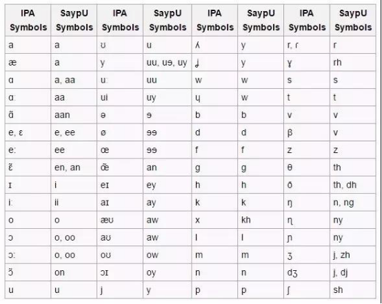

经过 SaypU 改造的英语，一般人已难以读懂；而 SaypU 项目自 2012 年推出后，也已基本停止发展。陈爱文的《英语见字知音法》则是另一例：它根据电脑统计 6000 常用词得出，约 60% 的单词符合规则、可直接拼读，另 40% 则需添加"定音记号"（类似法语字母上方的标号）；它还主张这些记号要像法语那样永远保留在英语单词上。然而，40% 的单词都要加符号，比例实在太高——人们连 café、fiancé 上那一点点符号都不喜欢，何况近一半的词都要永久标记。

从这些方案的得失，可以总结出文字改革的几条原则：

- **第一**，要改革的话，首先考虑改变音标（用一套标注符号），而不是改变书写；
- **第二**，除非万不得已，不要改变语言原有的发音；
- **第三**，除非万不得已，不要改变语言原有的书写；
- **第四**，宁可改变发音，也不要改变书写。

这几条原则指向同一个结论：**英语需要的，是一套附加在原有拼写之上的音素标注，而不是对拼写本身的改造。** IPS 走的正是这条路——它不改书写，也不加永久符号，只在字母上方临时标注音素符号，把发音规则融入单词。这与第 4 章快速入门、第 9 章字母所做的一脉相承。

#### 11.7 激励类：成功学的兴起与局限

最后看一类特殊的方法。把英语当作"成功学"来教，最具代表性的是李阳的"疯狂英语"。它一度风靡，从教学方法的角度看，有几个值得分析的原因。

其一，"疯狂英语"与"哑巴英语"这两个概念切中痛点、深入人心。国人长期学的是开不了口的"哑巴英语"，要告别"哑巴"，似乎就只有"疯狂"一条路。它从大学英语角起步，吸引了一批性格内向、不善表达的学生，让他们有机会站到众人面前大胆开口、克服心理障碍。其二，它采用公司化、团队化的运作，而非个人单打独斗，大型现场活动（如千人喊英语）制造了强烈的感染力，这是其营销能力的集中体现。其三，李阳本人英语发音浑厚清晰，达到这一点需要长期练习；他还逐个教音标、自创手势辅助记忆，教学上确有用心之处。

那么，它为何难以持久？关键在于：**形式大于内容，核心是激励而非方法。**"疯狂英语"的形式是成功学式的现场激励，内容则主要是"大声喊"。如果学一门语言需要如此大的力气，它就很难真正普及。许多参与者只是一次性的围观者，真正学会英语的并不多。后来模仿者创立"力量英语""大声英语"等名目，却无人能盖过其势头，因为他们模仿的仍是"英语成功学"这一形式本身。当一种教学法的核心是激励而非方法时，它注定难以长久。

激励类方法的启示在于：**激励能点燃一时的热情，却替代不了方法本身。**它解决的是"敢不敢开口"的心理障碍，而不是"如何记牢、如何读准"的方法问题。IPSM 走的是相反的路线——不靠现场的热烈，而靠一套可学习、可传授、可验证的规律；它要给人的，不是一时的亢奋，而是受用终身的系统方法。

**综观本章所评述的各种方法**，它们的共同短板，都可以归结到一点：**偏离了"音形意统一"，尤其是偏离了"以音为纲"。**复习类把节奏当方法，联想类硬加无关中介，词根词源类重形轻音，拼读类规则不够系统，文字改革类想动拼写，激励类用热情替方法——毛病各不相同，根子却是同一个。

每一种方法又都有其合理的一面：复习确能巩固，联想降低入门门槛，构词扩展词汇，拼读思路正确，改革方案动机良好，激励鼓舞人心。**音形意统一记忆法之所以自称"集大成"，正因为它尽量保留了这些方法的优点，而用"音"这条主线把它们贯穿起来、补足其短板**——取构词法的词素划分之"形"，取自然拼读的拼读之"理"，再以音素标注之"音"统摄全局，最终通向音意体会之"意"。方法本无高下之争，只有合不合适、系不系统之分；而判断的尺子始终是那一条——是否抓住了英语"以音为纲"的本质。

> **第 11 章一句概括**：万法归一，音为主线。

### 第 12 章　教学与自学指南

前两章分别谈了学习理念与常见方法。理念是"道"，方法是"器"，本章则回到"用"——这套方法究竟该如何教、如何学。

#### 12.1 方法的六个层面与教学路径

英语的构成，说起来很简单，就是"字母 → 单词 → 文章"这样的层次。本书专门针对"字母 → 单词"这一段，力图彻底解决从字母到单词的问题。

学完本书，学习者最终要在头脑中建立起这样一张思维之网：它把字母、读音、字形、意义全部连接起来，既是"音"的网，也是"形"的网，还是"意"的网。要全面织就这张网，是一项不小的工程；可一旦织成，任何一个新词落入网中，都会迅速与已有的节点建立联系，从而被轻松记住。网状结构是最高效的数据结构——懂得计算机编程的人都知道，数据的存储不仅要看容量，更要看结构。经过这套方法训练的学习者，反应速度会比未受训练者快得多，有机会接近母语者的水平。

这张网由六个层面构成，从 ① 到 ⑥ 依次是：

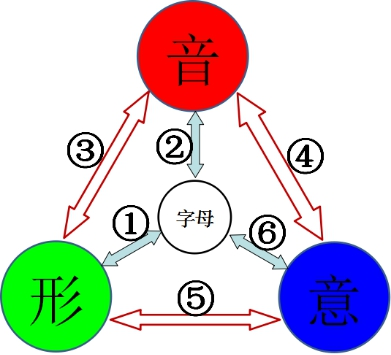

> ① 26 个字母 ↔ 字形：字母是怎么写的；
> ② 26 个字母 ↔ 读音：字母是怎么读的；
> ③ 读音 ↔ 字形：（难点）结合本书符号开展音素标注教学；
> ④ 读音 ↔ 意义：（难点）通过听歌、看电影、大声朗读来体会；
> ⑤ 字形 ↔ 意义：（难点）全面讲解构词法；
> ⑥ 26 个字母 ↔ 意义：（难点）点明每个单词的核心字母及其意义。

针对不同年龄段，教学可以分层推进：

- **幼儿与低年级学生**：先开展 ①②。①② 的内容就是 26 个字母的字形与读音，靠熟记即可，所有学生短期内都能熟练掌握。
- **小学生**：接着开展 ③。③ 是"重中之重"，一定要结合本书的音素标注，使学生达到"音形统一"，可从简单词开始，再慢慢深入。小学阶段把 ③ 教到位，已有相当完整的学习效果。
- **初中生**：接着开展 ④，告诉学生每个音素都有内在意义，让学生体会声音本身的乐趣。
- **高中生**：接着开展 ⑤，这也是一个难点。所幸市面上已有不少构词法的参考书，而本书在词素划分上力求更简洁、更系统，顺着本书的脉络来学比较顺畅。需要注意的是：英语以音为主，对词源过度穷根究底并无必要。
- **①–⑤ 全面掌握后**：切入 ⑥，点明每个单词的核心字母及其意义。①–⑤ 都是从简单到复杂，⑥ 则是从复杂回到简单，首尾相扣。

这套方法与别的方法的不同之处在于：从上到下，每一步都能让学习者真正学会。其中，"形"最实在（白纸黑字，确确实实），"音"次之，"意"最为虚渺。因此代表音形关系的 ③ 最实在、最易学；代表形意关系的 ⑤ 稍难；代表音意关系的 ④ 最难。不少基础稍好的自学者，看到 ③ 时眼前一亮，却止步于此——须知 ④⑤⑥ 同样是本书的精华，不可不学。

退一步说，即便只保留 ③ 这一部分，本方法所建立的"音形统一"体系，也已有相当的完整性和实用性。自学者不妨从 ③ 入手、先尝甜头，但勿忘继续向 ④⑤⑥ 推进。

> **一句概括**：六层织网，音为主线；由简入深，自学循序。

#### 12.2 如何打出音素符号

学习本书，需要在字母上方打出各种"音素"符号。这主要有三种方法。

**第一种，用系统自带的字符编辑工具。** 以 Windows 为例，在"开始 → 附件 → 系统工具"中可找到"专用字符编辑程序"（eudcedit），能自行绘制并编辑字符。

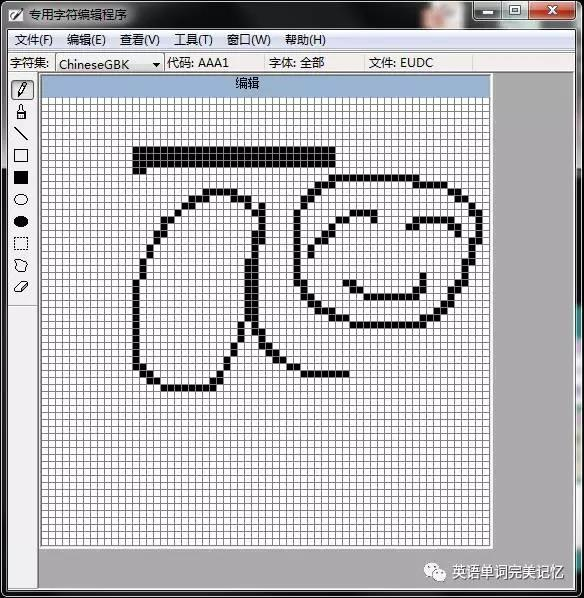

**第二种，用专业的字体编辑软件。** 如 FontCreator。若把第一种工具比作"画图"，FontCreator 就相当于 Photoshop，功能更强，适合建立个人字库。至于具体用法，网上已有许多详细教程。

这两种方法各有所长，但有一个共同的局限：它们生成的字符依赖特定的字体文件，在不同电脑上需要一并移植字体，否则显示不出，因而不适合在网络上传播。于是有了第三种方法。

**第三种，使用 Unicode 字符（推荐）。** Unicode 是一套覆盖极广的字符编码标准，它自带的变音符号能在不同电脑、不同手机、不同操作系统、论坛、微信等任何地方正常显示，天然适合网络传播。在 Word 中通过"插入 → 符号 → 其他符号"可以找到大部分符号（如 `å`），个别符号（如 `e̊`）需要一点小技巧。

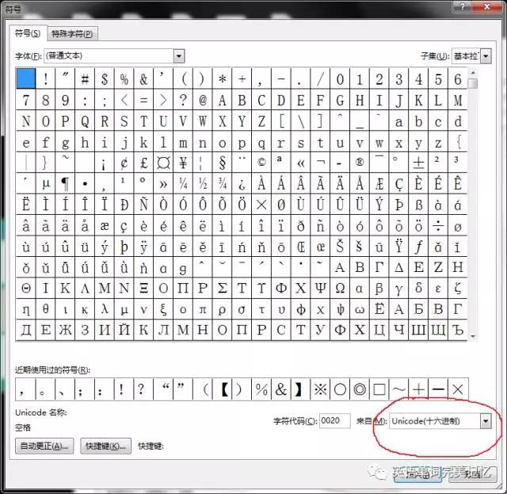

本书用到的符号及其 Unicode 形式如下：

| 符号 | 名称 | Unicode 形式 |
|:---:|---|---|
| ─ | 开音符（横线） | `ā ē ī ō ū ȳ w̄` |
| ○ | 弱音符（圆圈） | `å e̊ i̊ o̊ ů ẙ` |
| ⦁ | 轻音符（圆点） | `ȧ ė ẏ u̇` |
| ∼ | 长音符（波浪） | `ã õ ĩ` |
| ∖ | 变音符（长捺） | `à è ò` |
| ˄ | 尖角符 | `ô` |
| 辅音变体 | 浊音 / 第二种发音 | `ṫh`（浊音 th）、`ṡ`、`ċh` |

最方便的输入方式，是利用输入法的"自定义短语"。以搜狗输入法为例（其他输入法类似）：右键"属性设置 → 高级 → 自定义短语设置"，点击"直接编辑配置文件"。

将下面这类配置复制到配置文件末尾，保存并确定：

> va,1=ā
> ve,1=ē
> vi,1=ī
> vo,1=ō
> vu,1=ū
> va,2=ȧ
> ve,2=ė
> vo,2=ô
> va,3=à
> ve,3=è
> vo,3=ò
> va,4=ã
> vo,4=õ
> vva,1=å
> vve,1=e̊
> vvi,1=i̊
> vvo,1=o̊
> vvu,1=ů
> vs,1=ṡ
> vt,1=ṫ
> vth,1=ṫh
> vch,1=ċh

此后，输入 `va` 便会出现 `ā`、`ȧ`、`à`、`ã` 等候选，输入 `vva` 便会出现 `å`。理论上，若建立一个完整的词库，甚至可以做到输入 `meet` 直接出现 `mēet`。标注后的英文文本，能在任何平台正常显示。

> **一句概括**：Unicode 变音符，跨平台通用；自定义短语，一劳永逸。

#### 12.3 配套音频与学习资源

"音"是耳与口的功夫，光看文字学不会，必须听音、开口。本书的单词列表可以借助词典类应用（如欧路词典等）导入，实现跟读、听音与测验：一边听标准发音，一边对照本书的音素标注，把"听到的音"与"标注出的形"一一对应——这正是第 5 章（见词识音）与第 8 章（听音识意）在日常学习中的落实。工具可自行选择，原则只有一条：多听、多读、多标注。

第六篇到此结束。回望全书：从第 1 章的符号约定与第 2 章的方法定义出发，经 IPS（音形）、ISM（形意）、IPM（音意）三个方面，落到第 9 章的字母根基；再由第 10 章的学习理念、第 11 章的方法评述，回到第 12 章的教学指南——从"器"（方法）到"道"（理念），再到"用"（教学），构成一个完整的闭环。贯穿始终的主线始终是那一条：**以音为纲，音形意统一**。正文之外，以下两篇附录作为延伸阅读，供感兴趣的读者扩展视野。

## 附录

> **说明**：以下附录为延伸阅读，与方法的操作核心（IPSM 三方面）不直接相关。附录 A 延伸第 2 章关于语言编码的论述，附录 B 收两篇语言文化短文，读者可按兴趣选读。

### 附录 A　汉语与英语：编码与文字漫谈

第 2 章已经说明：汉语是一种拼形文字，英语是一种拼音文字，二者在编码上有本质区别。本附录就"拼形文字"这一概念再作两点延伸，并做一个思想实验，帮助读者从另一个角度理解"英语以音为纲"的缘由。

#### A.1 "拼形文字"再认识

"拼形"的"拼"，是"拼凑、合并"的意思。拼形与拼音恰好对仗："拼音"是把"音"凑合在一起，"拼形"是把"形"凑合在一起。音靠耳朵来认识，形靠眼睛来认识。搜狗等输入法是一种拼音输入法，五笔等输入法则是一种拼形（形码）输入法。

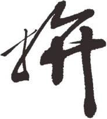

将汉字称为"拼形文字"，可与英语等"拼音文字"形成对仗的概念框架：拼音文字以读音为编码主线，拼形文字以字形为编码主线。

认识到汉字是一种"拼形文字"，不仅有助于理解英语，对学习汉字本身也有启发。学英语从元音、辅音开始学起——因为元音、辅音的数量很少；同理，学汉语若从字根（偏旁部首）开始学起，也会更省时、省力，因为字根的数量同样很少。小孩子先学字根，便能在短期内掌握大量汉字。

#### A.2 假如汉语拼音化：一个思想实验

这是一个常被讨论的假设：假如汉语真的拼音化了，会怎样？由此可以推想——以后除了背字，还要背拼音。

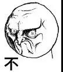

请试着读一读下面这篇"拼音文章"。看拼音文章，对我们学英语很有启发：学英语和学拼音在机理上是相通的，二者都以"音"来编码；体会过"读拼音"的费力，便能理解英语作为拼音文字"以音为纲"的编码逻辑，也明白汉字一旦拼音化，其"以形表意"的优势将丧失殆尽。

《Gù dōu de qiū（故都的秋）》　——yù dáfū（郁达夫）

> qiūtiān, wúlùn zài shénme dìfāng de qiūtiān, zǒng shì hǎo de; kěshì a, běiguó de qiū, què tèbié de láide qīng, láide jìng, láide bēiliáng. Wǒ de bù yuǎn qiānlǐ, yào cóng hángzhōu gǎn shàng qīngdǎo, gèng yào cóng qīngdǎo gǎn shàng běipíng láide lǐyóu, yě bùguò xiǎng bǎocháng yī cháng zhè "qiū", zhè gù dōu de qiū wèi.
>
> 秋天，无论在什么地方的秋天，总是好的；可是啊，北国的秋，却特别地来得清，来得静，来得悲凉。我的不远千里，要从杭州赶上青岛，更要从青岛赶上北平来的理由，也不过想饱尝一尝这"秋"，这故都的秋味。

读这段拼音，远比读汉字吃力——这"吃力"，正是拼音文字使用者每天都在做的事，也是汉语一旦放弃字形、改用拼音，所有学习者都必须额外承担的负担。

#### A.3 从拼形到形码输入法

理解了"拼形文字"的概念，便不难理解汉字的形码输入法。汉字输入法大体分两类：一类是拼音输入法，按读音输入；另一类是形码（拼形）输入法，按字形拆分输入，如五笔字型等。

形码输入法把汉字拆成字根（偏旁部首与基本笔画），再将字根映射到键盘字母上，其思路与"拼形文字"以字形组合编码的本质一脉相承，可看作拼形编码思想在键盘输入上的实践。拼音输入法对应"音"，形码输入法对应"形"，二者正好映照了汉语"拼形"与英语"拼音"在编码逻辑上的分野。

### 附录 B　语言文化延伸阅读

本附录收两篇关于语言的文化短文，与方法的操作层面无关，作为读者茶余饭后的延伸。一篇谈语言所调动的人体器官与"听说读写"，一篇谈英语为何成为今天的通用语。

#### B.1 语言是人类最得意的发明

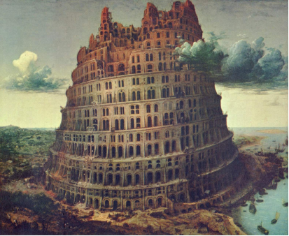

《圣经·创世记》记载，人类曾经口音、言语都是一样，他们商量着建造一座城和一座塔，塔顶通天。耶和华说："看哪，他们成为一样的人民，都是一样的言语，如今既作起这事，以后所要作的事，就没有不成就的了。"于是耶和华在那里变乱了天下人的言语，使众人分散在全地上。那城名叫巴别，就是"变乱"的意思。

这则巴别塔的传说，道出了语言的力量。看看语言调用了人体的哪些器官，便知它的不凡。

人体的信息采集器官，主要有眼、耳、触觉、味觉、嗅觉；语言调动了其中最敏锐的两个——**眼和耳**。人体的信息输出器官，主要有口腔、手、脚、面部表情；语言调动了其中最敏捷的两个——**口腔和手**。眼、耳、口、手协同，共同实现了语言的"听、说、读、写"。

不同语言，侧重的器官又不尽相同：汉语侧重调动"眼和手"，英语侧重调动"耳和嘴"。在汉语的世界里，能写一手龙飞凤舞的毛笔字，最为人称道；在英语的世界里，能唱一曲余音绕梁的歌曲，最为人称道。这一观察，与本书 IPSM"以音切入"的方法论不谋而合——英语的世界里，耳与嘴（听与说）始终是主线。

语言史上有一位传奇人物——海伦·凯勒（Helen Adams Keller）。她不靠眼和耳，而是靠触觉掌握了语言，并成为作家。语言不仅是大脑与世界交流的工具，更重塑了大脑本身。

语言是精细的、挑剔的，任何多余的东西都不会长久留存。语言既是工具也是枷锁，既是交流的纽带也是纷争的根源——交流促进统一，隔绝导致分裂。多少风流人物想把自己的名字刻进语言，转眼间这些名字又消散在风中。语言，确是人类最得意的发明。

#### B.2 英语为何成为通用语

这个世界需要一门通用语。从目前的种种迹象看来，这门语言极有可能是英语。原因，要从英语本身的结构去找。

英语的优势，可以归结为三点：**足够简单、足够开放、足够丰富**。

**第一，简单。** 英语的简单是全方位的——字母、发音、词汇、语法，无一不相对简单。英语吸收了法语的精华（约三分之二的英语词汇源自法语），却摒弃了法语繁复的屈折变化。相比一些欧洲语言，英语词汇上方没有复杂的标号，书写与录入方便；发音相对容易上手；名词没有"性、数、格"的繁复区分，动词变位也少；语法规则较为简明，学习负担不重。

**第二，开放。** 英语是开放的、包容的。想往英语里添加新事物，很简单——创造一个新词汇即可。这种开放性，使英语能不断吸收各领域的最新表达。

**第三，丰富。** 经过数百年对各语言精华的吸收，英语已足够丰富，以至于以英语为母语的人，往往不需要再学第二语言。

正是简单、开放、丰富这三点，使英语逐渐成为今天最通用的语言。这与本书从结构上分析英语"以音为纲"的思路是一致的——一种语言能否被广泛接受，根子还在它编码与使用的结构。

### 附录 C　IPSM 标注阅读练习

本附录收 30 篇经典英语短文，每篇都已用 IPS 音形标注符号逐词标注，并附中文译文，供读者在真实语篇中熟习本书的标注规则。它属于阅读练习材料，不是方法本身的核心内容。

**使用方法**：先对照第 4 章（快速入门）与第 5 章（IPS 音形统一）的符号规则，试读带标注的英文原文，体会"见词识音"的过程；遇到拿不准的读音，再参考其后的中文译文理解句意。读得多了，标注符号便会从"提示"渐渐内化为直觉。

#### 第一篇　Youth（青春）

Yoūth

Yoūth is not å tīme of līfe; it is å stāte of mīnd; it is not å matte̊r of rōṡẏ chēeks, red lips and supple knēes; it is å matte̊r of ṫhe̊ will, å quãlitẏ of ṫhe̊ imaginātio̊n, å vigo̊r of ṫhe̊ ėmōtio̊ns; it is ṫhe̊ freshnėss of ṫhe̊ dēep springs of līfe.

Yoūth mēans å tempe̊råmentål prėdominånce of côurȧge ōve̊r timiditẏ, of ṫhe̊ appėtīte for ådventůre ōve̊r ṫhe̊ lôve of ēaṡe. Ṫhis ofte̊n ėxists in å man of 60 more ṫhan å boẏ of 20. Nōbodẏ grōws ōld mērelẏ bȳ å numbe̊r of ye̊ars. Wē grōw ōld bȳ dėṡe̊rting òur īdēåls.

Ye̊ars māy wrinkle ṫhe̊ skin, but tõ give up ėnthūṡiaṡm wrinkles ṫhe̊ sōul. Wôrrẏ, fēar, self-distrust bōws ṫhe̊ heàrt and tůrns ṫhe̊ spirit back tõ dust.

Wheṫhe̊r 60 or 16, ṫhère is in eve̊rẏ hūmån bēing’s heàrt ṫhe̊ lūre of wônde̊rs, ṫhe̊ unfāiling appėtīte for what’s next and ṫhe̊ joẏ of ṫhe̊ gāme of living. In ṫhe̊ cente̊r of yōur heàrt and mȳ heàrt, ṫhère is å wīrelėss stātio̊n; sō long aṡ it rėcēives messȧges of bēaūtẏ, hōpe, côurȧge and pòwe̊r from man and from ṫhe̊ infinite, sō long aṡ yoū àre yôung.

When yōur āeriåls àre dòwn, and yōur spirit is côve̊red wiṫh snōws of cẏniciṡm and ṫhe̊ īce of pessimiṡm, ṫhen you’ve grōwn ōld, ēve̊n at 20; but aṡ long aṡ yōur āeriåls àre up, tõ catch wāves of optimiṡm, ṫhère’s hōpe yoū māy dīe yôung at 80.

> 译文：青春
>
> 青春不是年华，而是心境；青春不是桃面、丹唇、柔膝，而是深沉的意志，恢宏的想象，炙热的恋情；青春是生命的深泉在涌流。
>
> 青春气贯长虹，勇锐盖过怯弱，进取压倒苟安。如此锐气，二十后生而有之，六旬男子则更多见。年岁有加，并非垂老，理想丢弃，方堕暮年。
>
> 岁月悠悠，衰微只及肌肤；热忱抛却，颓废必致灵魂。忧烦，惶恐，丧失自信，定使心灵扭曲，意气如灰。
>
> 无论年届花甲，拟或二八芳龄，心中皆有生命之欢乐，奇迹之诱惑，孩童般天真久盛不衰。人人心中皆有一台天线，只要你从天上人间接受美好、希望、欢乐、勇气和力量的信号，你就青春永驻，风华常存。
>
> 一旦天线下降，锐气便被冰雪覆盖，玩世不恭、自暴自弃油然而生，即使年方二十，实已垂垂老矣；然则只要树起天线，捕捉乐观信号，你就有望在八十高龄告别尘寰时仍觉年轻。

#### 第二篇　Three Days to See（假如给我三天光明）

Thrēe Dāys tõ Sēe

Ãll of us have rēad thrilling stories in which ṫhe̊ hērō had onlẏ å limitėd and specified tīme tõ līve. Sômetīmeṡ it was aṡ long aṡ å ye̊ar, sômetīmeṡ aṡ short aṡ 24 hòurs. But ãlwāyṡ wē we̊re inte̊rėstėd in discôve̊ring just hòw ṫhe̊ doomed hērō chōse tõ spend his làst days or his làst hòurs. I spēak, of cōurse, of frēe men whõ have å choice, not co̊ndemned criminåls whõse sphēre of activities is strictlẏ delimitėd.

Such stories set us thinking, wônde̊ring what wē shoūld dõ unde̊r similår ci̊rcůmstånces. What ėvents, what ėxpērie̊nces, what åssōciātio̊ns shoūld wē cròwd intõ ṫhōṡe làst hòurs aṡ mortål bēings, what rėgrets?

Sômetīmeṡ I have thōught it woūld bē ån exce̊lle̊nt rūle tõ līve ēach dāy aṡ if wē shoūld dīe to̊morrōw. Such ån attitūde woūld emphåsīze shàrplẏ ṫhe̊ valūes of līfe. Wē shoūld līve ēach dāy wiṫh gentlenėss, vigo̊r and å kēennėss of åpprēciātio̊n which àre ofte̊n lost when tīme stretches bėfore us in ṫhe̊ constånt pano̊ràmå of more dāys and mônths and ye̊ars tõ côme. Ṫhère àre ṫhōṡe, of cōurse, whõ woūld ådopt ṫhe̊ Epicūrean mottō of “Ēat, drink, and bē merrẏ”. But mōst pēople woūld bē chāste̊ned bȳ ṫhe̊ ce̊rtåintẏ of impending dèath.

In stōries ṫhe̊ doomed hērō is ūs̃ūållẏ sāved at ṫhe̊ làst minite bȳ sôme strōke of fortůne, but ãlmōst ãlwāyṡ his sense of valūes is chānged. Hē bėcômes more åpprēciåtive of ṫhe̊ mēaning of līfe and its pe̊rmåne̊nt spiritūål valūes. It has ofte̊n bēen nōtėd ṫhat ṫhōṡe whõ līve, or have lived, in ṫhe̊ shadōw of dèath bring å mellōw swēetnėss tõ eve̊rẏ̇thing ṫhèy dõ.

Mōst of us, hòweve̊r, tāke līfe for gràntėd. Wē knōw ṫhat ône dāy wē must dīe, but ūs̃ūållẏ wē pictůre ṫhat dāy aṡ fàr in ṫhe̊ fūtůre. When wē àre in buoẏånt hèalth, dèath is ãll but unimagināble. Wē seldo̊m think of it. Ṫhe̊ days stretch òut in ån endlėss vistå. Sō wē gō åbòut òur pettẏ tàsks, hàrdlẏ åwāre of òur listlėss attitūde to̊wãrd līfe.

Ṫhe̊ sāme lethårgẏ, I am åfrāid, charȧcte̊rīzes ṫhe̊ ūṡe of ãll òur facůlties and senses. Onlẏ ṫhe̊ dèaf åpprēciāte hēaring, onlẏ ṫhe̊ blīnd rēålīze ṫhe̊ manifōld blessings ṫhat līe in sīght. Pàrticūlårlẏ dôes ṫhis obṡe̊rvātio̊n åpplȳ tõ ṫhōṡe whõ have lost sīght and hēaring in adult līfe. But ṫhōṡe whõ have neve̊r suffe̊red impāirment of sīght or hēaring seldo̊m māke ṫhe̊ fūllest ūṡe of ṫhēṡe blessed faculties. Ṫhèir eȳes and ēars tāke in ãll sīghts and sòunds hazily, wiṫhòut conce̊ntrātio̊n and wiṫh little åpprēciātio̊n. It is ṫhe̊ sāme ōld story of not bēing grātefůl for what wē have ůntil wē lõṡe it, of not bēing conscio̊us of hèalth ůntil wē àre ill.
I have ofte̊n thōught it woūld bē å blessing if ēach hūmån bēing we̊re stricke̊n blīnd and dèaf for å few̄ days at sôme tīme dūring his e̊arlẏ adult līfe. Dàrkness woūld māke him more åpprēciātive of sīght; sīle̊nce woūld tēach him ṫhe̊ joẏs of sòund.

> 译文：假如给我三天光明（节选）
>
> 我们都读过震撼人心的故事，故事中的主人公只能再活一段很有限的时光，有时长达一年，有时却短至一日。但我们总是想要知道，注定要离世人的会选择如何度过自己最后的时光。当然，我说的是那些有选择权利的自由人，而不是那些活动范围受到严格限定的死囚。
>
> 这样的故事让我们思考，在类似的处境下，我们该做些什么？作为终有一死的人，在临终前的几个小时内我们应该做什么事，经历些什么或做哪些联想？回忆往昔，什么使我们开心快乐？什么又使我们悔恨不已？
>
> 有时我想，把每天都当作生命中的最后一天来过，也不失为一个极好的生活法则。这种态度会使人格外重视生命的价值。我们每天都应该以优雅的姿态，充沛的精力，抱着感恩之心来生活。但当时间以无休止的日，月和年在我们面前流逝时，我们却常常没有了这种感觉。当然，也有人奉行“吃，喝，享受”的享乐主义信条，但绝大多数人还是会受到即将到来的死亡的惩罚。
>
> 在故事中，将死的主人公通常都在最后一刻因突降的幸运而获救，但他的价值观通常都会改变，他变得更加理解生命的意义及其永恒的精神价值。我们常常注意到，那些生活在或曾经生活在死亡阴影下的人无论做什么都会感到幸福。
>
> 然而，我们中的大多数人都把生命看成是理所当然的。我们知道有一天我们必将面对死亡，但总认为那一天还在遥远的将来。当我们身强体健之时，死亡简直不可想象，我们很少考虑到它。日子多得好像没有尽头。因此我们一味忙于琐事，几乎意识不到我们对待生活的冷漠态度。
>
> 我担心同样的冷漠也存在于我们对自己官能和意识的运用上。只有聋子才理解听力的重要，只有盲人才明白视觉的可贵，这尤其适用于那些成年后才失去视力或听力之苦的人很少充分利用这些宝贵的能力。他们的眼睛和耳朵模糊地感受着周围的景物与声音，心不在焉，也无所感激。这正像我们只有在失去后才懂得珍惜一样，我们只有在生病后才意识到健康的可贵。
>
> 我经常想，如果每个人在年轻的时候都有几天失明失聪，也不失为一件幸事。黑暗将使他更加感激光明，寂静将告诉他声音的美妙。

#### 第三篇　Companionship of Books（以书为伴）

Co̊mpanio̊nship of Books

Å man māy ūs̃ūållẏ bē knōwn bȳ ṫhe̊ books hē rēads aṡ well aṡ bȳ ṫhe̊ cômpånẏ hē kēeps; for ṫhère is å co̊mpanio̊nship of books aṡ well aṡ of men; and ône shoūld ãlwāyṡ līve in ṫhe̊ best cômpånẏ, wheṫhe̊r it bē of books or of men.

Å good book māy bē åmông ṫhe̊ best of friends. It is ṫhe̊ sāme to̊dāy ṫhat it ãlwāyṡ was, and it will neve̊r chānge. It is ṫhe̊ mōst pātie̊nt and chēerfůl of co̊mpanio̊ns. It dôes not tůrn its back ůpon us in times of ådve̊rsitẏ or distress. It ãlwāyṡ rėcēives us wiṫh ṫhe̊ sāme kīndnėss; åmūsing and instructing us in yoūth, and cômfo̊rting and co̊nsōling us in āge.

Men ofte̊n discôve̊r ṫhèir åffinitẏ tõ ēach ôṫhe̊r bȳ ṫhe̊ mūtūål lôve ṫhèy have for å book just aṡ twõ pe̊rso̊ns sômetīmeṡ discôve̊r å friend bȳ ṫhe̊ admi̊rātio̊n which bōth ente̊rtāin for å thi̊rd. Ṫhère is ån ōld prove̊rb, ‘Lôve mē, lôve mȳ dog.” But ṫhère is more wiṡdo̊m in ṫhis:” Lôve mē, lôve mȳ book.” Ṫhe̊ book is å trūe̊r and hīghe̊r bond of ūnio̊n. Men can think, fēel, and sẏmpåthīze wiṫh ēach ôṫhe̊r throūgh ṫhèir favo̊rite ãutho̊r. Ṫhèy līve in him to̊gethe̊r, and hē in ṫhem.

Å good book is ofte̊n ṫhe̊ best ůrn of å līfe ėnshrīning ṫhe̊ best ṫhat līfe coūld think out; for ṫhe̊ wo̊rld of å man’s līfe is, for ṫhe̊ mōst pàrt, but ṫhe̊ wo̊rld of his thōughts. Ṫhus ṫhe̊ best books àre trèasůries of good words, ṫhe̊ gōlde̊n thōughts, which, rėmembe̊red and cherished, bėcôme òur constånt co̊mpanio̊ns and cômfo̊rte̊rs.

Books po̊sṡess ån esse̊nce of immortålity. Ṫhèy àre bȳ fàr ṫhe̊ mōst làsting pro̊ducts of hūmån effo̊rt. Temples and statūes dėcāy, but books sůrvīve. Tīme is of nō åccòunt wiṫh greāt thōughts, which àre aṡ fresh to̊dāy aṡ when ṫhèy fi̊rst passed throūgh ṫhèir ãutho̊r’s mīnds, āges ågō. What was ṫhen said and thōught still spēaks tõ us aṡ vividly aṡ eve̊r from ṫhe̊ printed pāge. Ṫhe̊ onlẏ ėffect of tīme have bēen tõ sift òut ṫhe̊ bad pro̊ducts; for nôthing in lite̊råtůre can long sůrvīve but what is rēållẏ good.

Books intro̊dūce us intõ ṫhe̊ best so̊cīe̊tẏ; ṫhèy bring us intõ ṫhe̊ preṡe̊nce of ṫhe̊ greātest mīnds ṫhat have eve̊r lived. Wē hēar what ṫhèy said and did; wē sēe ṫhe̊ aṡ if ṫhèy we̊re rēållẏ ålīve; wē sẏmpåthīze wiṫh ṫhem, ėnjoẏ wiṫh ṫhem, griēve wiṫh ṫhem; ṫhèir ėxpērie̊nce bėcômes òurṡ, and wē fēel aṡ if wē we̊re in å mèas̃ůre acto̊rs wiṫh ṫhem in ṫhe̊ scēnes which ṫhèy dėscrībe.

Ṫhe̊ greāt and good dõ not dīe, ēve̊n in ṫhis wo̊rld. Embàlmed in books, ṫhèir spirits wãlk åbrōad. Ṫhe̊ book is å living voice. It is ån intėllect tõ which on still liste̊ns.

> 译文：以书为伴（节选）
>
> 通常看一个读些什么书就可知道他的为人，就像看他同什么人交往就可知道他的为人一样，因为有人以人为伴，也有人以书为伴。无论是书友还是朋友，我们都应该以最好的为伴。
>
> 好书就像是你最好的朋友。它始终不渝，过去如此，现在如此，将来也永远不变。它是最有耐心，最令人愉悦的伴侣。在我们穷愁潦倒，临危遭难时，它也不会抛弃我们，对我们总是一如既往地亲切。在我们年轻时，好书陶冶我们的性情，增长我们的知识；到我们年老时，它又给我们以慰藉和勉励。
>
> 人们常常因为喜欢同一本书而结为知己，就像有时两个人因为敬慕同一个人而成为朋友一样。有句古谚说道：“爱屋及乌。”其实“爱我及书”这句话蕴涵更多的哲理。书是更为真诚而高尚的情谊纽带。人们可以通过共同喜爱的作家沟通思想，交流感情，彼此息息相通，并与自己喜欢的作家思想相通，情感相融。
>
> 好书常如最精美的宝器，珍藏着人生的思想的精华，因为人生的境界主要就在于其思想的境界。因此，最好的书是金玉良言和崇高思想的宝库，这些良言和思想若铭记于心并多加珍视，就会成为我们忠实的伴侣和永恒的慰藉。
>
> 书籍具有不朽的本质，是为人类努力创造的最为持久的成果。寺庙会倒坍，神像会朽烂，而书却经久长存。对于伟大的思想来说，时间是无关紧要的。多年前初次闪现于作者脑海的伟大思想今日依然清新如故。时间惟一的作用是淘汰不好的作品，因为只有真正的佳作才能经世长存。
>
> 书籍介绍我们与最优秀的人为伍，使我们置身于历代伟人巨匠之间，如闻其声，如观其行，如见其人，同他们情感交融，悲喜与共，感同身受。我们觉得自己仿佛在作者所描绘的舞台上和他们一起粉墨登场。
>
> 即使在人世间，伟大杰出的人物也永生不灭。他们的精神被载入书册，传于四海。书是人生至今仍在聆听的智慧之声，永远充满着活力。

#### 第四篇　If I Rest,I Rust（如果我休息，我就会生锈）

If I Rest, I Rust

Ṫhe̊ significånt inscription fòund on ån ōld kēy ---“If I rest, I rust”---woūld bē ån exce̊lle̊nt mottō for ṫhōṡe whõ àre åfflictėd wiṫh ṫhe̊ slīghtėst bit of īdlenėss. Ēve̊n ṫhe̊ mōst industrio̊us pe̊rso̊n mīght ådopt it wiṫh ådvantȧge tõ se̊rve aṡ å rėmīnder ṫhat, if ône ållòws his faculties tõ rest, līke ṫhe̊ īro̊n in ṫhe̊ unūṡed kēy, ṫhèy will soon shōw signs of rust and, ultimȧtelẏ, cannot dõ ṫhe̊ wo̊rk rėquīred of ṫhem.

Ṫhōṡe whõ woūld åttāin ṫhe̊ heīghts rēached and kept bȳ greāt men must kēep ṫhèir facůlties pōlished bȳ constånt ūṡe, sō ṫhat ṫhèy māy unlock ṫhe̊ doors of knōwlėdge, ṫhe̊ gāte ṫhat guàrd ṫhe̊ entrånces tõ ṫhe̊ pro̊fessio̊ns, tõ scīe̊nce, àrt, lite̊råtůre, agricultůre---eve̊rẏ dėpàrtme̊nt of hūmån ėndèavo̊r.

Indůstrẏ kēeps brīght ṫhe̊ kēy ṫhat ōpe̊ns ṫhe̊ trèasůrẏ of åchiēveme̊nt. If Hugh Mille̊r, àfte̊r toiling ãll dāy in å quarrẏ, had dėvōtėd his ēve̊nings tõ rest and recrėātio̊n, hē woūld neve̊r have bėcôme å fāmo̊us gėolo̊gist. Ṫhe̊ celėbrāted maṫhe̊måticiån, Edmund Stōne, woūld neve̊r have published å mathe̊maticål dictio̊nårẏ, neve̊r have fòund ṫhe̊ kēy tõ scīe̊nce of mathe̊matics, if hē had give̊n his spāre mōme̊nts tõ īdlenėss, had ṫhe̊ little Scotch lad, Ferguson, ållòwed ṫhe̊ bu̇ṡẏ brāin tõ gō tõ slēep whīle hē tended shēep on ṫhe̊ hillsīde instèad of calcūlāting ṫhe̊ po̊ṡitio̊n of ṫhe̊ stàrs bȳ å string of bēads, hē woūld neve̊r have bėcôme å fāmo̊us åstrono̊me̊r.

Lābo̊r vanquishes all---not inconstånt, spasmodic, or ill-directėd lābo̊r; but fāithfůl, unrėmitting, dāilẏ effo̊rt to̊wãrd å well-directėd půrpo̊se. Just aṡ trūlẏ aṡ ėte̊rnål vigilånce is ṫhe̊ prīce of libe̊rtẏ, sō is ėte̊rnål indůstrẏ ṫhe̊ prīce of nōble and ėndūring sůccess.

> 译文：如果我休息，我就会生锈
>
> 在一把旧钥匙上发现了一则意义深远的铭文——如果我休息，我就会生锈。对于那些懒散而烦恼的人来说，这将是至理名言。甚至最为勤勉的人也以此作为警示：如果一个人有才能而不用，就像废弃钥匙上的铁一样，这些才能就会很快生锈，并最终无法完成安排给自己的工作。
>
> 有些人想取得伟人所获得并保持的成就，他们就必须不断运用自身才能，以便开启知识的大门，即那些通往人类努力探求的各个领域的大门，这些领域包括各种职业：科学，艺术，文学，农业等。
>
> 勤奋使开启成功宝库的钥匙保持光亮。如果休•米勒在采石场劳作一天后，晚上的时光用来休息消遣的话，他就不会成为名垂青史的地质学家。著名数学家爱德蒙•斯通如果闲暇时无所事事，就不会出版数学词典，也不会发现开启数学之门的钥匙。如果苏格兰青年弗格森在山坡上放羊时，让他那思维活跃的大脑处于休息状态，而不是借助一串珠子计算星星的位置，他就不会成为著名的天文学家。
>
> 劳动征服一切。这里所指的劳动不是断断续续的，间歇性的或方向偏差的劳动，而是坚定的，不懈的，方向正确的每日劳动。正如要想拥有自由就要时刻保持警惕一样，要想取得伟大的，持久的成功，就必须坚持不懈地努力。

#### 第五篇　Ambition（抱负）

Ambitio̊n

It is not difficůlt tõ imagine å wo̊rld short of ambitio̊n. It woūld probåblẏ bē å kīnde̊r wo̊rld: wiṫh òut dėmànds, wiṫhòut åbrāsions, wiṫhòut disåppointme̊nts. Pēople woūld have tīme for rėflectio̊n. Such wo̊rk aṡ ṫhèy did woūld not bē for ṫhemselveṡ but for ṫhe̊ co̊llectivitẏ. Compe̊titio̊n woūld neve̊r ente̊r in. conflict woūld bē ėlimināted, tension bėcôme å thing of ṫhe̊ pàst. Ṫhe̊ stress of crėātio̊n woūld bē at ån end. Àrt woūld nō longer bē trôubling, but pūrelẏ celėbrāto̊rẏ in its functio̊ns. Longevitẏ woūld bē incrēased, for fewe̊r pēople woūld dīe of heàrt åttack or strōke cãūṡed bȳ tūmultūo̊us ėndèavo̊r. Anxīe̊tẏ woūld bē ėxtinct. Tīme woūld stretch on and on, wiṫh ambitio̊n long dėpàrted from ṫhe̊ hūmån heàrt.

Ah, hòw unrėliēved boring līfe woūld be!

Ṫhère is å strong view̄ ṫhat hōlds ṫhat sůccess is å myth, and ambitio̊n ṫhèrefore å sham. Dôes ṫhis mēan ṫhat sůccess dôes not rēållẏ ėxist? Ṫhat åchiēveme̊nt is at botto̊m empty? Ṫhat ṫhe̊ effo̊rts of men and women àre of nō significånce ålongsīde ṫhe̊ force of mõveme̊nts and ėvents nòw not ãll sůccess, obvio̊uslẏ, is wo̊rth esteeming, nor ãll ambitio̊n wo̊rth cultivating. Which àre and which àre not is sômething ône soon ėnôugh le̊arns on one’s ōwn. But ēve̊n ṫhe̊ mōst cẏnicål sēcrėtly ådmit ṫhat sůccess ėxists; ṫhat åchiēveme̊nt còunts for å greāt dēal; and ṫhat ṫhe̊ trūe mẏth is ṫhat ṫhe̊ actio̊ns of men and women àre ūselėss. Tõ bėliēve ôṫherwīṡe is tõ tāke on å point of view̄ ṫhat is līkelẏ tõ bē dėrānging. It is, in its implicātio̊ns, tõ rėmõve ãll mōtives for co̊mpēte̊nce, inte̊rėst in åttāinment, and rėgàrd for posteritẏ.

Wē dõ not choose tõ bē born. Wē dõ not choose òur pāre̊nts. Wē dõ not choose òur historicål ēpoch, ṫhe̊ côuntrẏ of òur bi̊rth, or ṫhe̊ immēdiåte ci̊rcůmstånces of òur upbringing. Wē dõ not, mōst of us, choose tõ die; nor dõ wē choose ṫhe̊ tīme or co̊nditio̊ns of òur dèath. But wiṫhin ãll ṫhis rèalm of choicelėssnėss, wē dõ choose hòw wē shall live: co̊urāgeo̊usly or in còwårdice, hono̊råblẏ or dishono̊råblẏ, wiṫh půrpo̊se or in drift. Wē dėcīde what is importånt and what is triviål in līfe. Wē dėcīde ṫhat what mākes us significånt is ēithe̊r what wē dõ or what wē rėfūṡe tõ dõ. But nō matte̊r hòw indiffe̊re̊nt ṫhe̊ ūnive̊rse māy bē tõ òur choices and dėcisio̊ns, ṫhēṡe choices and dėcisio̊ns àre òurṡ tõ māke. Wē dėcīde. Wē choose. And aṡ wē dėcīde and choose, sō àre òur lives formed. In ṫhe̊ end, forming òur ōwn destīnẏ̇ is what ambitio̊n is åbòut.

> 译文：抱负
>
> 一个缺乏抱负的世界将会怎样，这不难想象。或许，这将是一个更为友善的世界：没有渴求，没有磨擦，没有失望。人们将有时间进行反思。他们所从事的工作将不是为了他们自身，而是为了整个集体。竞争永远不会介入；冲突将被消除。人们的紧张关系将成为过往云烟。创造的重压将得以终结。艺术将不再惹人费神，其功能将纯粹为了庆典。人的寿命将会更长，因为由激烈拼争引起的心脏病和中风所导致的死亡将越来越少。焦虑将会消失。时光流逝，抱负却早已远离人心。
>
> 啊，长此以往人生将变得多么乏味无聊！
>
> 有一种盛行的观点认为，成功是一种神话，因此抱负亦属虚幻。这是不是说实际上并不丰在成功？成就本身就是一场空？与诸多运动和事件的力量相比，男男女女的努力显得微不足？显然，并非所有的成功都值得景仰，也并非所有的抱负都值得追求。对值得和不值得的选择，一个人自然而然很快就能学会。但即使是最为愤世嫉俗的人暗地里也承认，成功确实存在，成就的意义举足轻重，而把世上男男女女的所作所为说成是徒劳无功才是真正的无稽之谈。认为成功不存在的观点很可能造成混乱。这种观点的本意是一笔勾销所有提高能力的动机，求取业绩的兴趣和对子孙后代的关注。
>
> 我们无法选择出生，无法选择父母，无法选择出生的历史时期与国家，或是成长的周遭环境。我们大多数人都无法选择死亡，无法选择死亡的时间或条件。但是在这些无法选择之中，我们的确可以选择自己的生活方式：是勇敢无畏还是胆小怯懦，是光明磊落还是厚颜无耻，是目标坚定还是随波逐流。我们决定生活中哪些至关重要，哪些微不足道。我们决定，用以显示我们自身重要性的，不是我们做了什么，就是我们拒绝做些什么。但是不论世界对我们所做的选择和决定有多么漠不关心，这些选择和决定终究是我们自己做出的。我们决定，我们选择。而当我们决定和选择时，我们的生活便得以形成。最终构筑我们命运的就是抱负之所在。

#### 第六篇　What I have Lived for（我为何而生）

What I Have Lived For

Thrēe passio̊ns, simple but ōve̊rwhelminglẏ strong, have gôve̊rned mȳ līfe: ṫhe̊ longing for lôve, ṫhe̊ se̊arch for knōwlėdge, and unbeāråble pitẏ for ṫhe̊ suffe̊ring of mankīnd. Ṫhēṡe passio̊ns, līke greāt winds, have blōwn mē hiṫhe̊r and thiṫhe̊r, in å wāywãrd cōurse, ōve̊r å dēep ōcėån of anguish, rēaching tõ ṫhe̊ verẏ ve̊rge of dėspāir.

I have sought lôve, fi̊rst, bėcãuse it brings ecståsẏ---ecståsẏ sō greāt ṫhat I woūld ofte̊n have sacrifīced ãll ṫhe̊ rest of mȳ līfe for å few̄ hòurs for ṫhis joẏ. I have sought it, next, bėcãuse it rėliēves lonelinėss---ṫhat terri̊ble lonelinėss in which ône shive̊ring conscio̊usnėss looks ōve̊r ṫhe̊ rim of ṫhe̊ wo̊rld intõ ṫhe̊ cōld unfatho̊måble līfelėss åbẏss. I have sought it, fīnållẏ, bėcãuse in ṫhe̊ ūnio̊n of lôve I have sēen, in å mẏstic miniåtůre, ṫhe̊ prēfigůring visio̊n of ṫhe̊ hèave̊n ṫhat sāints and pōėts have imagined. Ṫhis is what I sought, and ṫhōugh it mīght sēem too good for hūmån līfe, ṫhis is what---at last---I have fòund.

Wiṫh ēquål passio̊n I have sought knōwlėdge. I have wished tõ unde̊rstand ṫhe̊ heàrts of men. I have wished tõ knōw whȳ ṫhe̊ stàrs shīne. And I have tried tõ apprėhend ṫhe̊ Pȳthago̊rėån pòwe̊r bȳ which numbe̊r hōlds swāy åbôve ṫhe̊ flux. Å little of ṫhis, but not much, I have åchiēved.

Lôve and knōwlėdge, sō fàr aṡ ṫhèy we̊re possi̊ble, led upwård to̊wãrd ṫhe̊ hèave̊ns. But ãlwāyṡ it brôught mē back tõ e̊arth. Echōes of cries of pāin rėve̊rbe̊rāte in mȳ heàrt. Chīldren in famine, victims tortůred bȳ o̊ppresso̊rs, helplėss ōld pēople å hāted bůrde̊n tõ ṫhèir sons, and ṫhe̊ whōle wo̊rld of lonelinėss, pove̊rtẏ, and pāin māke å mocke̊rẏ of what hūmån līfe shoūld bē. I long tõ ållēviāte ṫhe̊ ēvi̊l, but I cannot, and I too suffe̊r.

Ṫhis has bēen mȳ līfe. I have fòund it wo̊rth living, and woūld gladly līve it ågāin if ṫhe̊ chànce we̊re offe̊red mē.

> 译文：我为何而生
>
> 我的一生被三种简单却又无比强烈的激情所控制：对爱的渴望，对知识的探索和对人类苦难难以抑制的屿。这些激情像狂风，把我恣情吹向四方，掠过苦痛的大海，迫使我濒临绝望的边缘。
>
> 我寻求爱，首先因为它使我心为之着迷，这种难以名状的美妙迷醉使我愿意用所有的余生去换取哪怕几个小时这样的幸福。我寻求爱，还因为它能缓解我心理上的孤独中，我感觉心灵的战栗，仿如站在世界的边缘而面前是冰冷，无底的死亡深渊。我寻求爱，因为在我所目睹的结合中，我仿佛看到了圣贤与诗人们所向往的天堂之景。这就是我所寻找的，虽然对人的一生而言似乎有些遥不可及，但至少是我用尽一生所领悟到的。
>
> 我用同样的激情去寻求知识。我希望能理解人类的心灵，希望能够知道群星闪烁的缘由。我试图领悟毕达哥拉斯所景仰的“数即万物”的思想。我已经悟出了其中的一点点道理，尽管并不是很多。
>
> 爱和知识，用它们的力量把人引向天堂。但是同情却总把人又拽回到尘世中来。痛苦的呼喊声回荡在我的内心。饥饿的孩子，受压迫的难民，贫穷和痛苦的世界，都是对人类所憧憬的美好生活的无情嘲弄。我渴望能够减少邪恶，但是我无能为力，我也难逃其折磨。
>
> 这就是我的一生。我已经找到它的价值。而且如果有机会，我很愿意能再活它一次。

#### 第七篇　When Love Beckons You（爱的召唤）

When Lôve Beckons You

When lôve beckons tõ yoū, follōw him, ṫhōugh his ways àre hàrd and stēep. And when his wings ėnfōld yoū, yiēld tõ him, ṫhōugh ṫhe̊ sword hidde̊n åmông his pinio̊ns māy woūnd yoū. And when hē spēaks tõ yoū, bėliēve in him, ṫhōugh his voice māy shatte̊r yōur drēams aṡ ṫhe̊ north wind lāys wāste ṫhe̊ gàrde̊n.

For ēve̊n aṡ lôve cròwns yoū sō shall hē crūcifȳ yoū. Ēve̊n aṡ hē is for yōur grōwth sō is hē for yōur prūning. Ēve̊n aṡ hē åscends tõ yōur heīght and cāresses yōur tende̊rest brànches ṫhat quive̊r in ṫhe̊ sun, sō shall hē dėscend tõ òur roots and shāke ṫhem in ṫhèir clinging tõ ṫhe̊ e̊arth.

But if, in yōur fēar, yoū woūld sēek onlẏ lôve’s pēace and lôve’s plèasůre, ṫhen it is bette̊r for yoū ṫhat yoū côve̊r yōur nākėdnėss and pass òut of lôve’s threshing-floor, intõ ṫhe̊ sēaṡo̊nlėss wo̊rld whère yoū shall làugh, but not ãll of yōur làughte̊r, and wēep, but not ãll of yōur tēars. Lôve gives naught but it self and tākes naught but from itself. Lôve po̊sṡesses not, nor woūld it bē po̊sṡessed, for lôve is sůfficie̊nt untõ lôve.

Lôve has nō ôṫhe̊r dėṡīre but tõ fūlfill itself. But if yoū lôve and must have dėṡīres, let ṫhēṡe bē yōur dėṡīres:

Tõ melt and bē līke å running brook ṫhat sings its melo̊dẏ tõ ṫhe̊ nīght.

Tõ knōw ṫhe̊ pāin of too much tende̊rnėss.

Tõ bē woūnded bȳ yōur ōwn unde̊rstanding of lôve;

And tõ blēed willingly and joẏfůlly.

Tõ wāke at dãwn wiṫh å winged heàrt and give ṫhanks for ånôṫhe̊r dāy of loving;

Tõ rest at ṫhe̊ noon hòur and meditāte lôve’s ecståsẏ;

Tõ rėtůrn hōme at ėventīde wiṫh gratitūde;

And ṫhen tõ slēep wiṫh å pāye̊r for ṫhe̊ bėlôved in yōur heàrt and å song of prāiṡe ůpon yōur lips.

> 译文：爱的召唤
>
> 当爱召唤你时，请追随她，尽管爱的道路艰难险峻。当爱的羽翼拥抱你时，请顺从她，尽管隐藏在其羽翼之下的剑可能会伤到你。当爱向你诉说时，请相信她，尽管她的声音可能打破你的梦想，就如同北风吹落花园里所有的花瓣。
>
> 爱会给你戴上桂冠，也会折磨你。爱会助你成长，也会给你修枝。爱会上升到枝头，抚爱你在阳光下颤动力的嫩枝，也会下潜至根部，撼动力你紧抓泥土的根基。
>
> 但是，如果你在恐惧之中只想寻求爱的平和与快乐，那你就最好掩盖真实的自我，避开爱的考验，进入不分季节的世界，在那里你将欢笑，但并非开怀大笑，你将哭泣，但并非尽情地哭。爱只将自己付出，也只得到自己。爱一无所有，也不会为谁所有，因为爱本身就已自足。
>
> 爱除了实现自我别无他求。但是如果你爱而又不得不有所求，那就请期望：
>
> 将自己融化并像奔流的溪水一般向夜晚吟唱自己优美的曲调。
>
> 明了过多的温柔所带来的苦痛。
>
> 被自己对爱的理解所伤害；
>
> 并情愿快乐地悲伤。
>
> 在黎明带着轻快的心醒来并感谢又一个有家的日子；
>
> 在黄昏怀着感恩之心回家；
>
> 然后为内心所爱之人祈祷，吟唱赞美之歌，并带着祷告和歌声入眠。

#### 第八篇　The Road to Success（成功之道）

Ṫhe̊ Rōad tõ Sůccess

It is well ṫhat yôung men shoūld bėgin at ṫhe̊ bėginning and occūpȳ ṫhe̊ mōst sůbordinȧte po̊ṡitio̊ns. Manẏ of ṫhe̊ lēading bu̇ṡinėssmen of Pittsbůrgh had å sērio̊us rėsponsi̊bilitẏ thrust ůpon ṫhem at ṫhe̊ verẏ threshōld of ṫhèir cårēer. Ṫhèy we̊re intro̊dūced tõ ṫhe̊ broom, and spent ṫhe̊ fi̊rst hòurs of ṫhèir bu̇ṡinėss lives swēeping òut ṫhe̊ office. I nōtice wē have janito̊rs and janitrėsses nòw in offices, and òur yôung men unfortůnȧtelẏ miss ṫhat salůtårẏ brànch of bu̇ṡinėss edūcātio̊n. But if bȳ chànce ṫhe̊ pro̊fessio̊nål swēepe̊r is abse̊nt anẏ morning, ṫhe̊ boẏ whõ has ṫhe̊ gēniůs of ṫhe̊ fūtůre pàrtne̊r in him will not heṡitāte tõ trȳ his hand at ṫhe̊ broom. It dôes not hůrt ṫhe̊ new̄ėst côme̊r tõ swēep òut ṫhe̊ office if necėssårẏ. I was ône of ṫhōṡe swēepe̊rs mȳself.

Assūming ṫhat yoū have ãll o̊btāined ėmploẏme̊nt and àre fāirlẏ stàrted, mȳ ådvīce tõ yoū is “aim hīgh”. I woūld not give å fig for ṫhe̊ yôung man whõ dôes not ãlrèadẏ sēe himself ṫhe̊ pàrtne̊r or ṫhe̊ hèad of ån importånt fi̊rm. Dõ not rest content for å mōme̊nt in yōur thōughts aṡ hèad cle̊rk, or foreman, or gene̊rål manȧge̊r in anẏ co̊nce̊rn, nō matte̊r hòw ėxtensive. Sāy tõ yōurself, “Mȳ plāce is at ṫhe̊ top.” Bē king in yōur drēams.

And hēre is ṫhe̊ prīme co̊nditio̊n of sůccess, ṫhe̊ greāt sēcrėt: conce̊ntrāte yōur ene̊rgẏ, thōught, and capital ėxclūsivelẏ ůpon ṫhe̊ bu̇ṡinėss in which yoū àre ėngāged. Having bėgun in ône līne, rėṡolve tõ fīght it òut on ṫhat līne, tõ lēad in it, ådopt eve̊rẏ̇ imprõveme̊nt, have ṫhe̊ best måc̅hĩnery, and knōw ṫhe̊ mōst åbòut it.

Ṫhe̊ co̊nce̊rns which fāil àre ṫhōṡe which have scatte̊red ṫhèir capitål, which mēans ṫhat ṫhèy have scatte̊red ṫhèir brāins ãlsō. Ṫhèy have investme̊nts in ṫhis, or ṫhat, or ṫhe̊ ôṫhe̊r, hēre ṫhère, and eve̊rẏ̇whère. “Don’t pūt ãll yōur eggs in ône bàskėt.” is ãll wrong. I tell yoū tõ “put ãll yōur eggs in ône bàskėt, and ṫhen watch ṫhat bàskėt.” Look ròund yoū and tāke nōtice, men whõ dõ ṫhat not ofte̊n fāil. It is ēaṡẏ tõ watch and carrẏ ṫhe̊ ône bàskėt. It is trȳing tõ carrẏ too manẏ bàskėts ṫhat breāks mōst eggs in ṫhis côuntrẏ. Hē whõ carries thrēe bàskėts must pūt ône on his hèad, which is apt tõ tumble and trip him up. Ône fãult of ṫhe̊ Åmericån bu̇ṡinėssman is lack of conce̊ntrātio̊n.

Tõ summårīze what I have said: āim for ṫhe̊ hīghest; neve̊r ente̊r å bàr room; dõ not tôuch liquo̊r, or if at ãll onlẏ at mēals; neve̊r specūlāte; neve̊r indorse bėyond yōur sůrplůs cash fund; māke ṫhe̊ fi̊rm’s inte̊rėst yōurṡ; breāk orde̊rs ãlwāyṡ tõ sāve ōwne̊rs; conce̊ntrāte; pūt ãll yōur eggs in ône bàskėt, and watch ṫhat bàskėt; ėxpenditůre ãlwāyṡ wiṫhin revėnūe; lastly, bē not impatie̊nt, for aṡ Eme̊rson says, “no ône can chēat yoū òut of ultimȧte sůccess but yòurselveṡ.”

> 译文：成功之道
>
> 年轻人创业之初，应该从最底层干起，这是件好事。匹兹保有很多商业巨头，在他们创业之初，都肩负过“重任”：他们以扫帚相伴，以打扫办公室的方式度过了他们商业生涯中最初的时光。我注意到我们现在办公室里都有工友，于是年轻人就不幸错过了商业教育中这个有益的环节。如果碰巧哪天上午专职扫地的工友没有来，某个具有未来合伙人气质的年轻人会毫不犹豫地试着拿起扫帚。在必要时新来的员工扫扫地也无妨，不会因为而有什么损失。我自己就曾经扫过地。
>
> 假如你已经被录用，并且有了一个良好的开端，我对你的建议是：要志存高远。一个年轻人，如果不把自己想象成一家大公司未来的老板或者是合伙人，那我会对他不屑一顾。不论职位有多高，你的内心都不要满足于做一个总管，领班或者总经理。要对自己说：我要迈向顶尖！要做就做你梦想中的国王！
>
> 成功的首要条件和最大秘诀就是：把你的精力，思想和资本全都集中在你正从事的事业上。一旦开始从事某种职业，就要下定决心在那一领域闯出一片天地来；做这一行的领导人物，采纳每一点改进之心，采用最优良的设备，对专业知识熟稔于心。
>
> 一些公司的失败就在于他们分散了资金，因为这就意味着分散了他们的精力。他们向这方面投资，又向那方面投资；在这里投资，在那里投资，到处都投资。“不要把所有的鸡蛋放在一个篮子里”的说法大错特错。我要对你说：“把所有的鸡蛋都放在一个篮子里，然后小心地看好那个篮子。”看看你周围，你会注意到：这么做的人其实很少失败。看管和携带一个篮子并不太难。人们总是试图提很多篮子，所以才打破这个国家的大部分鸡蛋。提三个篮子的人，必须把一个顶在头上，而这个篮子很可能倒下来，把他自己绊倒。美国商人的一个缺点就是不够专注。
>
> 把我的话归纳一下：要志存高远；不要出入酒吧；要滴酒不沾，或要喝也只在用餐时喝少许；不要做投机买卖；不要寅吃卯粮；要把公司的利益当作自己的利益；取消订货的目的永远是为了挽救货主；要专注；要把所有的鸡蛋放在一个篮子里，然后小心地看好它；要量入为出；最后，要有耐心，正如爱默生所言，“谁都无法阻止你最终成功，除非你自己承认自己失败。”

#### 第九篇　On Meeting the Celebrated（论见名人）

On Mēeting ṫhe̊ Celebrāted

I have ãlwāyṡ wônde̊red at ṫhe̊ passio̊n manẏ pēople have tõ mēet ṫhe̊ celėbrāted. Ṫhe̊ prestĩge yoū åcquīre bȳ bēing āble tõ tell yōur friends ṫhat yoū knōw fāmo̊us men prõves onlẏ ṫhat yoū àre yōurself of smãll åccòunt. Ṫhe̊ celėbrāted dėvelo̊p å technique tõ dēal wiṫh ṫhe̊ pe̊rso̊ns ṫhèy côme åcross. Ṫhèy shōw ṫhe̊ wo̊rld å màsk, ofte̊n ån impressive on, but tāke cāre tõ co̊ncēal ṫhèir rēal selves. Ṫhèy plāy ṫhe̊ pàrt ṫhat is ėxpected from ṫhem, and wiṫh practice le̊arn tõ plāy it verẏ well, but yoū àre stūpid if yoū think ṫhat ṫhis public pe̊rformånce of ṫhèirṡ corrėsponds wiṫh ṫhe̊ man wiṫhin.

I have bēen åttached, dēeply åttached, tõ å few̄ pēople; but I have bēen inte̊rėsted in men in gene̊rål not for ṫhèir ōwn sākes, but for ṫhe̊ sāke of mȳ wo̊rk. I have not, aṡ Kant ėnjoined, rėgàrded ēach man aṡ ån end in himself, but aṡ måtēriål ṫhat mīght bē ūsefůl tõ mē aṡ å wrīte̊r. I have bēen more co̊nce̊rned wiṫh ṫhe̊ o̊bscūre ṫhan wiṫh ṫhe̊ fāmo̊us. Ṫhèy àre more ofte̊n ṫhemselveṡ. Ṫhèy have had nō nēed tõ crēāte å figůre tõ pro̊tect ṫhemselveṡ from ṫhe̊ wo̊rld or tõ impress it. Ṫhèir idiosyncrasies have had more chànce tõ dėvelo̊p in ṫhe̊ limitėd ci̊rcle of ṫhèir activitẏ, and since ṫhèy have neve̊r bēen in ṫhe̊ public eȳe it has neve̊r o̊ccůrred tõ ṫhem ṫhat ṫhèy have anything tõ co̊ncēal. Ṫhèy displāy ṫhèir oddities bėcãuse it has neve̊r struck ṫhem ṫhat ṫhèy àre odd. And àfte̊r ãll it is wiṫh ṫhe̊ commo̊n run of men ṫhat wē wrīte̊rs have tõ dēal; kings, dictāto̊rs, co̊mme̊rciål magnates àre from òur point of view̄ verẏ unsatisfacto̊rẏ. Tõ wrīte åbòut ṫhem is å ventůre ṫhat has ofte̊n tempted wrīte̊rs, but ṫhe̊ fāilůre ṫhat has åttended ṫhèir effo̊rts shōws ṫhat such bēings àre too ėxceptio̊nål tõ form å prope̊r gròund for å wo̊rk of àrt. Ṫhèy cannot bē māde rēal. Ṫhe̊ ordinårẏ is ṫhe̊ wrīte̊r’s richer fiēld. Its unėxpectėdness, its singūlårity, its infinite vårīe̊tẏ åfford unending måtēriål. Ṫhe̊ greāt man is too ofte̊n ãll of å piēce; it is ṫhe̊ little man ṫhat is å bundle of contrådictory elėme̊nts. Hē is inėxhãustible. Yoū neve̊r côme tõ ṫhe̊ end of ṫhe̊ sůrprīṡes hē has in store for yoū. For mȳ pàrt I woūld much sooner spend å mônth on å dėṡe̊rt īslånd wiṫh å veterinary sůrgeo̊n ṫhan wiṫh å prīme ministe̊r.

> 译文：论见名人
>
> 许多人热衷于见名人，我始终不得其解。在朋友面前吹嘘自己认识某某名人，同此而来的声望只能证明自己的微不足道。名人个个练就了一套处世高招，无论遇上谁，都能应付自如。他们给世人展现的是一副面具，常常是美好难忘的面具，但他们会小心翼翼地掩盖自己的真相。他们扮演的是大家期待的角色，演得多了，最后都能演得惟妙惟肖。如果你还以为他们在公众面前的表演就是他们的真实自我，那就你傻了。
>
> 我自己就喜欢一些人，非常喜欢他们。但我对人感兴趣一般不是因为他们自身的缘故，而是出于我工作需求。正如康德劝告的那样，我从来没有把认识某人作为目的，而是将其当作对一个作家有用的创作素材。比之名流显士，我更加关注无名小卒。他们常常显得较为自然真实，他们无须再创造另一个人物形象，用他来保护自己不受世人干扰，或者用他来感动世人。他们的社交圈子有限，自己的种种癖性也就越有可能得到滋长。因为他们从来没有引起公众的关注，也就从来没有想到过要隐瞒什么。他们会表露他们古怪的一面，因为他们从来就没有觉得有何古怪。总之，作家要写的是普通人。在我们看来，国王，独裁者和商界大亨等都是不符合条件的。去撰写这些人物经常是作家们难以抗拒的冒险之举，可为此付出的努力不免以失败告终，这说明这些人物都过于特殊，无法成为一件艺术作品的创作根基，作家也不可能把他们写得真真切切。老百姓才是作家的创作沃土，他们或变幻无常，或难觅其二，各式人物应有尽有，这些都给作家提供了无限的创作素材。大人物经常是千人一面，小人物身上才有一组组矛盾元素，是取之不尽的创作源泉，让你惊喜不断。就我而言，如果在孤岛上度过一个月，我宁愿和一名兽医相守，也不愿同一位首相做伴。

#### 第十篇　The 50-Percent Theory of Life（生活理论半对半）

Ṫhe̊ 50-Pe̊rcent Thėo̊rẏ of Līfe

I bėliēve in ṫhe̊ 50-pe̊rcent thėo̊rẏ. Hàlf ṫhe̊ tīme things àre bette̊r ṫhan normål; ṫhe̊ ôṫhe̊r hàlf, ṫhèy àre wo̊rse. I bėliēve līfe is å pendūlům swing. It tākes tīme and ėxpērie̊nce tõ unde̊rstand what normål is, and ṫhat gives mē ṫhe̊ pe̊rspective tõ dēal wiṫh ṫhe̊ sůrprīṡes of ṫhe̊ fūtůre.

Let’s benchmàrk ṫhe̊ påramėte̊rs: yes, I will dīe. I’ve dèalt wiṫh ṫhe̊ dèaths of bōth pāre̊nts, å best friend, å bėlôved boss and cherished pets. Sôme of ṫhēṡe dèaths have bēen vīo̊le̊nt, bėfore mȳ eȳes, or slōw and ago̊nizing. Bad stuff, and it bėlongs at ṫhe̊ botto̊m of ṫhe̊ scāle.

Ṫhen ṫhère àre ṫhōṡe hīgh points: rōmånce and marriȧge tõ ṫhe̊ rīght pe̊rso̊n; having å chīld and doing ṫhōṡe Dad things līke cōaching mȳ son’s bāsebãll tēam, paddling åròund ṫhe̊ crēek in ṫhe̊ bōat whīle he’s swimming wiṫh ṫhe̊ dogs, discôve̊ring his cômpåssion sō dēep it manifests ēve̊n in his kīndnėss tõ snāils, his imaginātio̊n sō vivid hē builds å spāceship from å scatte̊red pīle of Legos.

But ṫhère is å vàst mèadōw of līfe in ṫhe̊ middle, whère ṫhe̊ bad and ṫhe̊ good flip-flop acrobaticãlly. Ṫhis is what co̊nvinces mē tõ bėliēve in ṫhe̊ 50-pe̊rcent thėo̊rẏ.

Ône spring I planted corn too e̊arlẏ in å botto̊mland sō flôod-prōne ṫhat neighbors làughed. I felt chagrined at ṫhe̊ wāsted effo̊rt. Summe̊r tůrned brutal---the wo̊rst hēat wāve and dròught in mȳ līfetīme. Ṫhe̊ āir-co̊nditio̊ned died; ṫhe̊ well went dry; ṫhe̊ marriȧge ended; ṫhe̊ job lost; ṫhe̊ mônėy gone. I was living lyrics from å côuntrẏ tūne---mūṡic I lōathed. Onlẏ å surging Kanṡås Citẏ Roẏåls tēam buoyed mȳ spirits.

Looking back on ṫhat horri̊ble summe̊r, I soon unde̊rstood ṫhat ãll sůccēeding good things mērelẏ offset ṫhe̊ bad. Wo̊rse ṫhan normål woūldn’t làst long. I am owed and sāvo̊r ṫhe̊ halcẏo̊n times. Ṫhe̊ rèinvigo̊rāte mē for ṫhe̊ next nàstẏ sůrprīṡe and offe̊r åssūrånce ṫhat can thrīve. Ṫhe̊ 50-pe̊rcent thėo̊rẏ ēve̊n helps mē sēe hōpe bėyond mȳ Roẏåls’ rēce̊nt slump, å fiēld of struggling rookies sown sō ṫhat sôme ye̊ar soon wē can rēap ån Octōbe̊r hàrvėst.

For ṫhat on blistering summe̊r, ṫhe̊ gròund moistůre was just rīght, planting e̊arlẏ ållòwed pollinātio̊n bėfore hēat wiṫhe̊red ṫhe̊ tops, and ṫhe̊ lack of rāin spāred ṫhe̊ standing corn from flôods. Ṫhat winte̊r mȳ crib ōve̊rflōwed wiṫh corn---fat, hèalthẏ thrēe-to-a-stãlk ears filled wiṫh ke̊rne̊ls from hēel tõ tip---whīle mȳ neighbors’ fiēlds yiēlded onlẏ bròwn, emptẏ husks.

Ãlṫhōugh plantings pàst māy have fãllen bėlōw ṫhe̊ 50-pe̊rcent ėxpectātio̊n, and ṫhèy probåblẏ will ågāin in ṫhe̊ fūtůre, I am still sůstāined bȳ ṫhe̊ crop ṫhat flôurishes dūring ṫhe̊ dròught.

> 译文：生活理论半对半
>
> 我信奉对半理论。生活时而无比顺畅，时而倒霉透顶。我觉得生活就像来回摆的钟摆。读懂生活的常态需要时间和阅历，而读懂它也练就了我面对未来的生活态度。
>
> 让我们确定一下好坏的标准：是的，我注定会死去。我已经经历了双亲，一位好友，一位敬爱的老板和心爱宠物的死亡。有些突如其来，近在眼前，有些却缓慢痛苦。这些都是糟糕的事情，它们属于最坏的部分。
>
> 生活中也不乏高潮：坠入爱河缔结良缘；身为人父养育幼子，诸如训练指导儿子的棒球队，当他和狗在小河中嬉戏时摇桨划船，感受他如此强烈的同情心-即使对蜗牛也善待有加，发现他如此丰富的想象力-即使用零散的乐高玩具积木也能堆出太空飞船。
>
> 但在生活最好与最坏部分之间有一片巨大的中间地带，其间各种好事坏事像耍杂技一样上下翻滚，轮番出现。这就是让我信服对半理论的原因。
>
> 有一年奏，我在一块洼地上过早地种上了玉米。那块地极易遭到水淹，所以邻居们都嘲笑我。我为浪费了精力而感到懊恼。没想到夏天更为残酷-我经历了最糟糕的热浪和干旱。空调坏了，进干了，婚姻破裂了，工作丢了，钱也没有。我正经历着某首乡村歌曲中描绘的情节，我讨厌这种音乐，只有刚出道不久的堪萨斯皇家棒球队能鼓舞我的精神。
>
> 回首那个糟糕的夏天，我很快就明白了，所有后来出现的好事只不过与坏事相互抵消。比一般情况糟糕的境遇不会延宕过久；而太平时光是我应得的，我要尽情享受，它们为我注入活力以应对下一个险情，并确保我可以兴旺发达。对半理论甚至帮助我在堪萨斯皇家棒球队最近的低潮中看到希望-这是一快艰难行进的新手们耕耘的土地，只要播种了，假以时日我们就可以收获十月的金秋。
>
> 那个夏天天气酷热，地而湿度适宜，提早播种就可以在热浪打蔫植尖之前完成授粉，同于干旱更没有爆发洪水，产在田里的玉米得以保存。因此那个冬天我的粮仓堆满了玉米-丰满，健康，一颗三穗且从头到脚都是饱满的玉米粒的玉米穗-而我的邻居们收获的只是晒黑的空壳。
>
> 尽管过去的播种可能没有达到50%的收获期望，而且将来也可能是这样，但我仍然能靠着在旱季繁茂生长的庄稼而生存下去。

#### 第十一篇　What is Your Recovery Rate?（你的恢复速率是多少？）

What is Yōur Rėcôve̊rẏ Rāte?

What is yōur rėcôve̊rẏ rāte? Hòw long dôes it tāke yoū tõ rėcôve̊r from actio̊ns and bėhāvio̊rs ṫhat upset you? Mintes? Hòurṡ? Days? Wēeks? Ṫhe̊ longer it tākes yoū tõ rėcôve̊r, ṫhe̊ more inflūe̊nce ṫhat incide̊nt has on yōur actio̊ns, and ṫhe̊ less āble yoū àre tõ pe̊rform tõ yōur pe̊rso̊nål best. In å nutshell, ṫhe̊ longer it tākes yoū tõ rėcôve̊r, ṫhe̊ wēaker yoū àre and ṫhe̊ poorer yōur pe̊rformånce.

Yoū àre well åwāre ṫhat yoū nēed tõ exe̊rcīse tõ kēep ṫhe̊ bodẏ fit and, nō dòubt, åccept ṫhat å rēaso̊nåble mèas̃ůre of hèalth is ṫhe̊ spēed in which yōur heàrt and respiratory sẏste̊m rėcôve̊rs àfte̊r exe̊rcīse. Līkewīse ṫhe̊ fàster yoū let gō of ån issūe ṫhat upsets yoū, ṫhe̊ fàster yoū rėtůrn tõ ån ēquilibriům, ṫhe̊ hèalthier yoū will bē. Ṫhe̊ best ėxample of ṫhis bėhāvio̊r is fòund wiṫh pro̊fessio̊nål sportspēople. Ṫhèy knōw ṫhat ṫhe̊ fàster ṫhèy can fo̊rget ån incide̊nt or missd oppo̊rtūnitẏ and get on wiṫh ṫhe̊ gāme, ṫhe̊ bette̊r ṫhèir pe̊rformånce. In fact, mōst mèas̃ůre ṫhe̊ tīme it tākes ṫhem tõ ōve̊rcôme and fo̊rget ån incide̊nt in å gāme and mōst recko̊n å rėcôve̊rẏ rāte of 30 seco̊nds is too long!

Imagine yōurself tõ bē ån acto̊r in å plāy on ṫhe̊ stāge. Yōur āim is tõ plāy yōur pàrt tõ ṫhe̊ best of yōur åbilitẏ. Yoū have bēen give̊n å script and at ṫhe̊ end of ēach sente̊nce is å ful stop. Ēach tīme yoū get tõ ṫhe̊ end of ṫhe̊ sente̊nce yoū stàrt å new̄ ône and ãlṫhōugh ṫhe̊ next sente̊nce is rėlāted tõ ṫhe̊ làst it is not åffected bȳ it. Yōur job is tõ dėlive̊r ēach sente̊nce tõ ṫhe̊ best of yōur åbilitẏ.

Don’t līve yōur līfe in ṫhe̊ past! Le̊arn tõ līve in ṫhe̊ prėsent, tõ ōve̊rcôme ṫhe̊ pàst. Stop ṫhe̊ pàst from influencing yōur dāilẏ līfe. Don’t ållòw thōughts of ṫhe̊ pàst tõ rėdūce yōur pe̊rso̊nål best. Stop ṫhe̊ pàst from interfering wiṫh yōur līfe. Le̊arn tõ rėcôve̊r quicklẏ.

Remembe̊r: Rome wasn’t built in å dāy. Rėflect on yōur rėcôve̊rẏ rāte ēach dāy. Eve̊rẏ̇ dāy bėfore yoū gō tõ bed, look at yōur prōgress. Don’t līe in bed saying tõ yoū, “I did ṫhat wrong.” “I shoūld have dône bette̊r ṫhère.” Nō. look at yōur dāy and nōte when yoū māde ån effo̊rt tõ plāce å fūll stop àfte̊r ån incide̊nt. Ṫhis is å sůccess. Yoū àre taking co̊ntrōl of yōur līfe. Rėmembe̊r ṫhis is å step bȳ step prōcess. Ṫhis is not å māke-ōve̊r. Yoū àre unde̊rtāking rēal chānge hēre. Yōur aim: rėdūce ṫhe̊ tīme spent in rėcôve̊rẏ.

Ṫhe̊ wāy forwård?

Līve in ṫhe̊ prėsent. Not in ṫhe̊ prėcēdent.

> 译文：你的恢复速率是多少？
>
> 你的恢复速率是多少？你需要多长时间才能从让你烦恼的行为中恢复？几分钟？几小时？几天？几星期？你需要的恢复时间越长，那个事件对你的影响越大，你也就越不能做到最好。简言之，你的恢复时间越长，你就越软弱，你的表现也就越差劲。
>
> 你充分意识到，要保持身体健康你需要锻炼，并且你无疑会接受，你的心脏和呼吸系统在锻炼后的恢复速度是衡量健康的一个合理尺度。同样，你越快摆脱使你烦恼的问题，越快恢复平静，你就越健康。此类行为的最好典范是专业运动员。他们知道，越快忘记一件事或失去的机会而好好比赛，他们的发挥就越好。实际上，大多数运动员会佰自己克服并忘记比赛中一个事件所需的时间，而且大多数人都认为30秒的恢复时间太长了！
>
> 想象自己是一位站在舞台上的戏剧赏。你的目标是尽全力扮演好你的角色。你已经拿到了剧本，而剧本中的每句话都以句号结尾。每次你念到一个句子的末尾，你就会开始一个新的句子。尽管下一句和上一句有关联，但并不受它的影响。你的工作是尽力说好每句台词。
>
> 不要生活在过去！要学会生活在现在，学会克服过去；不要让过去影响你的日常生活；不要让过去的思想妨碍你做到最好；不要让过去干扰你的生活；学会快速恢复。
>
> 记住，罗马不是一日建成的。每天都反思自己的恢复速率；每天上床睡觉前，都看看自己的进步；不要躺在床上对自己说：“我那个做错了。”“我应该做到更好。”不要那样做；回想自己的一天，并注意努力给某个事件画上句号的时刻。这就是一个成功，你在控制自己的生活。记住这是一个循序渐进的过程。这不是简单的修修补补。你正在进行的是真正的改变，你的目标是减少用在恢复上的时间。
>
> 将来该怎么做呢？
>
> 生活在现在，而不是从前。

#### 第十二篇　Clear Your Mental Space（清理心灵的空间）

Clēar Yōur Mentål Spāce

Think åbòut ṫhe̊ làst tīme yoū felt å negåtive ėmōtio̊n---līke stress, ange̊r, or frustration. What was going throūgh yōur mīnd aṡ yoū we̊re going throūgh ṫhat negativity? Was yōur mīnd clutte̊red wiṫh thōughts? Or was it paralyzed, unāble tõ think?

Ṫhe̊ next tīme yoū fīnd yōurself in ṫhe̊ middle of å verẏ stressful tīme, or yoū fēel angrẏ or frustrāted, stop. Yes, ṫhat’s rīght, stop. Whateve̊r you’re doing, stop and sit for ône minte. Whīle you’re sitting ṫhère, co̊mplētelẏ imme̊rse yōurself in ṫhe̊ negåtive ėmōtio̊n.

Ållòw ṫhat ėmōtio̊n tõ co̊nsūme yoū. Ållòw yōurself ône minte tõ trūlẏ fēel ṫhat ėmōtio̊n. Don’t chēat yōurself hēre. Tāke ṫhe̊ ėntīre minte---but onlẏ ône minte---to dõ nôthing else but fēel ṫhat ėmōtio̊n.

When ṫhe̊ minte is ōve̊r, àsk yōurself, “Am I wiling tõ kēep hōlding on tõ ṫhis negåtive ėmōtio̊n aṡ I gō throūgh ṫhe̊ rest of ṫhe̊ day?”

Ônce you’ve ållòwed yōurself tõ bē tōtålly imme̊rsed in ṫhe̊ ėmōtio̊n and rēållẏ fell it, yoū will bē sůrprīṡed tõ fīnd ṫhat ṫhe̊ ėmōtio̊n clēars ràṫhe̊r quicklẏ.

If yoū fēel yoū nēed tõ hōld on tõ ṫhe̊ ėmōtio̊n for å little longer, ṫhat is OK. Ållòw yōurself ånôṫhe̊r minte tõ fēel ṫhe̊ ėmōtio̊n.

When yoū fēel you’ve had ėnôugh of ṫhe̊ ėmōtio̊n, àsk yōurself if you’re willing tõ carrẏ ṫhat negativity wiṫh yoū for ṫhe̊ rest of ṫhe̊ dāy. If not, tāke å dēep brèath. Aṡ yoū exhale, rėlēase ãll ṫhat negativity wiṫh yōur brèath.

Ṫhis exe̊rcīse sēems simple---ãlmōst too simple. But, it is verẏ ėffective. Bȳ ållòwing ṫhat negåtive ėmōtio̊n ṫhe̊ spāce tõ bē trūlẏ felt, yoū àre dēaling wiṫh ṫhe̊ ėmōtio̊n ràṫhe̊r ṫhan stuffing it dòwn and trying not tõ fēel it. Yoū àre actūållẏ taking åwāy ṫhe̊ pòwe̊r of ṫhe̊ ėmōtio̊n bȳ giving it ṫhe̊ spāce and åttentio̊n it nēeds. When yoū imme̊rse yōurself in ṫhe̊ ėmōtio̊n, and rēålīze ṫhat it is onlẏ ėmōtio̊n, it lõṡes its co̊ntrōl. Yoū can clēar yōur hèad and pro̊cēed wiṫh yōur tàsk.

Trȳ it. Next tīme you’re in ṫhe̊ middle of å negåtive ėmōtio̊n, give yōurself ṫhe̊ spāce tõ fēel ṫhe̊ ėmōtio̊n and sēe what happe̊ns. Kēep å piēce of pāpe̊r wiṫh yoū ṫhat says ṫhe̊ follōwing:

Stop. Imme̊rse for ône minte. Dõ I want tõ kēep ṫhis negativity? Brèath dēep, exhale, rėlēase. Mõve on!

Ṫhis will rėmīnd yoū of ṫhe̊ steps tõ ṫhe̊ prōcess. Remembe̊r; tāke ṫhe̊ tīme yoū nēed tõ rēållẏ imme̊rse yōurself in ṫhe̊ ėmōtio̊n. Ṫhen, when yoū fēel you’ve felt it ėnôugh, rėlēase it---rēållẏ let gō of it. Yoū will bē sůrprīṡed at hòw quicklẏ yoū can mõve on from å negåtive sitūātio̊n and get tõ what yoū rēållẏ want tõ do!

> 译文：清理心灵的空间
>
> 想下你最近一次感受到的消极情绪，例如压力，愤怒或挫折。当你处于那种消极情绪时你在想些什么？是充满了混乱的思绪？还是陷于麻木，无法思考？
>
> 下次当你发现自己处于非常紧张的状态时，或是你感到气愤或受挫时，停下来。是的，对，停下来。不管你在做什么，停下来坐上一分钟。坐着的时候，让自己完全沉浸在那种消极情绪之中。
>
> 让那种消极情绪吞噬你，给自己一分钟的时间去真切地体会那种情绪，不要欺骗自己。花整整一分钟的时间 – 但只有一分钟 – 去体会那种情绪，别的什么也不要做。
>
> 当一分钟结束时，问自己：“我是否想在今天余下的时间里继续保持这种消极情绪？”
>
> 一旦你允许自己完全沉浸在那种情绪当中并真切体会到它，你就会惊奇地发现那种情绪很快就消失了。
>
> 如果你觉得还需要点时间来保持那种情绪，没关系，再给自己一分钟的时间去体会它。
>
> 如果你觉得自己已经充分体会了那种情绪，那就问自己是否愿意在今天余下的时间里继续保持这种消极情绪。如果不愿意，那就深呼吸。呼气的时候，把所有的消极情绪都释放出去。
>
> 这个方法似乎很简单 – 几乎是太过简单了，但却非常有效。通过给自己空间真正体会消极情绪，你是在处理这种情绪，而不是将其压制下去然后尽量不加理会。通过给予消极情绪所需的空间和关注，你实际上是在消解其力量。当你沉浸在那种情绪之中，并且明白它只是一种情绪时，你就摆脱了它的控制。你可以清理头脑并继续做事。
>
> 你下次笼罩消极情绪时，试一下这种做法，给自己一点空间来体会那种情绪并看看会发生什么。随身带一张写着如下字句的纸条：
>
> 停下来。沉浸一分钟。我想保持这种消极情绪吗？深吸气，呼气，放松。继续做事！
>
> 这会提醒你该怎样去做。记住，要花你所需要的时间去真正沉浸于那种情绪之中。然后，当你感到自己已经充分体会到了它。你会惊奇地发现，你很快就能摆脱消极情绪，并开始做你真正想做的事情！

#### 第十三篇　Be Happy（快乐）

Bē Happy!

“Ṫhe̊ days ṫhat māke us happẏ māke us wīse.”----John Masefiēld

when I fi̊rst rēad ṫhis līne bȳ Ėnglånd’s Pōėt Laureate, it stàrtled mē. What did Masefiēld mēan? Wiṫhòut thinking åbòut it much, I had ãlwāyṡ åssūmed ṫhat ṫhe̊ oppo̊ṡite was trūe. But his sōbe̊r åssūrånce was årresting. I coūld not fo̊rget it.

Fīnållẏ, I sēemed tõ gràsp his mēaning and rēålīzed ṫhat hēre was å pro̊fòund obṡe̊rvātio̊n. Ṫhe̊ wiṡdo̊m ṫhat happinėss mākes possi̊ble lies in clēar pe̊rceptio̊n, not fogged bȳ anxīe̊tẏ nor dimmed bȳ dėspāir and boredom, and wiṫhòut ṫhe̊ blīnd spots cãūṡed bȳ fēar.

Active happinėss---not mēre satisfactio̊n or contentment ---ofte̊n cômes sudde̊nlẏ, līke ån Āpri̊l shòwe̊r or ṫhe̊ unfōlding of å bud. Ṫhen yoū discôve̊r what kīnd of wiṡdo̊m has accompanied it. Ṫhe̊ gràss is grēener; bi̊rd songs àre swēeter; ṫhe̊ shortcômings of yōur friends àre more unde̊rstandāble and more forgivāble. Happinėss is līke å pāir of eyeglàsses co̊rrecting yōur spiritūål visio̊n.

Nor àre ṫhe̊ insīghts of happinėss limitėd tõ what is nēar åròund yoū. Unhappẏ, wiṫh yōur thōughts tůrned in ůpon yōur ėmōtio̊nål woes, yōur visio̊n is cut short aṡ ṫhōugh bȳ å wãll. Happẏ, ṫhe̊ wãll crumbles.

Ṫhe̊ long vista is ṫhère for ṫhe̊ seeing. Ṫhe̊ gròund at yōur feet, ṫhe̊ wo̊rld åbòut you----pēople, thōughts, ėmōtio̊ns, pressůres---are nòw fitted intõ ṫhe̊ làrger scēne. Eve̊rẏ̇thing åssūmes å fāirer pro̊portio̊n. And hēre is ṫhe̊ bėginning of wiṡdo̊m.

> 译文：快乐
>
> “快乐的日子使人睿智。”--- 约翰•梅斯菲尔德
>
> 第一次读到英国桂冠诗人梅斯菲尔德的这行诗时，我感到十分震惊。他想表达什么意思？我以前从未对此仔细考虑，总是认定这行诗反过来才正确。但他冷静而又胸有成竹的表达引起了我的注意，令我无法忘怀。
>
> 终于，我似乎领会了他的意思，并意识到这行诗意义深远。快乐带来的睿智存在于敏锐的洞察力之间，不会因忧虑而含混迷惑，也不会因绝望和厌倦而黯然模糊，更不会因恐惧而造成盲点。
>
> 积极的快乐 – 并非单纯的满意或知足 – 通常不期而至，就像四月里突然下起的春雨，或是花蕾的突然绽放。然后，你就会发觉与快乐结伴而来的究竟是何种智慧。草地更为青翠，鸟吟更为甜美，朋友的缺点也变得更能让人理解，宽容。快乐就像是一副眼镜，可以矫正你的精神视力。
>
> 快乐的视野并不仅限于你周围的事物。当你不快乐时，你的思维陷入情感上的悲哀，你的眼界就像是被一道墙给阻隔了，而当你快乐时，这道墙就会砰然倒塌。
>
> 你的眼界变得更为宽广。你脚下的大地，你身边的世界，包括人，思想，情感和压力，现在都融入了更为广阔的景象之中，其间每件事物 的比例都更加合理。而这就是睿智的起始。

#### 第十四篇　The Goodness of life（生命的美好）

Ṫhe̊ Goodnėss of Līfe

Ṫhōugh ṫhère is much tõ bē co̊nce̊rned åbòut, ṫhère is fàr, fàr more for which tõ bē ṫhankful. Ṫhōugh līfe’s goodnėss can at times bē ōve̊rshadōwed, it is neve̊r outwèighed.

For eve̊rẏ̇ single act ṫhat is senselėssly dėstructive, ṫhère àre thòuṡånds more smãll, quīe̊t acts of lôve, kīndnėss and cômpåssion. For eve̊rẏ̇ pe̊rso̊n whõ sēeks tõ hůrt, ṫhère àre manẏ, manẏ more whõ dėvōte ṫhèir lives tõ helping and tõ hēaling.

Ṫhère is goodnėss tõ līfe ṫhat cannot bē denied.

In ṫhe̊ mōst magnifice̊nt vistas and in ṫhe̊ smãllest dėtāils, look clōselẏ, for ṫhat goodnėss ãlwāyṡ cômes shining throūgh.

Ṫhère si nō limit tõ ṫhe̊ goodnėss of līfe. It grōws more åbundånt wiṫh ēach new̄ ėncòunte̊r. Ṫhe̊ more yoū ėxpērie̊nce and åpprēciāte ṫhe̊ goodnėss of līfe, ṫhe̊ more ṫhère is tõ bē lived.

Ēve̊n when ṫhe̊ cōld winds blōw and ṫhe̊ wo̊rld sēems tõ bē cov ered in foggy shadōws, ṫhe̊ goodnėss of līfe lives on. Ōpe̊n yōur eyes, ōpe̊n yōur heàrt, and yoū will sēe ṫhat goodnėss is eve̊rẏ̇whère.

Ṫhōugh ṫhe̊ goodnėss of līfe sēems at times tõ suffe̊r setbacks, it ãlwāyṡ ėndūres. For in ṫhe̊ dàrkest mōme̊nt it bėcômes vividly clēar ṫhat līfe is å prīceless trèas̃ůre. And sō ṫhe̊ goodnėss of līfe is māde ēve̊n stronger bȳ ṫhe̊ verẏ things ṫhat woūld o̊ppōse it.

Tīme and tīme ågāin when yoū fēared it was gone fo̊reve̊r yoū fòund ṫhat ṫhe̊ goodnėss of līfe was rēållẏ onlẏ å mōme̊nt åwāy. Åròund ṫhe̊ next corne̊r, insīde eve̊rẏ̇ mōme̊nt, ṫhe̊ goodnėss of līfe is ṫhère tõ sůrprīṡe and dėlīght yoū.

Tāke å mōme̊nt tõ let ṫhe̊ goodnėss of līfe tôuch yōur spirit and càlm yōur thōughts. Ṫhen, shāre yōur good fortůne wiṫh ånôṫhe̊r. For ṫhe̊ goodnėss of līfe grōws more and more magnifice̊nt ēach tīme it is give̊n åwāy.

Ṫhōugh ṫhe̊ proble̊ms conståntly scrēam for åttentio̊n and ṫhe̊ conflicts åppēar tõ rāge eve̊r stronger, ṫhe̊ goodnėss of līfe grōws stronger still, quīe̊tly, pēacefůlly, wiṫh more půrpo̊se and mēaning ṫhan eve̊r bėfore.

> 译文：生命的美好
>
> 尽管有很多事让人忧虑，但相比而言，值得感激的事要多得多。尽管生命的美好有时被蒙上阴影，但它却永远不会被埋没。
>
> 相对于每一个无谓的破坏行为而言，都有更多数以千计更为微小的，包含着爱，友善和同情的举动静静地上演着。相对于每一个试图伤害他人的人而言，都有更多的人致力于帮助他人，治愈他人的创伤。
>
> 生命的美好不能否认。
>
> 在最为壮观的前景和最为琐碎的细节中，请仔细观察，因为美好的事物总是散发着耀眼的光芒闪亮登场。
>
> 生命的美好没有界限。每一次相遇都会使这美好变得越发丰富。你经历得越多，越能欣赏生命的美好，生命中的美好就会变得越多。
>
> 即使当寒风袭来，整个世界似乎被雾气掩盖之时，生命的美好仍会存在。睁开双眼，打开心扉，你就会发现这美好无处不在。
>
> 尽管生命的美好有时似乎遭受挫折，但它总会挺过来。因为，在最黑暗的时刻，有一点变得格外清楚，那就是，生命是无价的财富。因此，下正是与生命的美好相对立的事物使其越发强大。
>
> 无数次地，当你担心这美好已经远离之时，你会发现生命的美好其实只与你相隔须臾。它就在下一角落，存在于每个时刻之间，等着给你惊喜。
>
> 花些时间让生命的美好感动自己的灵魂，放松自己的思绪。然后，把你的幸运与他人分享。因为生命的美好会在每次给予之间变得越来越壮观。
>
> 尽管总是有问题让你去关注，冲突也似乎愈演愈烈，但生命的美好却总是静静地，平和地，带着比以往更强的意志和更多的价值变得更加强大。

#### 第十五篇　Facing the Enemies Within（直面内在的敌人）

Facing ṫhe̊ Enemies Wiṫhin

Wē àre not born wiṫh côurȧge, but nēiṫhe̊r àre wē born wiṫh fēar. Māybē sôme of òur fēars àre brôught on bȳ yōur ōwn ėxpērie̊nces, bȳ what sômeône has tōld yoū, bȳ what you’ve rēad in ṫhe̊ pāpe̊rs. Sôme fēars àre valid, līke wãlking ålōne in å bad pàrt of tòwn at twõ o’clock in ṫhe̊ morning. But ônce yoū le̊arn tõ åvoid ṫhat sitūātio̊n, yoū won’t nēed tõ līve in fēar of it.

Fēars, ēve̊n ṫhe̊ mōst bāsic ones, can tōtålly dėstroẏ òur ambitio̊ns. Fēar can dėstroẏ fortůnes. Fēar can dėstroẏ rėlātio̊nships. Fēar, if left unchecked, can dėstroẏ òur lives. Fēar is ône of ṫhe̊ manẏ enemies lurking insīde us.

Let mē tell yoū åbòut fīve of ṫhe̊ ôṫhe̊r enemies wē face from wiṫhin. Ṫhe̊ fi̊rst enėmẏ ṫhat you’ve got tõ dėstroẏ bėfore it dėstroẏs yoū is indiffe̊re̊nce. What å tragic disēaṡe ṫhis is! “Ho-hum, let it slīde. I’ll just drift ålong.” Hēre’s ône proble̊m wiṫh drifting: yoū can’t drift yōur wāy tõ ṫhe̊ tõ of ṫhe̊ mòuntain.

Ṫhe̊ seco̊nd enėmẏ wē face is indėcisio̊n. Indėcisio̊n is ṫhe̊ thiēf of oppo̊rtūnitẏ and ente̊rprīṡe. It will stēal yōur chànces for å bette̊r fūtůre. Tāke å sword tõ ṫhis enėmẏ.

Ṫhe̊ thi̊rd enėmẏ insīde is dòubt. Sūre, ṫhère’s room for hèalthẏ skepticism. Yoū can’t bėliēve eve̊rẏ̇thing. But yoū ãlsō can’t let dòubt tāke ōve̊r. Manẏ pēople dòubt ṫhe̊ pàst, dòubt ṫhe̊ fūtůre, dòubt ēach ôṫhe̊r, dòubt ṫhe̊ gôve̊rnme̊nt, dòubt ṫhe̊ possibilities nad dòubt ṫhe̊ opportūnities. Wo̊rse of ãll, ṫhèy dòubt ṫhemselveṡ. I’m telling yoū, dòubt will dėstroẏ yōur līfe and yōur chànces of sůccess. It will emptẏ bōth yōur bank åccòunt and yōur heàrt. Dòubt is ån enėmẏ. Gō àfte̊r it. Get rid of it.

Ṫhe̊ fōurth enėmẏ wiṫhin is wôrrẏ. We’ve ãll got tõ wôrrẏ sôme. Just don’t let conque̊r yoū. Instèad, let it ålàrm yoū. Wôrrẏ can bē ūsefůl. If yoū step off ṫhe̊ curb in New̄ York Citẏ and å taxi is coming, you’ve got tõ wôrrẏ. But yoū can’t let wôrrẏ loose līke å mad dog ṫhat drives yoū intõ å smãll corne̊r. Hēre’s what you’ve got tõ dõ wiṫh yōur worries: drīve ṫhem intõ å smãll corne̊r. Whateve̊r is òut tõ get yoū, you’ve got tõ get it. Whateve̊r is pūshing on yoū, you’ve got tõ pūsh back.

Ṫhe̊ fifth intērio̊r enėmẏ is ōve̊r cãutio̊n. It is ṫhe̊ timid åpprōach tõ līfe. Timidity is not å vi̊rtūe; it’s ån illnėss. If yoū let it gō, it’ll conque̊r yoū. Timid pēople don’t get pro̊mōted. Ṫhèy don’t ådvance and grōw and bėcôme pòwe̊rfůl in ṫhe̊ màrkėtplāce. You’ve got tõ åvoid ōve̊rcãutio̊n.

Dõ battle wiṫh ṫhe̊ enėmẏ. Dõ battle wiṫh yōur fēars. Build yōur côurȧge tõ fīght what’s hōlding ou back, what’s kēeping yoū from yōur gōals and drēams. Bē co̊urāgeo̊us in yōur līfe and in yōur půrsūit of ṫhe̊ things yoū want and ṫhe̊ pe̊rso̊n yoū want tõ bėcôme.

> 译文：直面内在的敌人
>
> 我们的勇气并不是与生俱来的，我们的恐惧也不是。也许有些恐惧来自你的亲身经历，别人告诉你的故事，或你在报纸上读到的东西。有些恐惧可以理解，例如在凌晨两点独自走在城里不安全的地段。但是一旦你学会避免那种情况，你就不必生活在恐惧之中。
>
> 恐惧，哪怕是最基本的恐惧，也可能彻底粉碎我们的抱负。恐惧可能摧毁财富，也可能摧毁一段感情。如果不加以控制，恐惧还可能摧毁我们的生活。恐惧是潜伏于我们内心的众多敌人之一。
>
> 让我来告诉你我们面临的其他五个内在敌人。第一个你要在它袭击你之前将其击败的敌人是冷漠。打着哈欠说：“随它去吧，我就随波逐流吧。”这是多么可悲的疾病啊！随波逐流的问题是：你不可能漂流到山顶去。
>
> 我们面临的第二个敌人是优柔寡断。它是窃取机会和事业的贼，它还会偷去你实现更美好未来的机会。向这个敌人出剑吧！
>
> 第三个内在的敌人是怀疑。当然，正常的怀疑还是有一席之地的，你不能相信一切。但是你也不能让怀疑掌管一切。许多人怀疑过去，怀疑未来，怀疑彼此，怀疑政府，怀疑可能性，并怀疑机会。最糟糕的是，他们怀疑自己。我告诉你，怀疑会毁掉你的生活和你成功的机会，它会耗尽你的存款，留给你干涸的心灵。怀疑是敌人，追赶它，消灭它。
>
> 第四个内在的敌人是担忧。我们都会有些担忧，不过千万不要让担忧征服你。相反，让它来警醒你。担忧也许能派上用场。当你在纽约走上人行道时有一辆出租车向你驶来，你就得担忧。但你不能让担忧像疯狗一样失控，将你逼至死角。你应该这样对付自己的担忧：把担忧驱至死角。不管是什么来打击你，你都要打击它。不管什么攻击你，你都要反击。
>
> 第五个内在的敌人是过分谨慎。那是胆小的生活方式。胆怯不是美德，而是一种疾病。如果你不理会它，它就会将你征服。胆怯的人不会得到提拔，他们在市场中不会前进，不会成长，不会变得强大。你要避免过分谨慎。
>
> 一定要向这引起敌人开战。一定要向恐惧开战。鼓起勇气抗击阻挡你的事物，与阻止你实现目标和梦想的事物作斗争。要勇敢地生活，勇敢地追求你想要的事物并勇敢地成为你想成为的人。

#### 第十六篇　Abundance is a Life Style（富足的生活方式）

Åbundånce is å Līfe Stȳle

Åbundånce is å līfe stȳle, å wāy of living yōur līfe. It isn’t sômething yoū buȳ nòw and ṫhen or pūll dòwn from ṫhe̊ cupbo̊ard, dust off and ūṡe ônce or twīce, and ṫhen rėtůrn tõ ṫhe̊ cupbo̊ard.

Åbundånce is å philoso̊phẏ; it åppēars in yōur physiology, yōur valūe sẏste̊m, and carries its ōwn set of bėliēfs. Yoū wãlk wiṫh it, slēep wiṫh it, bàth wiṫh it, fēel wiṫh it, and nēed tõ māintāin and tāke cāre of it aṡ well.

Åbundånce dôesn’t ãlwāyṡ rėquīre mônėy. Manẏ pēople līve wiṫh ãll ṫhat mônėy can buȳ yet līve emptẏ insīde. Åbundånce bėgins insīde wiṫh sôme māin self-ingrēdie̊nts, līke lôve, cāre, kīndnėss and gentleness, thōughtfůlness and cômpåssion. Åbundånce is å stāte of bēing. It rādiātes òutwård. It shīnes līke ṫhe̊ sun åmông ṫhe̊ manẏ moons in ṫhe̊ wo̊rld.

Bēing from ṫhe̊ brīghtnėss of åbundånce dôesn’t ållòw ṫhe̊ dàrkness tõ åppēar or bē in ṫhe̊ pàth unless å choice tõ ållòw it tõ. Ṫhe̊ trūe stāte of åbundånce dôesn’t have room for lies or gāmes normållẏ plāyed. Ṫhe̊ spāce is too fūll of åbundånce. Ṫhis māy bē å challėnge bėcãuse wē still nēed tõ shīne for ôṫhe̊r tõ sēe.

Åbundånce is seeing pēople for ṫhèir gifts and not what ṫhèy lack or coūld bē. Seeing ãll things for ṫhèir gifts and not what ṫhèy lack.

Stàrt bȳ knōwing what yōur åbundånces àre, fill ṫhat spāce wiṫh yoū, and bē fūlly prėsent from ṫhat stāte of bēing. Yōur pro̊fessio̊n of choice is telling yoū of knōwing and possibilities. Ṫhat is ṫhèir gift. Co̊nsultants and custo̊me̊r se̊rvice pro̊fessio̊nåls have ṫhe̊ ministrative åssistånts and vi̊rtūål åssistånts have ån åbundånce of coordinātio̊n and tīme manȧgeme̊nt. Åbundånce is ãll åròund yoū, and ãll wiṫhin. Sēe what it is; lôve yōurself for what it is, not what you’re missing, or what ṫhat can bē bette̊r, but for what it is at ṫhis prėsent mōme̊nt.

Bē in å stāte of åbundånce of what yoū ãlrèadẏ have. I guaråntēe ṫhèy àre ṫhère; it ãlwāyṡ is buried but ṫhère. Brēaṫhe ṫhem in aṡ if ṫhèy àre ṫhe̊ āir yoū brēaṫhe bėcãuse ṫhèy àre yōurṡ. Let gō of anything ṫhat isn’t åbundånt for ṫhe̊ tīme bēing. Nāme ṫhe̊ shõe boxes in yōur cloṡėt wiṫh yōur gifts of åbundånce; pūll from ṫhem eve̊rẏ̇ morning if nēeded. Knōw ṫhèy àre ṫhère.

Le̊arning tõ trust in yōur ōwn åbundånce is rėquīred. When yoū bėgin tõ bē wiṫhin yōur ōwn spāce of åbundånce, whateve̊r yoū nēed will åppēar wheneve̊r yoū nēed it. Ṫhat’s just ṫhe̊ wāy ṫhe̊ hīgher pòwe̊rs set ṫhis ūnive̊rse up tõ wo̊rk. Trust ṫhe̊ ūnive̊rsål ene̊rgẏ. Ṫhe̊ knōwing of it ãll will humble yoū tõ its pòwe̊r yet let ṫhe̊ brīghtnėss of yoū shīne eve̊rẏ̇whère it nēeds tõ. Just bȳ bēing from å stāte of åbundånce, it is bēing yoū.

> 译文：富足的生活方式
>
> 富足是一种生活方式。它不是你偶尔买来，从架子上拿下来，抹去灰尘用上一两次然后又放回到架子上的东西。
>
> 富足是一种哲学，它体现于你的生理机能和价值观之中，并带有自己的一套信仰。无论走路，睡觉，洗澡你都会感受到它，你还要维护并照顾它。
>
> 富足并不一定需要金钱。许多人拥有金钱所能买到的一切，但却内心空虚。富足源自内心，其中包含一些重要的自我成分，比如爱，关心，善良和温柔，体贴与同情。富足是一种存在状态，它向处发散，像处于众多星球之间的太阳那样发光发亮。
>
> 来自富足的光亮不允许黑暗的出现或存在，除非选择允许它存在。真正的富足不给谎言或通常玩的游戏留有空间，因为富足已经把空间填得太满了。这可能是一个挑战，因为我们仍然需要为了让别人看见而发光。
>
> 富足是看到人们的天赋，而不是他的缺陷。所有的事物都要看其天赋而不是缺陷。
>
> 从知道自己的富足是什么时开始，填写满空间，全身心投入生活。你的选择已经告诉你。例如：教练能够了解队员并激发其潜力，那是他们的天赋；顾问和客服专业人士通常能够提供很多成功且很具实用性的案例；行政助理和虚拟助理熟识直辖市配合和时间管理的技巧。富足充盈于你的四周以及你的内心。明白富足的内容，爱本色的自己，不要为自己缺少的或是能变得更好的方面爱自己，而是为此时此刻的富足而爱自己。
>
> 要处于你已经拥有的事物的富足状态。我保证它们就在那儿，深藏不露却从未远离。将其看成空气，吸入体内，因为它们是你的。放开暂并不富足的东西。把你富足的所有天赋写在橱柜里的鞋盒子上，如果需要就每天早晨拉开橱柜，知道你的天赋都在那儿。
>
> 你需要学会信任自己的富足。当你开始处在自己富足的空间之内时，你需要的东西都会在你需要的时刻出现。这就是更高的力量设置这个宇宙动转的方式。要相信宇宙的能量。知道这一点会让你在其力量面前保持谦卑，但也会让你的光亮闪耀在所有需要的地方。只要处于富足的状态，就是做你自己。

#### 第十七篇　Human Life a Poem（人生如诗）

Hūmån Līfe å Pōėm

I think ṫhat, from å biologicål standpoint, hūmån līfe ãlmōst rēads līke å pōėm. It has its ōwn rhẏṫhm and bēat, its inte̊rnål cȳcles of grōwth and dėcāy. It bėgins wiṫh inno̊ce̊nt chīldhood, follōwed bȳ ãwkwård adolescence trying ãwkwårdly tõ ådapt itself tõ måtūre so̊cīe̊tẏ, wiṫh its yôung passio̊ns and follies, its īdēåls and ambitio̊ns; ṫhen it rēaches å manhood of intense activities, profiting from ėxpērie̊nce and le̊arning more åbòut so̊cīe̊tẏ and hūmån nātůre; at middle āge, ṫhère is å slīght easing of tension, å mellowing of charȧcte̊r līke ṫhe̊ rīpe̊ning of frūit or ṫhe̊ mellowing of good wīne, and ṫhe̊ gradūål acquiring of å more tole̊rånt, more cynical and at ṫhe̊ sāme tīme å kindlier view̄ of līfe; ṫhen In ṫhe̊ sunset of òur līfe, ṫhe̊ endocrine glands dėcrēase ṫhèir activitẏ, and if wē have å trūe philoso̊phẏ of ōld āge and have orde̊red òur līfe patte̊rn åccording tõ it, it is for us ṫhe̊ āge of pēace and sėcūritẏ and lēis̃ůre and contentment; fīnållẏ, līfe flickers òut and ône goes intõ ėte̊rnål slēep, neve̊r tõ wāke up ågāin.

Ône shoūld bē āble tõ sense ṫhe̊ bēaūtẏ of ṫhis rhẏṫhm of līfe, tõ åpprēciāte, aṡ wē dõ in grand symphonies, its māin thēme, its strāins of conflict and ṫhe̊ fīnål reṡo̊lūtio̊n. Ṫhe̊ mõveme̊nts of ṫhēṡe cȳcles àre verẏ much ṫhe̊ sāme in å normål līfe, but ṫhe̊ mūṡic must bē pro̊vīdėd bȳ ṫhe̊ individūål himself. In sôme sōuls, ṫhe̊ discordant nōte bėcômes hàrsher and hàrsher and fīnållẏ ōve̊rwhelms or sůbme̊rges ṫhe̊ māin melo̊dẏ. Sômetīmeṡ ṫhe̊ discordant nōte gāins sō much pòwe̊r ṫhat ṫhe̊ mūṡic can nō longer gō on, and ṫhe̊ individūål shoots himself wiṫh å pisto̊l or jump intõ å rive̊r. But ṫhat is bėcãuse his o̊rigi̊nål leitmotif has bēen hōpelėssly ōve̊r-shōwed throūgh ṫhe̊ lack of å good self-edūcātio̊n. Ôṫherwīṡe ṫhe̊ normål hūmån līfe runs tõ its normål end in kīnd of dignified mõveme̊nt and pro̊cessio̊n. Ṫhère àre sômetīmeṡ in manẏ of us too manẏ staccatos or impetuosos, and bėcãuse ṫhe̊ tempo is wrong, ṫhe̊ mūṡic is not pleasing tõ ṫhe̊ ear; wē mīght have more of ṫhe̊ grand rhẏṫhm and majestic tempo o ṫhe̊ Ganges, flōwing slōwlẏ and ėte̊rnålly intõ ṫhe̊ sēa.

Nō ône can sāy ṫhat līfe wiṫh chīldhood, manhood and ōld āge is not å bēaūtifůl årrāngeme̊nt; ṫhe̊ dāy has its morning, noon and sunset, and ṫhe̊ ye̊ar has its sēaṡo̊ns, and it is good ṫhat it is sō. Ṫhère is nō good or bad in līfe, ėxcept what is good åccording tõ its ōwn sēaṡo̊n. And if wē tāke ṫhis biologicål view̄ of līfe and trȳ tõ līve åccording tõ ṫhe̊ sēaṡo̊ns, nō ône but å co̊ncēited fool or ån impossi̊ble īdēålist can dėnȳ ṫhat hūmån līfe can bē lived līke å pōėm. Shākespēare has ėxpressed ṫhis īdēå more graphicãlly in his passȧge åbòut ṫhe̊ seve̊n stāges of līfe, and å good manẏ Chīnēṡe wrīte̊rs have said åbòut ṫhe̊ sāme thing. It is cūrio̊us ṫhat Shākespēare was neve̊r verẏ rėligio̊us, or verẏ much co̊nce̊rned wiṫh rėligio̊n. I think ṫhis was his greātness; hē took hūmån līfe làrgelẏ aṡ it was, and intrūded himself aṡ little ůpon ṫhe̊ gene̊rål schēme of things aṡ hē did ůpon ṫhe̊ charȧcte̊rs of his plāys. Shākespēare was līke Nātůre itself, and ṫhat is ṫhe̊ greātest complime̊nt wē can pāy tõ å wrīte̊r or thinker. Hē mērelẏ lived, o̊bṡe̊rved līfe and went åwāy.

> 译文：人生如诗
>
> 我以为，从生物学角度看，人的一生恰如诗歌。人生自有其韵律和节奏，自有内在的生成与衰亡。人生始于无邪的童年，经过少年的青涩，带着激情与无知，理想与雄心，笨拙而努力地走向成熟；后来人到壮年，经历渐广，阅人渐多，涉世渐深，收益也渐大；及至中年，人生的紧张得以舒缓，人的性格日渐成熟，如芳馥之果实，如醇美之佳酿，更具容忍之心，处世虽更悲观，但对人生的态度趋于和善；再后来就是人生迟暮，内分泌系统活动减少，若此时吾辈已经悟得老年真谛，并据此安排残年，那生活将和平，宁静，安详而知足；终于，生命之烛摇曳而终熄灭，人开始永恒的长眠，不再醒来。
>
> 人们当学会感受生命韵律之美，像听交响乐一样，欣赏其主旋律、激昂的高潮和舒缓的尾声。这些反复的乐章对于我们的生命都大同小异，但个人的乐曲却要自己去谱写。在某些人心中，不和谐音会越来越刺耳，最终竟然能掩盖主曲；有时不和谐音会积蓄巨大的能量，令乐曲不能继续，这时人们或举枪自杀或投河自尽。
>
> 这是他最初的主题被无望地遮蔽，只因他缺少自我教育。否则，常人将以体面的运动和进程走向既定的终点。在我们多数人胸中常常会有太多的断奏或强音，那是因为节奏错了，生命的乐曲因此而不再悦耳。我们应该如恒河，学她气势恢弘而豪迈地缓缓流向大海。
>
> 人生有童年、少年和老年，谁也不能否认这是一种美好的安排，一天要有清晨、正午和日落，一年要有四季之分，如此才好。人生本无好坏之分，只是各个季节有各自的好处。如若我们持此种生物学的观点，并循着季节去生活，除了狂妄自大的傻瓜和无可救药的理想主义者，谁能说人生不能像诗一般度过呢。莎翁在他的一段话中形象地阐述了人生分七个阶段的观点，很多中国作家也说过类似的话。奇怪的是，莎士比亚并不是虔诚的宗教徒，也不怎么关心宗教。我想这正是他的伟大之处，他对人生秉着顺其自然的态度，他对生活之事的干涉和改动很少，正如他对戏剧人物那样。莎翁就像自然一样，这是我们能给作家或思想家的最高褒奖。对人生，他只是一路经历着，观察着，离我们远去了。

#### 第十八篇　Solitude（独处）

Solitude

I fīnd it whōleso̊me tõ bē ålōne ṫhe̊ greāter pàrt of ṫhe̊ tīme. Tõ bē in cômpånẏ, ēve̊n wiṫh ṫhe̊ best, is soon weārisôme and dissipating. I lôve tõ bē ålōne. I neve̊r fòund ṫhe̊ co̊mpanio̊n ṫhat was sō co̊mpanio̊nāble aṡ solitude. Wē àre for ṫhe̊ mōst pàrt more lōnelẏ when wē gō åbrōad åmông men ṫhan when wē stāy in òur chāmbe̊rs. Å man thinking or wo̊rking is ãlwāyṡ ålōne, let him bē whère hē will. Solitude is not mèas̃ůred bȳ ṫhe̊ mīles of spāce ṫhat inte̊rvēne bėtwēen å man and his fellōws. Ṫhe̊ rēållẏ dilige̊nt stūde̊nt in ône of ṫhe̊ cròwded hives of Cambridge Collėge is aṡ solitary aṡ å dervish in ṫhe̊ dėṡe̊rt. Ṫhe̊ fàrme̊r can wo̊rk ålōne in ṫhe̊ fiēld or ṫhe̊ woods ãll dāy, hoeing or chopping, and not fēel lonesôme, bėcãuse hē is ėmploẏed; but when hē cômes hōme at nīght hē cannot sit dòwn in å room ålōne, at ṫhe̊ me̊rcẏ of his thōughts, but must bē whère hē can :see ṫhe̊ fōlks,:” and recrēāte, and, aṡ hē thinks, remunerāte himself for his day’s solitude; and hence hē wônde̊rs hòw ṫhe̊ stūde̊nt can sit ålōne in ṫhe̊ hòuse ãll nīght and mōst of ṫhe̊ dāy wiṫhòut ennui and :the blūes:; but hē dôes not rēålīze ṫhat ṫhe̊ stūde̊nt, ṫhōugh in ṫhe̊ hòuse, is still at wo̊rk in his fiēld, and chopping in his woods, aṡ ṫhe̊ fàrme̊r in his, and in tůrn sēeks ṫhe̊ sāme recrėātio̊n and so̊cīe̊tẏ ṫhat ṫhe̊ latte̊r dôes, ṫhōugh it māy bē å more co̊ndensed form of it.

So̊cīe̊tẏ is commo̊nlẏ too chēap. Wē mēet at verẏ short inte̊rvåls, not having had tīme tõ åcquīre anẏ new̄ valūe for ēach ôṫhe̊r. Wē mēet at mēals thrēe times å dāy, and give ēach ôṫhe̊r å new̄ tāste of ṫhat ōld musty chēese ṫhat wē àre. Wē have had tõ ågrēe on å ce̊rtåin set of rūles, cãlled etiquette and po̊līteness, tõ māke ṫhis frēque̊nt mēeting tolerāble and ṫhat wē nēed not côme tõ ōpe̊n wãr. Wē mēet at ṫhe̊ post-office, and at ṫhe̊ sociāble, and åbòut ṫhe̊ firėṡīde eve̊rẏ̇ nīght; wē līve thick and àre in ēach ôṫhe̊r’s wāy, and stumble ōve̊r ône ånôṫhe̊r, and I think ṫhat wē ṫhus lõṡe sôme rėspect for ône ånôṫhe̊r. Ce̊rtåinlẏ less frēque̊ncẏ woūld sůffīce for ãll importånt and heàrtẏ co̊mmūnicātio̊ns. Co̊nside̊r ṫhe̊ gi̊rls in å facto̊rẏ---neve̊r ålōne, hàrdlẏ in ṫhèir drēams. It woūld bē bette̊r if ṫhère we̊re but ône inhabitånt tõ å squāre mīle, aṡ whère I līve. Ṫhe̊ valūe of å man is not in his skin, ṫhat wē shoūld tôuch him.

I have å greāt dēal of cômpånẏ in mȳ hòuse; ėspeciållẏ in ṫhe̊ morning, when nōbodẏ cãlls. Let mē sůggest å few̄ co̊mpariso̊ns, ṫhat sôme ône māy co̊nvèy ån īdēå of mȳ sitūātio̊n. I am nō more lōnelẏ ṫhan ṫhe̊ loon in ṫhe̊ pond ṫhat làughs sō lòud, or ṫhan Walden Pond itself. What cômpånẏ has ṫhat lōnelẏ lāke, I prāy?

And yet it has not ṫhe̊ blūe devi̊ls, but ṫhe̊ blūe ānge̊ls in it, in ṫhe̊ azure tint of its wãte̊rs. Ṫhe̊ sun is ålōne, ėxcept in thick wèaṫhe̊r, when ṫhère sômetīmeṡ åppēar tõ bē twõ, but ône is å mock sun. god is ålōne---but ṫhe̊ devi̊l, hē is fàr from bēing ålōne; hē sees å greāt dēal of cômpånẏ; hē is legion. I am nō more lōnelẏ ṫhan å single mullein or dandelīo̊n in å pàstůre, or å bēan lēaf, or sorrel, or å horse-fly, or å bumblebee. I am nō more lōnelẏ ṫhan ṫhe̊ Millbrook, or å wèaṫhe̊rcock, or ṫhe̊ north stàr, or ṫhe̊ sòuth wind, or ån Āpri̊l shòwe̊r, or å Janūårẏ thaw, or ṫhe̊ fi̊rst spīde̊r in å new̄ hòuse.

> 译文：独处
>
> 我发现人若大部分时间用于独处，将有益身心。与人为伴，即使是挚友，也很快会有厌烦或虚度光阴的感觉。我爱独处，我发现没有比独处更好的伴侣了。出国，身在熙攘人群中，要比退守陋室更让人寂寞。心有所想，身有所系的人总是孤身一人，不论他身处何地。独处与否也不是由人与人之间的距离来确定。在剑桥苦读的学子虽身处蜂巢般拥挤的教室，实际上却和沙漠中的苦行僧一样，是在独处。家人终日耕于田间，伐于山野，此时他虽孤单但并不寂寞，因他专心于工作；但待到他日暮而息，却未必能忍受形影相吊，空有思绪做伴的时光，他必到“可以看见大伙儿”的去处去找乐子，如他所认为的那样以补偿白日里的孤独；因此他无法理解学子如何能竟夜终日独坐而不心生厌倦或倍感凄凉；然而他没意识到，学子虽身在学堂，但心系劳作，但是耕于心田，伐于学林，这正和农人一样，学子在寻求的无非是和他一样的快乐与陪伴，只是形式更简洁罢了。
>
> 与人交往通常都因唾手可得而毫无价值，在频繁的相处中，我们无暇从彼此获取新价值。我们每日三餐相聚，反复让彼此重新审视的也是依旧故我，并无新奇之处。为此我们要循规蹈矩，称其为懂礼仪，讲礼貌，以便在这些频繁的接触中相安无事，无须论战而有辱斯文。我们相遇在邮局，邂逅在社交场所，围坐在夜晚的炉火旁，交情甚笃，彼此干扰着，纠缠着；实际上我认为这样我们都或多或少失去了对彼此的尊重。对于所有重要的倾心交流，相见不必过频。想想工厂里的女孩，她们虽从不落单，但也少有梦想。像这样方圆一英里仅一人居住，那情况会更好。人的价值非在肌肤相亲，而在心有灵犀。
>
> 我的房子里有很多伙伴，尤其在无人造访的清晨。我把自己和周围事物对比一下，你或许能窥见我生活的一斑。比起那湖中长笑的潜鸟，还有那湖，我并不比它们孤独多少。你看：这孤单的湖又何以为伴呢？然而它那一湾天蓝的湖水里有的却是天使的纯净，而非魔鬼的忧郁。太阳是孤独的，虽然时而在阴郁的天气里会出现两个太阳，但其中之一为幻日；上帝是孤独的 – 魔鬼才从不孤单，他永远不乏伙伴，因从他都甚众。比起牧场上的一朵毛蕊花，一支蒲公英，一片豆叶，一束酢浆草，一只牛虻或大黄蜂来，我并不孤单多少；比想密尔溪，风标，北极星，南风，四月春雨，正月融雪，或者新房中的第一只蜘蛛，我也并不更加孤单。

#### 第十九篇　Giving Life Meaning（给生命以意义）

Giving Līfe Mēaning

Have yoū thōught åbòut what yoū want pēople tõ sāy åbòut yoū àfte̊r you’re gone? Can yoū hēar ṫhe̊ voice saying, “Hē was å greāt man.” Or “Shē rēållẏ will bē missed.” What else dõ ṫhèy say?

Ône of ṫhe̊ strāngest phenomena of līfe is tõ ėngāge in å wo̊rk ṫhat will làst long àfte̊r dèath. Isn’t ṫhat å lot līke investing ãll yōur mônėy sō ṫhat fūtůre gene̊rātio̊ns can bāre inte̊rėst on it? Pe̊rhaps, yet if yoū look dēep in yōur ōwn heàrt, you’ll fīnd sômething drives yoū tõ māke ṫhis kīnd of contribution---sômething drives eve̊rẏ̇ hūmån bēing tõ fīnd å půrpo̊se ṫhat lives on àfte̊r dèath.

Dõ yoū hōpe tõ mėmoriålize yōur nāme? Have å nāme ṫhat is whispe̊red wiṫh reve̊rent awe? Dõ yoū hōpe tõ have yōur face càrved ůpon 50 ft of granite rock? Is ṫhe̊ answe̊r rēållẏ ṫhat simple? Is ṫhe̊ půrpo̊se of līfetīme contribution ån ego-drive̊n dėṡīre for å mortål bēing tõ have ån immortål nāme or is it sômething more?

Å chīld ålīve to̊dāy will dīe to̊morrōw. Å bābẏ ṫhat had ṫhe̊ po̊tentiål tõ bē ṫhe̊ next Einstein will dīe from complicātio̊n is at bi̊rth. Ṫhe̊ ci̊rcůmstånces of līfe àre not set in stōne. Wē àre not ãll mèant tõ līve līfe throūgh tõ ōld āge. We’ve grōwn tõ pe̊rcēive līfe3 aṡ å fūll cȳcle wiṫh å ce̊rtåin numbe̊r of ye̊ars in bėtwēen. If ãll of ṫhōṡe ye̊ars aren’t lived òut, it’s å tragėdẏ. Å tragėdẏ bėcãuse å hūmån’s po̊tentiål was neve̊r rēålīzed. Å tragėdẏ bėcãuse å spàrk was snuffed òut bėfore it eve̊r bėcāme å flāme.

Bȳ vi̊rtūe of inhabiting å bodẏ wē åccept ṫhēṡe risks. Wē ėxpōse òur mortål flesh tõ ṫhe̊ laws of ṫhe̊ phẏṡicål ėnvīro̊nme̊nt åròund us. Ṫhe̊ trāde off isn’t sō bad when yoū think åbòut it. Ṫhe̊ proble̊m cômes when wē co̊nstruct mortål fantasies of what līfe shoūld bē līke. When līfe dôesn’t co̊nform tõ òur fantasy wē grōw upset, frustrāted, or dėpressed.

Wē àre ålīve; let us līve. Wē have ṫhe̊ åbilitẏ tõ ėxpērie̊nce; let us ėxpērie̊nce. Wē have ṫhe̊ åbilitẏ tõ le̊arn; let us le̊arn. Ṫhe̊ mēaning of līfe can bē gràsped in å mōme̊nt. Å mōme̊nt sō briēf it ofte̊n evades òur pe̊rceptio̊n.

What mēaning stands bėhīnd ṫhe̊ dråmatic unfōlding of līfe? What single trūth can wē gràsp and hang ontõ for dēar līfe when ãll ôṫhe̊r trūths åròund us sēem tõ fāde wiṫh time?

Ṫhēṡe mōme̊nts àre strung to̊gethe̊r in å sēriēṡ wē cãll ėvents. Ṫhēṡe ėvents àre strung to̊gethe̊r in å sēriēṡ wē cãll līfe. When wē sēize ṫhe̊ mōme̊nt and bend it åccording tõ òur will, å will drive̊n bȳ ṫhe̊ spirit dēep insīde us, ṫhen wē have discôve̊red ṫhe̊ mēaning of līfe, å mēaning for us ṫhat shall gō on long àfte̊r wē dėpàrt ṫhis E̊arth.

> 译文：给生命以意义
>
> 你有没有想过，你希望人们在你死后怎样评论你？你能否听到这样的说，“他是个伟大的人”或“人们的确会怀念她”，他们还会说些什么？
>
> 人生最奇异的现象之一就是，你从事的事业在你死后仍将长久存在。这和你用所的钱进行投资以便后人能从中获益不是如出一辙吗？也许，如果你审视自己的内心深处，你就会发现促使你做出这种贡献的驱动力-一种驱使每个人寻找在自己死后仍能继续存在的事业的驱动力。
>
> 你希望自己的名字被人记住吗？你希望别人提起你的名字时心怀敬畏吗？你希望自己的面容被雕刻在50英尺高的花岗岩上吗？答案真的那么简单吗？贡献一生的目的难道终将一死之人想要获得不朽名声的自我鞭策的欲望？抑或是其他更伟大的事物？
>
> 今天活着的孩子明天就会死去。一个有可能成为下一个爱因斯坦的婴儿会死于出生并发症。生命的情形并不是固定不变的。我们并没有注定都要活到老年。我们已经认识到，生命是一个周期，其时间长度是特定的。如果这些时间没有被充分利用，那就是个悲剧，因为人的潜能还未实现，因为火花还没形成火焰就被补灭。
>
> 由于存在于肉体之中，所以我们接受这些风险。我们使易朽的肉体服从周围物理环境的法则。你仔细想一想就会发现，这种交易并不是那么糟糕。当我们幻想生命应该如何时，问题就来了。当生命和我们的幻想不一致时，我们就变得烦恼，无奈或沮丧。
>
> 我们活着，那我们就要活得精彩；我们有能力体验，那我们就要体验人生甘苦；我们有能力学习，那我们就要在学海徜徉。生命的意义可以在一瞬间抓住-一个经常被我们忽略的短暂瞬间。
>
> 当生命戏剧般地一幕幕拉开时，其中隐含的意义是什么？当我们周围所有其他都似乎随着时间而消逝时，我们能够掌握哪个真理并依靠它来生活呢？
>
> 这些瞬间串联在一起，我们称之为事件。这些事件串联系在一起， 我们称之为生活。当我们抓住那个瞬间并按照我们的意志来改变它-这意志受到我们内心深处的精神的驱使，我们就发现了生命的意义-这意义将在我们离开地球之后长久存在。

#### 第二十篇　Relish the Moment（品位现在）

Relish ṫhe̊ Mōme̊nt

Tucked åwāy in òur subconscio̊usnėss is ån idyllic visio̊n. Wē sēe òurselveṡ on å long trip ṫhat spans ṫhe̊ mōme̊nt. Wē àre trave̊ling bȳ trāin. Òut ṫhe̊ windōws, wē drink in ṫhe̊ passing scēne of cars on nēarbȳ hīghwāys, of chīldren waving at å crossing, of cattle grazing on å distånt hillsīde, of smōke pōuring from å pòwe̊r plànt, of rōw ůpon rōw of corn ad whēat, of flatlands and vallėys, of mòuntains and rolling hillsīdes, of citẏ skylines and villå̇ge halls.

But uppe̊rmōst in òur mīnds is ṫhe̊ fīnål destinātio̊n. On å ce̊rtåin dāy at å ce̊rtåin hòur, wē will pūll intõ ṫhe̊ stātio̊n. Bands will bē plāying and flags waving. Ônce wē get ṫhère, sō manẏ wônde̊rful drēams will côme trūe and ṫhe̊ piēces of òur lives will fit to̊gethe̊r līke å co̊mplēted jigsaw puzzle. Hòw restlėssly wē pāce ṫhe̊ aisles, damning ṫhe̊ mintes for loitering---wāiting, wāiting, wāiting for ṫhe̊ stātio̊n.

“When wē rēach ṫhe̊ stātio̊n, ṫhat will bē it!” wē crȳ. “When I’m 18.” “When I buȳ å new̄ 450SL Mercedes Benz!” “When I pūt ṫhe̊ làst kid throūgh collėge.” “When I have pāid off ṫhe̊ mortgȧge!” “When I get å pro̊mōtio̊n.” “When I rēach ṫhe̊ āge of rėtīreme̊nt, I shall līve happily eve̊r àfte̊r!”

Sooner or lāte̊r, wē must rēålīze ṫhère is nō stātio̊n, nō ône plāce tõ årrīve at ônce and for ãll. Ṫhe̊ trūe joẏ of līfe is ṫhe̊ trip. Ṫhe̊ stātio̊n is onlẏ å drēam. It conståntly outdistånces us.

It isn’t ṫhe̊ bůrde̊ns of to̊dāy ṫhat drīve men mad. It is ṫhe̊ rėgrets ōve̊r yeste̊rdāy and ṫhe̊ fēar of to̊morrōw. Rėgret and fēar àre twin thieves whõ rob us of to̊dāy.

Sō stop pacing ṫhe̊ aisles and còunting ṫhe̊ mīles. Instèad, clīmb more mòuntains, ēat more īce crēam, gō bārefoot more ofte̊n, swim more rive̊rs, watch more sunsets, làugh more, crȳ less. Līfe must bē lived aṡ wē gō ålong. Ṫhe̊ stātio̊n will côme soon ėnôugh.

> 译文：品味现在
>
> 我们的潜意识里藏着一派田园诗般的风光! 我们仿佛身处一次横贯大陆的漫漫旅程之中! 乘着火车, 我们领略着窗外流动的景色：附近高速公路上奔驰的汽车、十字路口处招手的孩童、远山上吃草的牛群、源源不断地从电厂排放出的烟尘、一片片的玉米和小麦、平原与山谷、群山与绵延的丘陵、天空映衬下城市的轮廓, 以及乡间的庄园宅第!
>
> 然而我们心里想得最多的却是最终的目的地! 在某一天的某一时刻, 我们将会抵达进站! 迎接我们的将是乐队和飘舞的彩旗! 一旦到了那儿, 多少美梦将成为现实, 我们的生活也将变得完整, 如同一块理好了的拼图! 可是我们现在在过道里不耐烦地踱来踱去, 咒骂火车的拖拖拉拉! 我们期待着, 期待着, 期待着火车进站的那一刻!
>
> "当我们到站的时候, 一切就都好了! "我们呼喊着! "当我18岁的时候! ""当我有了一辆新450SL奔驰的时候! ""当我供最小的孩子念完大学的时候! ""当我偿清贷款的时候! ""当我官升高任的时候! ""当我到了退休的时候, 就可以从此过上幸福的生活啦! "
>
> 可是我们终究会认识到人生的旅途中并没有车站, 也没有能够"一到永逸"的地方!生活的真正乐趣在于旅行的过程, 而车站不过是个梦, 它始终遥遥领先于我们!
>
> 真正令人发疯的不是今日的负担, 而是对昨日的悔恨及对明日的恐惧! 悔恨与恐惧是一对孪生窃贼, 将今天从你我身边偷走!
>
> 那么就不要在过道里徘徊吧, 别老惦记着你离车站还有多远! 何不换一种活法, 将更多的高山攀爬, 多吃点儿冰淇淋甜甜嘴巴, 经常光着脚板儿溜达, 在更多的河流里畅游, 多看看夕阳西下, 多点欢笑哈哈, 少让泪水滴答! 生活得一边过一边瞧! 车站就会很快到达!

#### 第二十一篇　The Love of Beauty（爱美）

Ṫhe̊ Lôve of Bēaūtẏ

Ṫhe̊ lôve of bēaūtẏ is ån ėssentiål pàrt of ãll hèalthẏ hūmån nātůre. It is å morål qualitẏ. Ṫhe̊ abse̊nce of it is not ån åssūred gròund of co̊ndemnātio̊n, but ṫhe̊ preṡe̊nce of it is ån invāriåble sīgn of goodnėss of heàrt. In pro̊portio̊n tõ ṫhe̊ dėgrēe in which it is felt will probåblẏ bē ṫhe̊ dėgrēe in which nōbleness and bēaūtẏ of charȧcte̊r will bē åttāined.

Natůrål bēaūtẏ is ån all-pervading preṡe̊nce. Ṫhe̊ ūnive̊rse is its temple. It unfōlds intõ ṫhe̊ numbe̊rless flòwe̊rs of spring. It wāves in ṫhe̊ brànches of trēes and ṫhe̊ grēen blādes of gràss. It hãunts ṫhe̊ depths of ṫhe̊ e̊arth and ṫhe̊ sēa. It glēams from ṫhe̊ hues of ṫhe̊ shell and ṫhe̊ precio̊us stōne. And not onlẏ ṫhēṡe minte objėcts but ṫhe̊ ōcėåns, ṫhe̊ mòuntains, ṫhe̊ clòuds, ṫhe̊ stàrs, ṫhe̊ rising and ṫhe̊ setting sun---all ōve̊rflōw wiṫh bēaūtẏ. Ṫhis bēaūtẏ is sō precio̊us, and sō congenial tõ òur tende̊rest and nōblest fēelings, ṫhat it is pāinfůl tõ think of ṫhe̊ multitūde of pēople living in ṫhe̊ midst of it and yet rėmāining ãlmōst blīnd tõ it.

Ãll pe̊rso̊ns shoūld sēek tõ bėcôme åcquāinted wiṫh ṫhe̊ bēaūtẏ in nātůre. Ṫhère is not å wo̊rm wē trèad ůpon, nor å lēaf ṫhat dànces merrily aṡ it fãlls bėfore ṫhe̊ ãutůmn winds, but cãlls for òur studẏ and admi̊rātio̊n. Ṫhe̊ pòwe̊r tõ åpprēciāted bēaūtẏ not mērelẏ incrēases òur sōurces of happinėss---it ėnlàrges òur morål nātůre, too. Bēaūtẏ càlms òur restlėssness and dispels òur cāres. Gō intõ ṫhe̊ fiēlds or ṫhe̊ woods, spend å summe̊r dāy bȳ ṫhe̊ sēa or ṫhe̊ mòuntains, and ãll yōur little pe̊rplexities and anxieties will vanish. Liste̊n tõ swēet mūṡic, and yōur foolish fēars and pettẏ jèalo̊usies will pass åwāy. Ṫhe̊ bēaūtẏ of ṫhe̊ wo̊rld helps us tõ sēek and fīnd ṫhe̊ bēaūtẏ of goodnėss.

> 译文：爱美
>
> 爱美及是整个健全人性不可或缺之一部分。它是一种道德品质。缺乏这种品质并不能作为受到责难的充分理由，但是拥有这种品质则是心灵美好的永恒标志。品德的高尚与美好所达到的程度可能与对美的感受程度成正比。
>
> 大自然的美无处不在，整个宇宙就是美的殿堂。美，在春日百花中绽放；美，在绿叶嫩枝间摇曳；美，在深海幽谷里游弋；美，在奇石与贝壳的缤纷色彩中闪烁。不只是这些细微之物，还有海洋，山川，云彩，繁星，日升日落 – 一切都是洋溢着美。这样的美是如此珍贵，与我们最温柔，最高尚的情愫是如此相宜。然而，想到很多人置身于美之中，却几乎对它熟视无睹，真是令人痛心不已。
>
> 所有的人都应该去认识大自然之美。没有一条我们踩过的小虫，没有一片在秋风拂掠之际飞舞的树叶不值得我们研究与赞赏。欣赏美的能力不仅增加了我们快乐的来源，也加强了我们德性的修养。美使我们不安的心平静下来，也驱散了我们的忧虑。到田野或森林去，在夏日的海边或山上呆上一天，那么你所有微不足道的困惑与焦虑都会烟消云散。倾听悦耳的音乐，你那愚蠢的恐惧与狭隘的嫉妒都会过去。世界之美将有助于我们找到为善之美。

#### 第二十二篇　The Happy Door（快乐之门）

Ṫhe̊ Happẏ door

Happinėss is līke å pebble dropped intõ å pool tõ set in mōtio̊n ån eve̊r-wīde̊ning ci̊rcle of ripples. Aṡ Stēve̊nson has said, bēing happẏ is å dūtẏ.

Ṫhère is nō ėxact definitio̊n of ṫhe̊ wo̊rd happinėss. Happẏ pēople àre happẏ for ãll sorts of rēaṡo̊ns. Ṫhe̊ kēy is not wèalth or phẏṡicål well-bēing, since wē fīnd beggårs, invalids and sō-cãlled fāilůres, whõ àre ėxtrēmelẏ happẏ.

Bēing happẏ is å sort of unėxpectėd divīdend. But stāying happẏ is ån åccomplishment, å trīůmph of sōul and charȧcte̊r. It is not selfish tõ strīve for it. It is, indēed, å dūtẏ tõ òurselveṡ and ôṫhe̊rs.

Bēing unhappẏ is līke ån infectio̊us disēaṡe. It cãuses pēople tõ shrink åwāy from ṫhe̊ suffe̊rer. Hē soon fīnds himself ålōne, miṡe̊råble and embitte̊red. Ṫhère is, hòweve̊r, å cūre sō simple aṡ tõ sēem, at fi̊rst glànce, ridicūlo̊us; if yoū don’t fēel happẏ, prėtend tõ be!

It wo̊rks. Bėfore long yoū will fīnd ṫhat instèad of rėpelling pēople, yoū åttract ṫhem. Yoū discôve̊r hòw dēeply rėwãrding it is tõ bē ṫhe̊ cente̊r of wīder and wīder ci̊rcles of good will.

Ṫhen ṫhe̊ māke-bėliēve bėcômes å rėalitẏ. Yoū po̊sṡess ṫhe̊ sēcrėt of pēace of mīnd, and can fo̊rget yōurself in bēing of se̊rvice tõ ôṫhe̊rs.

Bēing happẏ, ônce it is rēålīzed aṡ å dūtẏ and ėstablished aṡ å habit, ōpe̊ns doors intõ unimagināble gàrde̊ns thronged wiṫh grātefůl friends.

> 译文：快乐之门
>
> 快乐就像一块为了激起阵阵涟漪而丢进池塘的小石头。正好史蒂文森所说，快乐是一种责任。
>
> 快乐这个词并没有确切的定义，快乐的人快乐的理由多种多样。快乐的关键并不是财富或身体健康，因为我们发现有些乞丐，残疾人和所谓的失败者也都非常快乐。
>
> 快乐是一种意外的收获，但保持快乐却是一种成就，一种灵性的胜利。努力追寻快乐并不自私，实际上，这是我们对自己和他人应尽的责任。
>
> 不快乐就像传染病，它使得人们都躲避不快乐的人。不快乐的人很快就会发现自己处于孤独，悲惨，痛苦的境地。然而，有一种简单得看似荒谬的治病良方：如果你不快乐，就假装你很快乐！
>
> 这很有效。不久你就会发现，别人不再躲着你了，相反，你开始吸引别人了。你会发觉，做一块能激起好意涟漪的小石头有多么值得。
>
> 然后假装就变成了现实。你拥有了使心灵平静的秘密，会因帮助他人而忘我。
>
> 一旦你认识到快乐是一种责任并使快乐成为习惯，通向不可思议的乐园的大门就会向你敞开，那里满是感激你的朋友。

#### 第二十三篇　Born to Win（生而为赢）

Born tõ Win

Ēach hūmån bēing is born aṡ sômething new̄, sômething ṫhat neve̊r ėxisted bėfore. Ēach is born wiṫh ṫhe̊ cåpacitẏ tõ win at līfe. Ēach pe̊rso̊n has å ūnĩque wāy of seeing, hēaring, tôuching, tasting and thinking. Ēach has his or he̊r ōwn ūnĩque po̊tentiåls---capabilities and limitātio̊ns. Ēach can bē å significånt, thinking, åwāre, and crēātive bēing---a pro̊ductive pe̊rso̊n, å winne̊r.

Ṫhe̊ wo̊rd “winne̊r” and “lõṡer” have manẏ mēanings. When wē rėfe̊r tõ å pe̊rso̊n aṡ å winne̊r, wē dõ not mēan ône whõ mākes sômeône else lõṡe. Tõ us, å winne̊r is ône whõ rėsponds auṫhenticãlly bȳ bēing credible, trustwo̊rthẏ, responsive, and genūine, bōth aṡ ån individūål and aṡ å membe̊r of å so̊cīe̊tẏ.

Winne̊rs dõ not dedicāted ṫhèir lives tõ å concept of what ṫhèy imagine ṫhèy shoūld be; ràṫhe̊r, ṫhèy àre ṫhemselveṡ and aṡ such dõ not ūṡe ṫhèir ene̊rgẏ putting on å pe̊rformånce, māintāining pretence and manipulating ôṫhe̊rs. Ṫhèy àre åwāre ṫhat ṫhère is å diffe̊re̊nce bėtwēen bēing loving and acting loving, bėtwēen bēing stūpid and acting stūpid, bėtwēen bēing knōwlėdgeāble and acting knōwlėdgeāble. Winne̊rs dõ not nēed tõ hīde bėhīnd å màsk.

Winne̊rs àre not åfrāid tõ dõ ṫhèir ōwn thinking and tõ ūṡe ṫhèir ōwn knōwlėdge. Ṫhèy can sepårāte facts from o̊pinio̊ns and don’t prėtend tõ have ãll ṫhe̊ answe̊rs. Ṫhèy liste̊n tõ ôṫhe̊rs, ėvalūāte what ṫhèy sāy, but côme tõ ṫhèir ōwn co̊nclūsio̊ns. Ãlṫhōugh winne̊rs can ådmīre and rėspect ôṫhe̊r pēople, ṫhèy àre not tōtålly dėfīned, demolished, bòund, or awed bȳ ṫhem.

Winne̊rs dõ not plāy “helplėss”, nor dõ ṫhèy plāy ṫhe̊ blaming gāme. Instèad, ṫhèy åssūme rėsponsi̊bilitẏ for ṫhèir ōwn lives. Ṫhèy don’t give ôṫhe̊rs å fãlse ãuthoritẏ ōve̊r ṫhem. Winne̊rs àre ṫhèir ōwn bosses and knōw it.

Å winne̊r’s timing is rīght. Winne̊rs rėspond åpprōpriātely tõ ṫhe̊ sitūātio̊n. Ṫhèir rėsponses àre rėlāted tõ ṫhe̊ messȧge sent and prėṡe̊rve ṫhe̊ significånce, wo̊rth, well-bēing, and dignitẏ of ṫhe̊ pēople involved. Winne̊rs knōw ṫhat for eve̊rẏ̇thing ṫhère is å sēaṡo̊n and for eve̊rẏ̇ activitẏ å tīme.

Ãlṫhōugh winne̊rs can frēelẏ ėnjoẏ ṫhemselveṡ, ṫhèy can ãlsō pōstpōne ėnjoẏment, can discipline ṫhemselveṡ in ṫhe̊ prėsent tõ ėnhance ṫhèir ėnjoẏment in ṫhe̊ fūtůre. Winne̊rs àre not åfrāid tõ gō àfte̊r what hē wants, but ṫhèy dõ sō in prope̊r ways. Winne̊rs dõ not get ṫhèir sėcūritẏ bȳ co̊ntrōlling ôṫhe̊rs. Ṫhèy dõ not set ṫhemselveṡ up tõ lõṡe.

Å winne̊r cāres åbòut ṫhe̊ wo̊rld and its pēoples. Å winne̊r is not īso̊lāted from ṫhe̊ gene̊rål proble̊ms of so̊cīe̊tẏ, but is co̊nce̊rned, cômpåssionate, and co̊mmitted tõ improving ṫhe̊ qualitẏ of līfe. Ēve̊n in ṫhe̊ face of natio̊nål and inte̊rnatio̊nål adversity, å winne̊r’s self-imȧge is not ône of å pòwe̊rless individūål. Å winne̊r wo̊rks tõ māke ṫhe̊ wo̊rld å bette̊r plāce.

> 译文：生而为赢
>
> 人皆生而为新，为前所未有之所存在；人皆生而能赢。人皆有其特立独行之方式去审视，聆听，触摸，品味及思考，因而都具备独特潜质-能力和局限。人皆能举足轻重，思虑明达，洞察秋毫，富有创意，成就功业。
>
> “成者”与“败者”含义颇多。谈及成者我们并非指令他人失意之人。对我们而言，成者必为人守信，值得信赖，有求必应，态度诚恳，或为个人，或为社会一员皆能以真诚回应他人。
>
> 成者行事并不拘泥于某种信条，即便是他们认为应为其奉献一生的理念；而是本色行事，所以并不把精力用来表演，保持伪装或操控他人。他们明了爱与装家，愚蠢与装傻，博学与卖弄之间迥然有别。成者无须藏于面具之后。
>
> 成者敢于利用所学，独立思考，区分事实与观点，且并不佯装通晓所有答案。他们倾听，权衡他人意见，但能得出自己的结论。尽管他们尊重，敬佩他们，但并不为他们所局限，所推翻，所束缚，也不对他人敬若神灵。
>
> 成者既不佯装“无助”，亦不抱怨他人。相反，他们对人生总是独担责任，也不以权威姿态凌驾他人之上。他们主宰自己，而且能意识到这点。
>
> 成者善于审时度势，随机应变。他们对所接受的信息做出回应，维护当事人的利益，康乐和尊严。成者深知成一事要看好时节，行一事要把握时机。
>
> 尽管成者可以自由享乐，但他更知如何推迟享乐，适时自律，以期将来乐趣更盛。成者并不忌惮追求所想，但取之有道，也并不靠控制他们而获取安然之感。他们总是使自己立于不败。
>
> 成者心忧天下，并不孤立尘世弊病之外，而是置身事内，满腔热情，致力于改善民生。即使面对民族，国家之危亡，成者亦非无力回天之个体。他总是努力令世界更好。

#### 第二十四篇　Work and Pleasure（工作和娱乐）

Wo̊rk and Pleasūre

Tõ bē rēållẏ happẏ and rēållẏ sāfe, ône ōught tõ have at lēast twõ or thrēe hobbies, and ṫhèy must ãll bē rēal. It is nō ūṡe stàrting lāte in līfe tõ say: “I will tāke ån inte̊rėst in ṫhis or ṫhat.” Such ån åttempt onlẏ aggravates ṫhe̊ strāin of mental effo̊rt. Å man māy åcquīre greāt knōwlėdge of topics unco̊nnected wiṫh his dāilẏ wo̊rk, and yet hàrdlẏ get anẏ benėfit or rėliēf. It is nō ūṡe doing what yoū līke; yoū have got tõ līke what yoū dõ. Brōadly spēaking, hūmån bēing māy bē divīded intõ thrēe classes: ṫhōṡe whõ àre toiled tõ dèath, ṫhōṡe whõ àre worried tõ dèath, and ṫhōṡe whõ àre bored tõ dèath. It is nō ūṡe offe̊ring ṫhe̊ manūål lābo̊rer, tīred òut wiṫh å hàrd wēek’s swèat and effo̊rt, ṫhe̊ chànce of plāying å gāme of footbãll or bāsebãll on Satůrdāy àfte̊rnoon. It is nō ūṡe inviting ṫhe̊ politiciån or ṫhe̊ pro̊fessio̊nål or bu̇ṡinėss man, whõ has bēen wo̊rking or wôrrẏing åbòut sērio̊us things for six days, tõ wo̊rk or wôrrẏ åbòut trifling things at ṫhe̊ wēekend.

It māy ãlsō bē said ṫhat ratio̊nål, industrio̊us, ūsefůl hūmån bēings àre divīded intõ twõ classes: fi̊rst, ṫhōṡe whõse wo̊rk is wo̊rk and whõse plèasůre is plèasůre; and seco̊ndlẏ, ṫhōṡe whõse wo̊rk and plèasůre àre ône. Of ṫhēṡe ṫhe̊ forme̊r àre ṫhe̊ måjoritẏ. Ṫhèy have ṫhèir compensātio̊ns. Ṫhe̊ long hòurs in ṫhe̊ office or ṫhe̊ facto̊rẏ bring wiṫh ṫhem aṡ ṫhèir rėwãrd, not onlẏ ṫhe̊ mēans of sustenance, but å kēen appėtīte for plèasůre ēve̊n in its simplest and mōst modėst forms. But Fortūne’s favored chīldren bėlong tõ ṫhe̊ seco̊nd clàss. Ṫhèir līfe is å natůrål hàrmo̊nẏ. For ṫhem ṫhe̊ wo̊rking hòurs àre neve̊r long ėnôugh. Ēach dāy is å holidāy, and ordinårẏ holidāys when ṫhèy côme àre grudged aṡ ėnforced inte̊rruptio̊ns in ån åbsorbing våcātio̊n. Yet tõ bōth classes ṫhe̊ nēed of ån ãlte̊rnātive òutlook, of å chānge of atmo̊sphēre, of å dīve̊rsio̊n of effo̊rt, is ėssentiål. Indēed, it māy well bē ṫhat ṫhōṡe whõse wo̊rk is ṫhèir plèasůre àre ṫhōṡe whõ mōst nēed ṫhe̊ mēans of banishing it at inte̊rvåls from ṫhèir mīnds.

> 译文：工作和娱乐
>
> 要想真正生活得幸福和平安，一个人至少应该有两三种业余爱好，而且必须是真正的爱好。到了晚年才开始说“我要培养这个或那个兴趣”是毫无用处的，种这种尝试只会增加精神上的负担。在与自己日常工作无关的领域中，一个人可以获得渊博的知识，但却很难有所收益或得到放松。做自己喜欢的事是无益的，你得喜欢自己所做的事。广言之，人可以分为三个类别：劳累而死的人，忧虑而死的人和无聊而死的人。对于那些体力劳动者来说，一周辛苦的工作使他们精疾力竭，因此在周六下午给他们提供踢足球或者打棒球的机会是没有意义的。对于政界人士，专业人士或者商人来说，他们已经为棘手的事务操劳或者烦恼了六天，因此在周末请他们为琐事劳神同样毫无意义。
>
> 或者可以这么说，理智的，勤奋的，有用的人可以分为两类：对第一类人而言，工作就是工作，娱乐就是娱乐；对于第二类人而言，工作和娱乐是合二为一的。很大一部分人属于前者。他们可以得到相应的补偿。在办公室或工厂里长时间的工作，不仅带给他们维持生计的金钱，还带给他们一种渴求娱乐的强烈欲望，哪怕这种娱乐消遣是以最简单，最淳朴的方式进行的。而第二类人则是命运的宠儿。他们的生活自然而和谐。在他们看来，工作时间永远不够多，每天都是假期；而当正常的假日到来时，他们总会抱怨自己有趣的休假被强行中断。然而，有一些东西对于这两类人来说都十分必要，那就是变换一下视角，改变一下氛围，尝试做点不同的事情。事实上，那些把工作看作娱乐的人可能是需要以某种方式将工作不时地驱赶出自己的大脑。

#### 第二十五篇　Mirror, Mirror--What do I see（镜子,镜子,告诉我）

Mirro̊r, Mirro̊r---What dõ I See?

Å loving pe̊rso̊n lives in å loving wo̊rld. Å hostīle pe̊rso̊n lives in å hostīle wo̊rld. Eve̊rẏ̇one yoū mēet is yōur mirro̊r.

Mirro̊rs have å verẏ pàrticūlår functio̊n. Ṫhèy rėflect ṫhe̊ imȧge in frônt of ṫhem. Just aṡ å phẏṡicål mirro̊r se̊rves aṡ ṫhe̊ vēhicle tõ rėflectio̊n, sō dõ ãll of ṫhe̊ pēople in òur lives.

When wē sēe sômething bēaūtifůl such aṡ å flòwe̊r gàrde̊n, ṫhat gàrde̊n se̊rves aṡ å rėflectio̊n. In orde̊r tõ sēe ṫhe̊ bēaūtẏ in frônt of us, wē must bē āble tõ sēe ṫhe̊ bēaūtẏ insīde of òurselveṡ. When wē lôve sômeône, it’s å rėflectio̊n of loving òurselveṡ. When wē lôve sômeône, it’s å rėflectio̊n of loving òurselveṡ. Wē have ofte̊n he̊ard things līke “I lôve hòw I am when I’m wiṫh ṫhat pe̊rso̊n.” Ṫhat simplȳ̇ translātes intõ “I’m āble tõ lôve mē when I lôve ṫhat ôṫhe̊r pe̊rso̊n.” Ofte̊ntimes, when wē mēet sômeône new̄, wē fēel aṡ ṫhōugh wē “click”. Sômetīmeṡ it’s aṡ if we’ve knōwn ēach ôṫhe̊r for å long tīme. Ṫhat fēeling can côme from sharing similarities.

Just aṡ ṫhe̊ “mirro̊r” or ôṫhe̊r pe̊rso̊n can bē å poṡitive rėflectio̊n, it is more līkelẏ ṫhat we’ll nōtice it when it has å negåtive connotation. For ėxample, it’s ēaṡẏ tõ rėmembe̊r times when wē have met sômeône we’re not pàrticūlårlẏ crāzẏ åbòut. Wē māy have sôme criticiṡm in òur mīnd åbòut ṫhe̊ pe̊rso̊n. Ṫhis is ėspeciållẏ trūe when wē get tõ knōw sômeône wiṫh whõm wē woūld ràṫhe̊r spend less tīme.
Frēque̊ntlẏ, when wē dislīke qualities in ôṫhe̊r pēople, īro̊nicãlly, it’s ūs̃ūållẏ ṫhe̊ mirro̊r ṫhat’s spēaking tõ us.

I bėgan questio̊ning mȳself fůrṫhe̊r ēach tīme I ėncòunte̊red sômeône ṫhat I didn’t pàrticūlårlẏ līke. Ēach tīme, I asked mȳself, “What is it åbòut ṫhat pe̊rso̊n ṫhat I don’t līke?” and ṫhen “Is ṫhère sômething similår in me?” in eve̊rẏ̇ instånce, I coūld sēe å piēce of ṫhat qualitẏ in mē, and sômetīmeṡ I had tõ rēållẏ get verẏ introspective. Sō what did ṫhat mēan?

It mēans ṫhat just aṡ I can get ånnoẏed or distůrbed when I nōtice ṫhat aspect in sômeône else, I bette̊r reėxamine mȳ qualities and co̊nside̊r making sôme chānges. Ēve̊n if I’m not willing tõ māke å drastic chānge, at lēast I co̊nside̊r hòw I mīght modifȳ sôme of ṫhe̊ things ṫhat I’m doing.

At times wē mēet sômeône new̄ and fēel distånt, disco̊nnected, or disgusted. Ãlṫhōugh wē don’t want tõ bėliēve it, and it’s not ēaṡẏ or dėṡīråble tõ look fůrṫhe̊r, it can bē å greāt le̊arning lesso̊n tõ figůre òut what pàrt of ṫhe̊ pe̊rso̊n is bēing rėflected in yoū. It’s simplȳ̇ just ånôṫhe̊r wāy tõ crēāte more self-åwāreness.

> 译文：镜子，镜子，告诉我
>
> 充满爱意人的生活在充满爱意的世界里，充满敌意的人则生活在充满敌意的世界里。你所遇到的每一个人都是你的镜子。
>
> 镜子里有一个非常独特的功能，那就是映射出在其前面的影像。就像真正的镜子具有反射功能一样，我们生活中的所有人也都能映射出他人的影子。
>
> 当我们看到美丽的事物时，例如一座花园，那这花园就起到了反射作用。为了发现我们面前美好的事物，我们必须能发现在自己内在的美。我们爱某个人，也正是我们爱自己的表现。我们经常听到这样的话：“当我和那个人在一起的时候，我爱那时的自己。”这句话也可以简单地说成：“在我爱那个人的同时，我也能爱我自己。”有时，我们遇见一个陌生人，感觉仿佛是一见如故，就好像我们已经相识甚久。这种熟悉感可能来自于彼此身上的共同点。
>
> 就像“镜子”或他人能映射出我们积极的一面一样，我们更有可能注意到映射出自己消极方面的“镜子”。例如，我们很容易就能记住我们碰到自己不太喜欢的人的时刻。我们可能在心里对那个人有些反感。当我们认识自己不喜欢与之相处的人时，这种情况就更为明显。
>
> 具有讽刺意味着的是，通常当我们讨厌别人身上的某些特质时，那就说明你其实讨厌自己身上相类似的特质。
>
> 每次，当我遇到不太喜欢的人时，我就开始进一步质问自己。我会扪心自问：“我不喜欢那个人的哪些方面？”然后还会问：“我是不是有和他相似的地方？”每次，我都能在自己身上看到一些令我厌恶的特质。我有时不得不深刻地反省自己。那这意味着什么呢？
> 这意味着，就像我会对其他人身上令我厌恶的特质感到恼怒或不安一样，我应该更好地重新审视自己的特质，并考虑做一些改变。即使我不想做大的改变，至少我会考虑该如何修正自己正在做的一些事情。
>
> 我们时常会遇到陌生人，并感到疏远或厌恶。尽管我们不想去相信，不容易也不想去深究，但是弄清楚别人的哪些特质在自己身上有所体现是非常有意义的一课，这也正是增强自我意识的另一个途径。

#### 第二十六篇　On Motes and Beams（微尘与栋梁）

On Mōtes and Bēams

It is cūrio̊us ṫhat òur ōwn o̊ffenses shoūld sēem sō much less heino̊us ṫhan ṫhe̊ offenses of ôṫhe̊rs. I sůppōṡe ṫhe̊ rēaṡo̊n is ṫhat wē knōw ãll ṫhe̊ ci̊rcůmstånces ṫhat have o̊ccāsio̊ned ṫhem and sō manȧge tõ ėxcūse in òurselveṡ what wē cannot ėxcūse in ôṫhe̊rs. Wē tůrn òur åttentio̊n åwāy from òur ōwn dėfects, and when wē àre forced bȳ unto̊wãrd ėvents tõ co̊nside̊r ṫhem, fīnd it ēaṡẏ tõ condône ṫhem. For ãll I knōw wē àre rīght tõ dõ ṫhis; ṫhèy àre pàrt of us and wē must åccept ṫhe̊ good and bad in òurselveṡ to̊gethe̊r.

But when wē côme tõ judge ôṫhe̊rs, it is not bȳ òurselveṡ aṡ wē rēållẏ àre ṫhat wē judge ṫhem, but bȳ ån imȧge ṫhat wē have formed of òurselveṡ frō which wē have left òut eve̊rẏ̇thing ṫhat o̊ffends òur vanitẏ or woūld discredit us in ṫhe̊ eyes of ṫhe̊ wo̊rld. Tõ tāke å triviål instånce: hòw scornful wē àre when wē catch sômeône òut telling å lie; but whõ can sāy ṫhat hē has neve̊r tōld not ône, but å hundre̊d?

Ṫhère is not much tõ choose bėtwēen men. Ṫhèy àre ãll å hotchpotch of greātness and littleness, of vi̊rtūe and vīce, of nobility and bāseness. Sôme have more strength of charȧcte̊r, or more oppo̊rtūnitẏ, and sō in ône directio̊n or ånôṫhe̊r give ṫhèir instincts frēer plāy, but po̊tentiålly ṫhèy àre ṫhe̊ sāme. For mȳ pàrt, I dõ not think I am anẏ bette̊r or anẏ wo̊rse ṫhan mōst pēople, but I knōw ṫhat if I set dòwn eve̊rẏ̇ actio̊n in mȳ līfe and eve̊rẏ̇ thōught ṫhat has crossed mȳ mīnd, ṫhe̊ wo̊rld woūld co̊nside̊r mē å monste̊r of depravity. Ṫhe̊ knōwlėdge ṫhat ṫhēṡe reve̊ries àre commo̊n tõ ãll men shoūld inspīre ône wiṫh tole̊rånce tõ ôneself aṡ well aṡ tõ ôṫhe̊rs. It is well ãlsō if ṫhèy ėnāble us tõ look ůpon òur fellōws, ēve̊n ṫhe̊ mōst eminent and rėspectåble, wiṫh humor, and if ṫhèy lēad us tõ tāke òurselveṡ not too sērio̊uslẏ.

> 译文：微尘与栋梁
>
> 让人奇怪的是，和别人的过错比起来，我们自身的过错往往不是那样的可恶。我想，其原因应该是我们知晓一切导致自己犯错的情况，因此能够设法谅解自己的错误，而别人的错误却不能谅解。我们对自己的缺点不甚关注，即便是深陷困境而不得不正视它们的时候，我们也会很容易就宽恕自己。据我所知，我们这样做是正确的。缺点是我们自身的一部分，我们必须接纳自己的好和坏。
>
> 但是当我们评判别人的时候，情况就不同了。我们不是通过真实的自我来评判别人，而是用一种自我形象来评判，这种自我形象完全摒弃了在任何世人眼中会伤害到自己的虚荣或者体面的东西。举一个小例子来说：当觉察到别人说谎时，我们是多么地蔑视他啊！但是，谁能够说自从未说过谎？可能还不止一百次呢。
>
> 人和人之间没什么大的差别。他们皆是伟大与渺小，善良与邪恶，高尚与低俗的混合体。有的人性格比较坚毅，机会也比较多，因而达个或那个方面，能够更自由地发挥自己的禀赋，但是人类的潜能却都是相同的。至于我自己，我认为自己并不比大多数人更好或者更差，但是我知道，假如我记下我生命中每一次举动和每一个掠过我脑海的想法的话，世界就会将我视为一个邪恶的怪物。每个人都会有这样的怪念头，这样的认识应当能够启发我们宽容自己，也宽容他人。同时，假如因此我们得以用幽默的态度看待他人，即使是天下最优秀最令人尊敬的人，而且假如我们也因此不把自己看得过于重要，那是很有裨益的。

#### 第二十七篇　An October Sunrise（十月的日出）

Ån Octōbe̊r Sunrīṡe

I was up ṫhe̊ next morning bē fore ṫhe̊ Octōbe̊r sunrīṡe, and åwāy throūgh ṫhe̊ wīld and ṫhe̊ woodland. Ṫhe̊ rising of ṫhe̊ sun was nōble in ṫhe̊ cōld and wãrmth of it pēeping dòwn ṫhe̊ sprèad of līght, hē rāiṡed his shōulde̊r hèavilẏ ōve̊r ṫhe̊ edge of grey mòuntain and wāve̊ring length of upland. Bėnēath his gāze ṫhe̊ dew-fogs dipped, and crept tõ crept tõ ṫhe̊ hollōw plāces; ṫhen stōle åwāy in līne and colůmn, hōlding ski̊rts, and clinging subtly at ṫhe̊ shelte̊ring corne̊rs whère rock hung ōve̊r gràssland, whīle ṫhe̊ brāve lines of ṫhe̊ hills cāme forth, ône bėyond ôṫhe̊r gliding.

Ṫhe̊ woods årōse in fōlds, līke drapery of åwākened mòuntains, stātely wiṫh å depth of awe, and memo̊rẏ of ṫhe̊ tempests. Ãutůmn’s mellow hand was ůpon ṫhem, aṡ ṫhèy owned ãlrèadẏ, tôuched wiṫh gōld and red and olive, and ṫhèir joẏ to̊wãrds ṫhe̊ sun was less tõ å brīdegroom ṫhan å fàṫhe̊r.

Yet bėfore ṫhe̊ flōating impress of ṫhe̊ woods coūld clēar it self, sudde̊nlẏ ṫhe̊ gladsôme līght lēaped ōve̊r hill and vallėy, càsting amber, blūe, and půrple, and å tint of rich red rōṡe; åccording tõ ṫhe̊ scēne ṫhèy lit on, and ṫhe̊ cůrtain flung åròund; yet ãll ålīke dispelling fēar and ṫhe̊ clôven hoof of dàrkness, ãll on ṫhe̊ wings of hōpe advancing, and pro̊clāiming, “God is hēre!” ṫhen līfe and joẏ sprang reåssūred from eve̊rẏ̇ crouching hollōw; eve̊rẏ̇ flòwe̊r, and bud and bi̊rd had å flutte̊ring sense of ṫhem; and ãll ṫhe̊ flashing of God’s gāze merged intõ soft beneficence.

Sō, pe̊rhaps, shall breāk ůpon us ṫhat ėte̊rnål morning, when crag and chasm shall bē nō more, nēiṫhe̊r hill and vallėy, nor greāt unvintaged ōcėån; but ãll things shall årīṡe, and shīne in ṫhe̊ līght of ṫhe̊ Fàṫhe̊r’s còuntenance, bėcãuse itself is rise̊n.

> 译文：十月的日出
>
> 第二天凌晨，在十月的太阳升起之前，我已经起身并穿过了旷野和丛林。十月的清晨乍寒还暖，日出的景象非常壮观。透过一片晨曦，朝日从朦胧的山冈和起伏连绵的高地过际，沉重地抬起肩头。在它的逼视下，蒙蒙的雾气向下沉降，落到洼地里去，接着一丝丝一缕缕地悄悄飘散，而在草地之上悬岩之下的那些隐秘角落里，雾气却还不愿散去，同时群山的雄姿接二连三地显现出来。
>
> 森林也层层叠叠地显现，宛若刚刚苏醒的山峦的斗篷，端庄威严，并带着狂风暴雨的回忆。秋天成熟的手已经在抚摸这些山林，因为它们的颜色已经改变，染上了金黄，丹红和橄榄绿。它们对朝日所怀的一片喜悦，像是要奉献给一个新郎，更像是要奉献给一位父亲。
>
> 然而，在树林那流动的景色逝去之前，欢悦的晨光突然跃出了峰峦和山谷，光线所及，把照到的地方和周围的森林分别染成青色，紫色，琥珀色和富丽的红玫瑰色。光线照到哪里，那里就如同一幅幕布被掀开。而所有的一切都同样在驱散恐惧和黑暗的魔影；所有的一切都展开希望的翅膀，向前习翔，并大声宣告：“上帝在这里！”于是生命和欢乐从每一个蜷伏的洞穴里信心十足地欣然跃出；一切花朵，蓓蕾和鸟雀都感到了生命和欢乐而抖动起来；上帝的凝视汇合成温柔的恩泽。
>
> 也许，那永恒的晨光就会这样降临人间，那时不再有险崖沟壑，不再有峰峦山谷，也不再有浩瀚无际的海洋；万物都将踊跃升腾，在造物主慈爱的光芒中生辉，因为太阳已经升起。

#### 第二十八篇　To Be or Not to Be（生存还是毁灭）

Tõ bē or not tõ be

Òutsīde ṫhe̊ Bīble, ṫhēṡe six words àre ṫhe̊ mōst fāmo̊us in ãll ṫhe̊ lite̊råtůre of ṫhe̊ wo̊rld. Ṫhèy we̊re spōke̊n bȳ Hamlėt when hē was thinking ålòud, and ṫhèy àre ṫhe̊ mōst fāmo̊us words in Shākespēare bėcãuse Hamlėt was spēaking not onlẏ for himself but ãlsō for eve̊rẏ̇ thinking man and wõmån. Tõ bē or not tõ bē, tõ līve or not tõ līve, tõ līve richly and åbundåntly and ēage̊rly, or tõ līve dully and mēanly and scārcelẏ. Å philoso̊phe̊r ônce wanted tõ knōw wheṫhe̊r hē was ålīve or not, which is å good questio̊n for eve̊rẏ̇one tõ pūt tõ himself o̊ccāsio̊nallẏ. Hē answe̊red it bȳ saying: ""I think, ṫhèrefore am.""

But ṫhe̊ best definitio̊n of ėxiste̊nce eve̊r sãw did ånôṫhe̊r philoso̊phe̊r whõ said: ""Tõ bē is tõ bē in rėlātio̊ns."" If ṫhis trūe, ṫhen ṫhe̊ more rėlātio̊ns å living thing has, ṫhe̊ more it is ålīve. Tõ līve åbundåntly mēans simplȳ̇ tõ incrēase ṫhe̊ rānge and intensitẏ of òur rėlātio̊ns. Unfortůnȧtelẏ wē àre sō constitūted ṫhat wē get tõ lôve òur roūtĩne. But åpàrt from òur regūlår occūpātio̊n hòw much àre wē ålīve? If yoū àre inte̊rėst-ed onlẏ in yōur regūlår occūpātio̊n, yoū àre ålīve onlẏ tõ ṫhat ėxtent. Sō fàr aṡ ôṫhe̊r things àre co̊nce̊rned--pōėtrẏ and prōṡe, mūṡic, pictůres, sports, unselfish friendships, politics, inte̊rnatio̊nål åffāirs--you àre dèad.

Contrariwīse, it is trūe ṫhat eve̊rẏ̇ tīme yoū åcquīre å new̄ inte̊rėst--ēve̊n more, å new̄ åccomplishment--you incrēase yōur pòwe̊r of līfe. Nō ône whõ is dēeply inte̊rėsted in å làrge vårīe̊tẏ of subjects can rėmāin unhappy; ṫhe̊ rēal pessimist is ṫhe̊ pe̊rso̊n whõ has lost inte̊rėst.

Bāco̊n said ṫhat å man dies aṡ ofte̊n aṡ hē lõṡes å friend. But wē gāin new̄ līfe bȳ contacts, new̄ friends. What is sūprēmely trūe of living objėcts is onlẏ less trūe of īdēås, which àre ãlsō ålīve. Whère yōur thōughts àre, ṫhère will yōur līve bē ãlsō. If yōur thōughts àre co̊nfīned onlẏ tõ yōur bu̇ṡinėss, onlẏ tõ yōur phẏṡicål welfāre, onlẏ tõ ṫhe̊ narrōw ci̊rcle of ṫhe̊ tòwn in which yoū līve, ṫhen yoū līve in å narrōw cir-conscribed līfe. But if yoū àre inte̊rėsted in what is going on in Chīnå, ṫhen yoū àre living in Chīnå~ if you’re inte̊rėsted in ṫhe̊ charȧcte̊rs of å good nove̊l, ṫhen yoū àre living wiṫh ṫhōṡe hīghlẏ inte̊rėsting pēople, if yoū liste̊n intently tõ fīne mūṡic, yoū àre åwāy from yōur immēdiåte sůrròundingṡ and living in å wo̊rld of passio̊n and imaginātio̊n.

Tõ bē or not tõ be--to līve intensely and richly, mērelẏ tõ ėxist, ṫhat dėpends on òurselveṡ. Let wīde̊n and intensify òur rėlātio̊ns. Whīle wē līve, let live!

> 译文：生存还是毁灭
>
> “生存还是毁灭。”如果把《圣经》除外，这六个字便是整个世界文学中最有名的六个字了。这六个字是哈姆雷特一次喃喃自语时说的，而这六个字也就成了莎士比亚作品中最有名的几个字了，因为这里哈姆雷特不仅道出了他自己的心声，同时也代表了一切有思想的男男女女。是活还是不活——是要生活还是不要生活，是要生活得丰满充实，兴致勃勃，还是只是活得枯燥委琐，贫乏无味。一位哲人一次曾想弄清他自己是否是在活着，这个问题我们每个人也大可不时地问问我们自己。这位哲学家对此的答案是： “我思故我在。”
>
> 但是关于生存我所见过的一条最好的定义却是另一位哲学家下的：“生活即是联系。”如果这话不假的话，那么一个有生命者的联系越多，它也就越有生气。所谓要活得丰富充实也即是要扩大和加强我们的各种联系。不幸的是，我们往往会因为天性不够丰厚而容易陷入自己的陈规旧套。试问除去我们的日常工作，我们的真正生活又有多少?如果你只是对你的日常工作才有兴趣，那你的生趣也就很有限了。至于在其它事物方面，比如诗歌、散文、音乐、美术、体育、无私的友谊、政治与国际事务，等等——你只是死人一个。
>
> 但反过来说，每当你获得一种新的兴趣——甚至一项新的造诣——你就增长了你的生活本领。一个能对许许多多事物都深感兴趣的人是不可能总不愉快的，真正的悲观者只能是那些丧失兴趣的人。
>
> 培根曾讲过，一个人失去朋友即是死亡。但是凭着交往，凭着新朋，我们就能获得再生。这条对于活人可谓千真万确的道理在一定程度上也完全适用于人的思想，它们也都是活的。你的思想所在，你的生命便也在那里。如果你的思想不出你的业务范围，不出你的物质利益，不出你所在城镇的狭隘圈子，那么你的一生便也只是多方受着局限的狭隘的一生。但是如果你对当前中国那里所发生的种种感到兴趣，那么你便可说也活在中国；如果你对一本佳妙小说中的人物感到兴趣，你便是活在一批极有趣的人们中间；如果你能全神贯注地听点好的音乐，你就会超脱出你的周围环境而活在一个充满激情与想象的神奇世界之中。
>
> 生存还是毁灭——活得热烈活得丰富，还是只是简单存在，这就全在我们自己。但愿我们都能不断扩展和增强我们的各种联系。只要一天我们活着，就要一天是在活着。

#### 第二十九篇　Gettysburg Address（葛底斯堡演说）

Gettẏsbůrg Åddress

Fourṡcore and seve̊n ye̊ars ågō, òur fàṫhe̊rs brôught forth ůpon ṫhis contine̊nt å new̄ nātio̊n, co̊ncēived in libe̊rtẏ and dedicāted tõ ṫhe̊ propo̊ṡitio̊n ṫhat ãll men àre crēāted ēquål.

Nòw, wē àre ėngāged in å greāt civil wãr, testing wheṫhe̊r ṫhat nātio̊n or anẏ nātio̊n sō co̊ncēived and sō dedicāted, can long ėndūre. Wē àre met on å greāt battlefiēld of ṫhat wãr. Wē have côme tõ dedicāte å portio̊n of ṫhat fiēld aṡ å fīnål resting-plāce for ṫhōṡe whõ hēre gāve ṫhèir lives ṫhat ṫhat nātio̊n mīght līve. It is ãlto̊geṫhe̊r fitting and prope̊r ṫhat wē shoūld dõ ṫhis.

But, in å làrger sense, wē cannot dedicāte, wē cannot consecrāte, wē cannot hållòw ṫhis gròund. Ṫhe̊ brāve men, living and dèad, whõ struggled hēre, have consecrāted it fàr åbôve òur poor pòwe̊r tõ add or detract. Ṫhe̊ wo̊rld will little nōte nor long rėmembe̊r what wē sāy hēre, but it can neve̊r fo̊rget what ṫhèy did hēre. It is for us, ṫhe̊ living, ràṫhe̊r, tõ bē dedicāted hēre tõ ṫhe̊ unfinished wo̊rk which ṫhèy whõ fought hēre have ṫhus fàr sō nobly ådvanced. It is ràṫhe̊r for us tõ bē hēre dedicāted tõ ṫhe̊ greāt tàsk rėmāining bėfore us---ṫhat from ṫhēṡe honored dèad wē tāke incrēased dėvōtio̊n tõ ṫhat cãuse for which ṫhèy gāve ṫhe̊ làst fūll mèas̃ůre of dėvōtio̊n; ṫhat wē hēre hīghlẏ rėṡolve ṫhat ṫhēṡe dèad shall not have died in vāin; ṫhat ṫhis nātio̊n, unde̊r God, shall have å new̄ bi̊rth of frēedo̊m; and ṫhat gôve̊rnme̊nt of ṫhe̊ pēople, bȳ ṫhe̊ pēople, and for ṫhe̊ pēople, shall not perish from ṫhe̊ e̊arth.

> 译文：在葛底斯堡的演说
>
> 87年前，我们的先辈们在这个大陆上创立了一个新国家，它孕育于自由之中，奉行一切人生来平等的原则。现在我们正从事一场伟大的内战，以考验这个国家，或者任何一个孕育于自由和奉行上述原则的国家是否能够长久存在下去。我们在这场战争中的一个伟大战场上集会。烈士们为使这个国家能够生存下去而献出了自己的生命，我们来到这里，是要把这个战场的一部分奉献给他们作为最后安息之所。我们这样做是完全应该而且是非常恰当的。
>
> 但是，从更广泛的意义上来说，这块土地我们不能够奉献，不能够圣化，不能够神化。那些曾在这里战斗过的勇士们，活着的和去世的，已经把这块土地圣化了，这远不是我们微薄的力量所能增减的。我们今天在这里所说的话，全世界不大会注意，也不会长久地记住，但勇士们在这里所做过的事，全世界却永远不会忘记。毋宁说，倒是我们这些还活着的人，应该在这里把自己奉献于勇士们已经如此崇高地向前推进但尚未完成的事业。倒是我们应该在这里把自己奉献于仍然留在我们面前的伟大任务——我们要从这些光荣的死者身上汲取更多的献身精神，来完成他们已经完全彻底为之献身的事业；我们要在这里下定最大的决心，不让这些死者白白牺牲；我们要使国家在上帝福佑下得到自由的新生，要使这个民有、民治、民享的政府永世长存。

#### 第三十篇　First Inaugural Address（就职演讲）

Fi̊rst Inaugural Åddress

Wē o̊bṡe̊rve to̊dāy not å victo̊rẏ of pàrtẏ, but å celebration of frēedo̊m, sẏmbo̊lizing ån end, aṡ well aṡ å bėginning; signifȳing rėnew̄al, aṡ well aṡ chānge. For I have sworn bėfore yoū and Ãlmīghtẏ God ṫhe̊ sāme sole̊mn ōath òur forebeārs prėscrībed nēarlẏ å centůrẏ and thrēe quarte̊rs ågō.

In yōur hands, mȳ fellōw citize̊ns, more ṫhan in mīne, will rest ṫhe̊ fīnål sůccess or fāilůre of òur cōurse. Since ṫhis côuntrẏ was fòunded, ēach gene̊rātio̊n of Åmericåns has bēen summo̊ned tõ give testimony tõ its natio̊nål loẏåltẏ. Ṫhe̊ graves of yôung Åmericåns whõ answe̊red ṫhe̊ cãll tõ se̊rvice sůrròund ṫhe̊ glōbe.

Nòw ṫhe̊ trumpėt summo̊ns us ågāin, not aṡ å cãll tõ beār arms, ṫhōugh arms wē nēed; not aṡ å cãll tõ battle, ṫhōugh embattled wē are; but å cãll tõ beār ṫhe̊ bůrde̊n of å long twīlīght struggle, ye̊ar in and ye̊ar òut, “rejoicing in hōpe; pātie̊nt in tribulation”, å struggle ågāinst ṫhe̊ commo̊n enemies of man: tẏrånnẏ, pove̊rtẏ, disēaṡe, and wãr itself.

Can wē forge ågāinst ṫhēṡe enemies å grand and glōbål alliance, North and Sòuth, Ēast and West, ṫhat can åssūre å more frūitfůl līfe for ãll mankīnd? Will yoū join in ṫhat historic effo̊rt?

In ṫhe̊ long histo̊rẏ of ṫhe̊ wo̊rld, onlẏ å few̄ gene̊rātio̊ns have bēen grànted ṫhe̊ rōle of dėfending frēedo̊m in its hòur of maximům dānge̊r. I dõ not shrink from ṫhis rėsponsi̊bilitẏ. I welco̊me it. I dõ not bėliēve ṫhat anẏ of us woūld ėxchānge plāces wiṫh anẏ ôṫhe̊r pēople or anẏ ôṫhe̊r gene̊rātio̊n. Ṫhe̊ ene̊rgẏ, ṫhe̊ fāith, ṫhe̊ dėvōtio̊n which wē bring tõ ṫhis ėndèavo̊r will līght òur côuntrẏ and ãll whõ se̊rve it. And ṫhe̊ glōw from ṫhat fīre can trūlẏ līght ṫhe̊ wo̊rld.

And sō, mȳ fellōw Åmericåns, àsk not what yōur côuntrẏ can dõ for yoū, àsk what yoū can dõ for yōur côuntrẏ.

Mȳ fellōw citize̊ns of ṫhe̊ wo̊rld, àsk not what Åmericå will dõ for yoū, but what to̊gethe̊r wē can dõ for ṫhe̊ frēedo̊m of man.

Fīnållẏ, wheṫhe̊r yoū àre citize̊ns of Åmericå or citize̊ns of ṫhe̊ wo̊rld, àsk of us hēre ṫhe̊ sāme hīgh standårds of strength and sacrifīce which wē àsk of yoū. Wiṫh å good conscie̊nce òur onlẏ sūre rėwãrd, wiṫh histo̊rẏ ṫhe̊ fīnål judge of òur dēeds, let us gō forth tõ lēad ṫhe̊ land wē lôve, asking His blessing and His help, but knōwing ṫhat hēre on e̊arth, God’s wo̊rk must trūlẏ bē òur ōwn.

> 译文：就职演讲(节选)
>
> 今天我们庆祝的不是政党的胜利，而是自由的胜利。这象征着一个结束，也象征着一个开端；意味着延续也意味着变革。因为我已在你们和全能的上帝面前，宣读了我们的先辈在170多年前拟定的庄严誓言。
>
> 公民们，我们方针的最终成败与其说掌握在我手中，不如说掌握在你们手中。自从合众国建立以来，每一代美国人都曾受到召唤去证明他们对国家的忠诚。响应召唤而献身的美国青年的坟墓遍及全球。
>
> 现在，号角已再次吹响---不是召唤我们拿起武器，虽然我们需要武器；不是召唤我们去作战，虽然我们严阵以待。它召唤我们为迎接黎明而肩负起漫长斗争的重任，年复一年，从希望中得到欢乐，在磨难中保持耐性，对付人类共同的敌人---专制、贫穷、疾病和战争本身。
>
> 为反对这些敌人，确保人类更为丰裕的生活，我们能够组成一个包括东西南北各方的全球大联盟吗？你们愿意参加这一历史性的努力吗？
>
> 在漫长的世界历史中，只有少数几代人在自由处于最危急的时刻被赋予保卫自由的责任。我不会推卸这一责任，我欢迎这一责任。我不相信我们中间有人想同其他人或其他时代的人交换位置。我们为这一努力所奉献的精力、信念和忠诚，将照亮我们的国家和所有为国效劳的人，而这火焰发出的光芒定能照亮全世界。
>
> 因此，美国同胞们，不要问国家能为你们做些什么、而要问你们能为国家做些什么。
> 全世界的公民们，不要问美国将为你们做些什么，而要问我们共同能为人类的自由做些什么。
>
> 最后，不论你们是美国公民还是其他国家的公民，你们应要求我们献出我们同样要求于你们的高度力量和牺牲。问心无愧是我们唯一可靠的奖赏，历史是我们行动的最终裁判，让我们走向前去，引导我们所热爱的国家。我们祈求上帝的福佑和帮助，但我们知道，确切地说，上帝在尘世的工作必定是我们自己的工作。

---

## 后记

这本书从一位朋友背单词的困境写起。他相信"投入更多时间"是唯一的出路，把一本四级词汇册翻到卷边脱页；可几个月后，"心脏"（heart）仍拼作 H-A-E-T。序言里的这一幕，其实是无数英语学习者的缩影——不是不够努力，而是从一开始就走偏了方向。

音形意统一记忆法（IPSM）想做的，不是再添一本需要死记硬背的词汇书，而是把发音规则与构词规则重新交还给单词本身：让"音"落到"形"上（IPS），让"意"嵌入"形"里（ISM），再让"音"与"意"彼此呼应（IPM）。当音、形、意三者在一个单词中合而为一，记忆便不再是反复抄写字母顺序的苦役，而成为一次有规律可循的理解。

方法本身并不神秘，它只是回到语言作为"编码"的本质。书中所讲的规则多有例外，所谈的音意联系亦多属"只可意会"——它们是理解的向导，而非包打天下的公式。真正掌握这套方法的人，终将获得两种能力：见词识音，见词识意。

谨以此书，献给每一位愿意换一种方式记单词的人。

---

**——全书完——**
